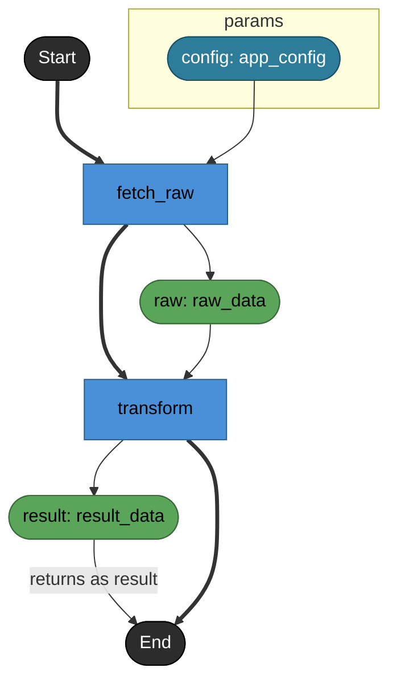
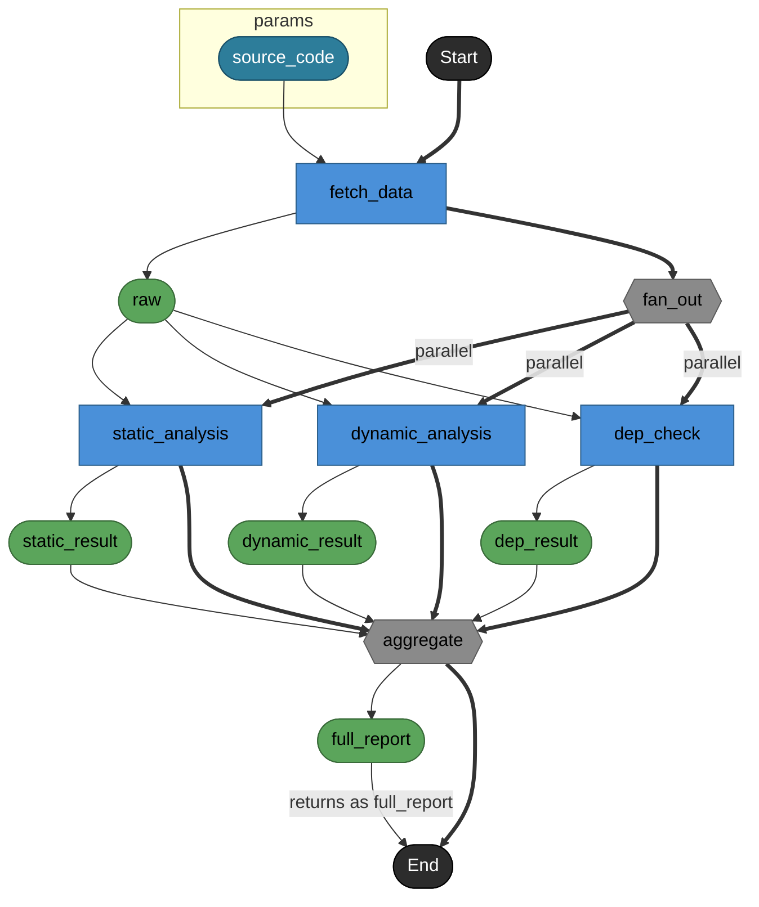
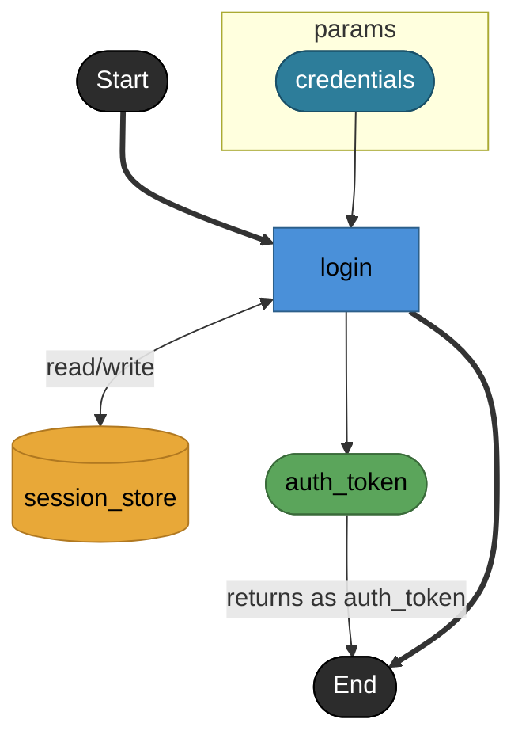
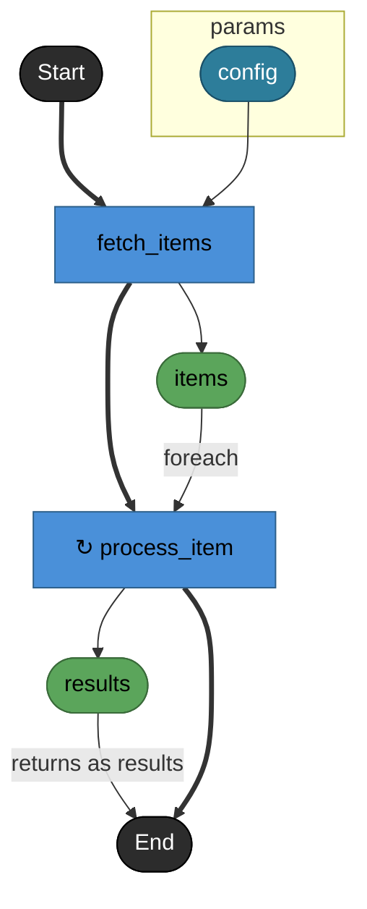
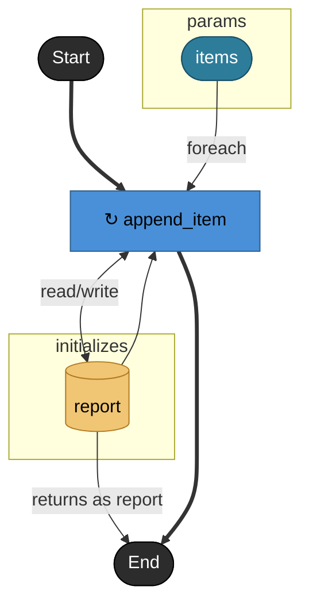
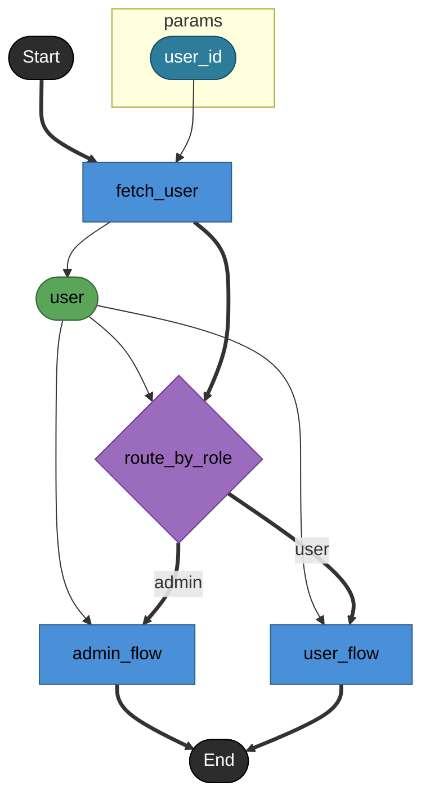

# Contract: DAG render rules

- **id**: `spec:bpdsl.views.dag`
- **status**: draft
- **date**: 2026-06-17
- **parent**: `spec:bpdsl.views.overview`
- **contract_class**: `format`

## What this is

Render rules for the DAG (Directed Acyclic Graph): node shape, edge kind, scope, and special-case handling when outputting Processing-layer nodes and edges as a Mermaid flowchart.

> Source: V01-ADR-009, V01-ADR-011, V01-ADR-012, V01-ADR-015, V01-ADR-016, V01-ADR-017, V01-ADR-020, V01-ADR-022, V01-ADR-023, V01-ADR-024, V01-ADR-040, V01-ADR-044, V01-ADR-062, V01-ADR-063, V01-ADR-064, V01-ADR-065, V01-ADR-066, V01-ADR-071

## Current contract

### Scope

One file = one DAG. The DAG is drawn at the granularity of the file containing the main node (V01-ADR-011). A module-wide DAG spanning multiple files is not defined.

When referencing a main node in another file (e.g. an external reference via `foreach.apply`), the referenced node is drawn as an external node (see §External reference node).

### Output format

```markdown
# {main node ID}

**API**: [{method} {path}](../_cross/api.md)

{main node's note}

​```mermaid
flowchart TD
  ...
​```

## Tasks

### {task_id}
...

## Private models

| model | kind | used by | shape | note |
|---|---|---|---|---|
| {helper_model_id} | struct | {task_id}.returns | field: type | note |
```

- H1 = the main node's `id`.
- **API line** = output only if the main node has `endpoint: true`, placed before `note`. Links to `_cross/api.md` under the same `renders/` tree.
- Description text = the main node's `note`; omitted if absent.
- Mermaid notation: `flowchart TD` (top to bottom).
- **Tasks detail section** = follows the Mermaid diagram. Lists task / fork / join / branch signature, reads/writes, and note.
- **Private models detail section** = follows `## Tasks`, output only if the target task file has file-private helper models. The section itself is omitted otherwise.

### Tasks detail section format

```markdown
## Tasks

### login

Validate credentials and issue a token.

#### Params

| name | model | note |
|---|---|---|
| credentials | credential | Login form input |

#### Returns

| name | model | source |
|---|---|---|
| auth_token | token | login |

#### Store access

| access | store |
|---|---|
| read/write | session_store |
| write | login_log_db |

### other_task

**External reference**: [auth.task.validate](../../auth/task/validate.md)
```

- task / fork / join / branch in the same file: `note` is output as body text directly under the H3; signature (params/returns) and reads/writes are listed as tables.
- The main node's `note` is already output as the description text directly under the H1, so it's omitted under the main node's own H3 within `## Tasks`.
- External reference task only: shown with **External reference**: and a link; detail is omitted.
- The body directly under H3 is omitted if `note` is absent.
- The `#### Params` section is omitted if `params` is absent.
- The `#### Returns` section is omitted if `returns` is absent.
- If `returns.source` is present, the Returns table's `source` column shows the source string; `—` if unspecified.
- The `#### Store access` section is omitted if both `reads` / `writes` are absent.
- When the same store appears in both `reads` and `writes`, the `Store access` `access` column collapses to a single `read/write` row.
- `Params`'s `note` shows `—` if absent.

> Source: V01-ADR-064 §1–3

### Private models detail section format

Task-file helper model basic semantics are defined by [`spec:bpdsl.dsl.nodes.data`](../dsl/nodes/data.md). The DAG Markdown does not draw this helper model in the Mermaid flowchart body — it shows it as a `## Private models` table after the Mermaid diagram and `## Tasks`.

```markdown
## Private models

| model | kind | used by | shape | note |
|---|---|---|---|---|
| preview_response | struct | get_preview.returns | items: list<preview_item> | response schema |
| preview_item | struct | preview_response.items | title: str<br/>url: str | item entry |
```

| column | content |
|---|---|
| `model` | Helper model ID. |
| `kind` | `struct` / `list` / `dict` / `enum`. |
| `used by` | Locations directly referencing this helper model. Multiple locations joined by `<br/>`. |
| `shape` | Depth-1 schema summary appropriate to `kind`. |
| `note` | The helper model's `note`; `—` if absent. |

`used by` lists only depth-1 direct references. Notation is `<parent_id>.<location>`, where `location` depends on the kind of referencing site:

| referencing site | location |
|---|---|
| struct field | Field name. |
| task / branch / fork / join param | `param:<name>` |
| returns | `returns` |
| list model element | `element` |
| dict model value | `value` |

`shape` displays per kind:

| kind | shape |
|---|---|
| `struct` | Fields listed as `name: type`, joined by `<br/>`. Field notes are not included. |
| `list` | `list<element_type>` |
| `dict` | `dict<value_type>`. Key is always `str`. |
| `enum` | Values joined by `<br/>`. |

A nested helper model is shown only as a type-name reference — no further deep schema expansion. Public model deep-schema expansion, model-file helper-model render, and model-catalog render are outside the DAG Markdown's responsibility.

> Source: V01-ADR-071 §1–5

## Rules

### Node render

#### start / end

```
_start([Start])
_end([End])
```

Shape: stadium (Mermaid `([label])`), corresponding to the ISO 5807:1985 Terminal symbol (V01-ADR-022). Mermaid ID is `_start` / `_end` (underscore-prefixed to avoid keyword collision) (V01-ADR-024). The DAG places `_start([Start])` at the top, and draws a control line (`==>`) from the last task to `_end([End])`. A floating node (see §Control line below) also connects to `_end`.

`_end` doubles as both the ControlFlow terminus and the ObjectFlow terminus for `returns.source`. The control line (`==>`) from the last task / floating node, and the labeled data line (`-- "returns as <returns.name>" -->`) from the node representing the value specified by `returns.source`, may both enter `_end` simultaneously. For an asset-producing source like a task / join / collected asset source, the return data line is drawn from the asset node to `_end`, not directly from the task node.

**Floating node**: a task within the flow with no subsequent wiring reference. Occurs, for example, when each branch case task completes processing at the branch destination with no further step. A floating node implicitly gets `==> _end([End])` added when drawn.

```
admin_flow ==> _end([End])
user_flow ==> _end
```

(`_end` is a single node, so two or more control lines may converge on it; if `returns.source` is present, data lines may converge there too.)

> Source: V01-ADR-024 §4, V01-ADR-064 §1–3

#### task

```
task_id[task_id]
```

Shape: rectangle (Mermaid `[label]`).

A task-file helper model is not a processing flow node, so it is never drawn in the Mermaid DAG body as a task / asset / store / branch / fork / join. Helper-model render exposure is limited to the `## Private models` detail section. The scope for showing a TypeRef hint on a DAG asset node label is owned by V01-ADR-074 / V01-REQ-DATA-005 / V01-WORK-DATA-007.

#### asset

```
asset_name([asset_name: type_hint])
```

Shape: stadium (Mermaid `([label])`). An intermediate node implicitly generated from a task's `returns` (V01-ADR-009).

Per V01-ADR-074, the asset label shows a top-level TypeRef hint:

```text
{asset_name}: {type_hint}
```

`type_hint` derivation rule:

| TypeRef | asset-label type_hint |
|---|---|
| primitive | The primitive name, e.g. `str`, `int`, `bool`, `any`. |
| named model | The model local ID. |
| inline `list<T>` | `list` |
| inline `dict<T>` | `dict` |

A named list/dict model is treated as a named model — it shows the model local ID rather than collapsing to `list` / `dict`.

If a named model with a different identity happens to share the same local-id hint within the same DAG render scope, the TypeRef hint is ambiguous. V01-WORK-DATA-007 minimum does not perform a shortened-QID fallback — for an ambiguous asset label, the TypeRef hint is omitted and only the asset name is shown.

```text
# normal case
response([response: get_reference_tree_response])

# ambiguous named-model local id
response([response])
```

The TypeRef hint is also omitted on the DAG label when the TypeRef is invalid / unresolved. Explaining an invalid / unresolved TypeRef is owned by diagnostics — DAG render adds no extra diagnostic surface for this.

A full TypeRef is never expanded into the Mermaid label. Check the full TypeRef / full identity via the Tasks detail section, MCP `inspect`, model render, or catalog render.

#### store

```
store_id[(store_id)]
```

Shape: cylinder (Mermaid `[(label)]`). Connected to a task via `reads` / `writes` edges (V01-ADR-020).

An initialized store is drawn with the same cylinder shape as a regular store on the DAG. To distinguish it from a normal module-level store, it is placed inside `subgraph initializes` and gets the `initStoreNode` classDef applied.

> Source: V01-ADR-020, V01-ADR-063, V01-ADR-065, V01-ADR-064 §4–6

#### branch

```
branch_id{branch_id}
```

Shape: diamond (Mermaid `{label}`). Exclusive branch (V01-ADR-012).

#### fork / join

```
fork_id{{fork_id}}
join_id{{join_id}}
```

Shape: hexagon (Mermaid `{{label}}`). Parallel split / merge (V01-ADR-012).

> The UML 2.x standard fork/join uses a bar symbol (━━), but since Mermaid flowchart can't reproduce a bar symbol, a hexagon is adopted as a substitute (V01-ADR-022).

#### External reference node

When referencing a main node outside the same file, distinguish it visually with a classDef.

```
classDef external fill:#e0e0e0,stroke:#999,color:#555
class other_task external
```

The shape of an external node follows its node kind (task → rectangle, etc.).

#### subgraph params

The main node's input is enclosed in `subgraph params` as the diagram's boundary (V01-ADR-024).

```
subgraph params
  config([config: config])
end
```

- If the main node has `params`, each param is listed as an asset node.
- A params-boundary asset is also subject to the same TypeRef hint display as a normal asset.
- The `boundaryNode` classDef is applied to a boundary asset.
- `subgraph returns` is abolished per V01-ADR-064. A boundary asset node representing `returns.name` is not drawn — return is instead expressed via a labeled data line (`-- "returns as <returns.name>" -->`) from the node representing the value specified by `returns.source`, to `_end`. For task / join / collected asset source, this goes via an asset node.

> Source: V01-ADR-024 §1–4, V01-ADR-064 §1–3

#### subgraph initializes

A file-private store declared via `initializes[]` is enclosed and drawn within `subgraph initializes`.

```
subgraph initializes
  report[(report)]
  cache[(cache)]
end
```

- `subgraph initializes` is not output for a task whose `initializes[]` is empty.
- An initialized store is drawn with the same cylinder shape `[(label)]` as a store.
- The `initStoreNode` classDef is applied to an initialized store.
- Recommended Mermaid source order: `subgraph params` → `subgraph initializes` → body → `_end`. Final placement is left to the Mermaid renderer.

> Source: V01-ADR-014, V01-ADR-063, V01-ADR-064 §4–6

#### foreach's ↻ decoration

`foreach` is not a node type — it's a `flow:` control construct — so it is not drawn as a standalone node (V01-ADR-016). It is expressed by adding `↻` to the apply-target task's node label.

```
process_item["↻ process_item"]
```

When the apply target is an external reference node, this combines with the external node's classDef.

#### Node coloring

Color-coded by kind via classDef, conforming to WCAG 2.1 Level AA (contrast ratio ≥ 4.5:1) (V01-ADR-022).

```
classDef taskNode      fill:#4A90D9,stroke:#2C5F8A,color:#000
classDef assetNode     fill:#5BA55B,stroke:#3A6B3A,color:#000
classDef storeNode     fill:#E8A838,stroke:#B07820,color:#000
classDef initStoreNode fill:#F0C674,stroke:#B07820,color:#000
classDef branchNode    fill:#9B6BBD,stroke:#6B3D8F,color:#000
classDef forkNode      fill:#8A8A8A,stroke:#5A5A5A,color:#000
classDef terminalNode  fill:#2C2C2C,stroke:#000,color:#fff
classDef boundaryNode  fill:#2D7D9A,stroke:#1A5068,color:#fff
classDef external      fill:#E0E0E0,stroke:#999,color:#555
```

`boundaryNode` applies to a boundary asset within `subgraph params`. `subgraph returns` was abolished by V01-ADR-064. `initStoreNode` applies to an initialized store within `subgraph initializes`.

> Source: V01-ADR-022, V01-ADR-024, V01-ADR-064 §4–9, V01-ADR-066

A class is assigned per node:

```
class login taskNode
class auth_token assetNode
class session_store storeNode
class report initStoreNode
class route_by_role branchNode
class fan_out,aggregate forkNode
class _start,_end terminalNode
class config boundaryNode
```

### Edge render

Edges correspond to the UML Activity Diagram's ControlFlow / ObjectFlow distinction (OMG UML 2.x / V01-ADR-022).

| kind | UML correspondence | Mermaid notation | purpose |
|------|---------|------------|------|
| Data line | ObjectFlow | `-->` | Passing data. |
| Labeled data line | ObjectFlow | `--"label"-->` | Passing data with added meaning, e.g. foreach. |
| Store access line | ObjectFlow | `-- "read" -->` / `-- "write" -->` / `<-- "read/write" -->` | Read/write access to a store. |
| Control line | ControlFlow | `==>` | Controls execution order. |
| Labeled control line | ControlFlow | `== "label" ==>` | Conditional control flow for branch/fork. |

#### Data line (`-->`)

Wiring from task → asset, asset → task. Derived from `flow:`'s `params` wiring.

```
fetch_data --> raw([raw])
raw --> transform
```

Referencing an initialized source from flow wiring is also drawn with a normal data line (`-->`), since it's a value-passing contract — it is not folded into the cross-edge `reads` representation.

```
report --> append_item
```

#### `returns.source` data line

When `returns.source` is specified, a labeled data line (`-- "returns as <returns.name>" -->`) is drawn from the node representing the value to `_end`. No boundary node representing `returns.name` is drawn.

| source kind | origin of the return data line into `_end` | Mermaid example |
|---|---|---|
| node ID / QualifiedID | The asset node produced by that task / join. | `result -- "returns as report" --> _end` |
| collected asset source (`foreach.returns`) | The collected asset node generated under the `foreach.returns` name. | `results -- "returns as report" --> _end` |
| initialized source | The store node within `subgraph initializes`. | `report -- "returns as report" --> _end` |
| `$params.<name>` | The boundary asset within `subgraph params`. | `config -- "returns as report" --> _end` |

If `returns.source` is unspecified, no return data line into `_end` is added. For node ID / QualifiedID / collected asset source, the connection goes via the asset node, not directly from the task node. The edge label is `returns as <returns.name>` regardless of source kind.

> Source: V01-ADR-062, V01-ADR-063, V01-ADR-064 §1–3

#### Store access line

A store's `reads` / `writes` is drawn as a store access line. To distinguish it from normal asset dataflow, the access kind is made explicit via an edge label (V01-ADR-044).

| YAML designation | Mermaid representation | meaning |
|-------------|-------------|------|
| `reads: [store]` | `store -- "read" --> task` | The task reads the store. |
| `writes: [store]` | `task -- "write" --> store` | The task writes the store. |
| Both `reads` and `writes` | `task <-- "read/write" --> store` | The task reads and writes the store. |

The store edge's direction is kept as before, but the primary meaning is now carried by the label.

```
session_store[(session_store)] -- "read" --> login       %% reads only
login -- "write" --> audit_log[(audit_log)]              %% writes only
login <-- "read/write" --> session_store[(session_store)] %% reads + writes both
```

`reads` / `writes` declared on an initialized store are also drawn with the normal store access line, same as a regular store. However, referencing an initialized source from flow wiring is drawn with a data line (`-->`). Both a data line and a store access line may connect to the same initialized-store node.

The fact that an initialized source is passed via flow wiring does not imply `reads` / `writes`. Conversely, the fact that `reads` / `writes` is declared does not let the flow-wiring data line be omitted. The two are drawn as independent contracts.

> Source: V01-ADR-044, V01-ADR-063 §7, V01-ADR-064 §7

#### Control line (`==>`)

A control line is drawn in all of the following cases:

- `_start` → first task (DAG entry point).
- Last task → `_end` (DAG exit point).
- Floating node → `_end` (implicit terminus).
- **Between consecutive tasks in the flow** (always co-drawn even when a data line also exists).
- task → branch / fork (entry into a branch).
- branch / join → subsequent task (exit from a branch/merge).

```
process_report ==> transform       %% between consecutive tasks
fetch_user ==> route_by_role       %% task → branch
fetch_data ==> fan_out{{fan_out}}  %% task → fork
```

> A data line (`-->`) alone doesn't convey execution order clearly to an LLM. Making it explicit as UML ControlFlow lets the DAG's control structure be parsed mechanically (V01-ADR-022).

**branch (exclusive branching)**

`cases[].label` is used as the edge label (V01-ADR-022, V01-ADR-023).

```
route_by_role{route_by_role} == "admin" ==> admin_flow
route_by_role{route_by_role} == "user" ==> user_flow
```

**branch's params wiring (data line)**: an asset received by a branch node gets two kinds of data lines — one to the branch node itself (for the routing decision), and one to each branch task (data used at execution time).

```
user --> route_by_role      %% for the routing decision
user --> admin_flow         %% data into the admin branch
user --> user_flow          %% data into the user branch
```

**fork / join (parallel execution)**

Each branch from a fork gets a `"parallel"` label (per BPMN 2.0 Parallel Gateway / V01-ADR-022). Into the join node, both a **control line (merge) and a data line (result)** are drawn from each branch task.

```
fan_out{{fan_out}} == "parallel" ==> static_analysis
fan_out{{fan_out}} == "parallel" ==> dynamic_analysis
fan_out{{fan_out}} == "parallel" ==> dep_check
static_analysis --> static_result([static_result])   %% data line (branch task output)
static_result --> aggregate{{aggregate}}              %% data line (input to join)
static_analysis ==> aggregate{{aggregate}}            %% control line (merge)
dynamic_analysis --> dynamic_result([dynamic_result])
dynamic_result --> aggregate
dynamic_analysis ==> aggregate
dep_check --> dep_result([dep_result])
dep_result --> aggregate
dep_check ==> aggregate
```

**foreach**

Since "foreach" carries the meaning of how data flows (one item at a time), it's expressed as a label on the data line (ObjectFlow). Task execution order is shown via the control line (ControlFlow) (per BPMN 2.0 Multi-Instance Activity / V01-ADR-022).

```
fetch_items ==> process_item["↻ process_item"]    %% control line (execution order)
items --"foreach"--> process_item                 %% data line (foreach-labeled ObjectFlow)
```

### Render examples

#### Basic DAG (2 tasks + asset)

YAML:
```yaml
nodes:
  - id: process_report
    type: task
    main: true
    params:
      - name: config
        model: app_config
    returns:
      name: result
      model: result_data
      source: transform

  - id: fetch_raw
    type: task
    params:
      - name: config
        model: app_config
    returns:
      name: raw
      model: raw_data

  - id: transform
    type: task
    params:
      - name: raw
        model: raw_data
    returns:
      name: result
      model: result_data

flow:
  - step: fetch_raw
    params:
      config: $params.config
  - step: transform
    params:
      raw: fetch_raw
```

Mermaid output:


#### DAG with fork / join

YAML:
```yaml
nodes:
  - id: analyze_code
    type: task
    main: true
    params:
      - name: source_code
        model: source_code
    returns:
      name: full_report
      model: full_report
      source: aggregate

  - id: fetch_data
    type: task
    params:
      - name: source_code
        model: source_code
    returns:
      name: raw
      model: raw_data

  - id: fan_out
    type: fork

  - id: static_analysis
    type: task
    params:
      - name: raw
        model: raw_data
    returns:
      name: static_result
      model: static_result

  - id: dynamic_analysis
    type: task
    params:
      - name: raw
        model: raw_data
    returns:
      name: dynamic_result
      model: dynamic_result

  - id: dep_check
    type: task
    params:
      - name: raw
        model: raw_data
    returns:
      name: dep_result
      model: dep_result

  - id: aggregate
    type: join
    params:
      - name: static_result
        model: static_result
      - name: dynamic_result
        model: dynamic_result
      - name: dep_result
        model: dep_result
    returns:
      name: full_report
      model: full_report

flow:
  - step: fetch_data
    params:
      source_code: $params.source_code
  - fork: fan_out
    branches:
      - steps:
          - step: static_analysis
            params:
              raw: fetch_data
      - steps:
          - step: dynamic_analysis
            params:
              raw: fetch_data
      - steps:
          - step: dep_check
            params:
              raw: fetch_data
    join: aggregate
```

Mermaid output:


#### DAG with a store

YAML:
```yaml
nodes:
  - id: authenticate
    type: task
    main: true
    params:
      - name: credentials
        model: credential
    returns:
      name: auth_token
      model: token
      source: login

  - id: login
    type: task
    params:
      - name: credentials
        model: credential
    returns:
      name: auth_token
      model: token
    reads: [session_store]
    writes: [session_store]

  - id: session_store
    type: store
    model: session

flow:
  - step: login
    params:
      credentials: $params.credentials
```

Mermaid output:


#### DAG with foreach

YAML:
```yaml
nodes:
  - id: process_reports
    type: task
    main: true
    params:
      - name: config
        model: app_config
    returns:
      name: results
      model: result_list
      source: results

  - id: fetch_items
    type: task
    params:
      - name: config
        model: app_config
    returns:
      name: items
      model: item_list

  - id: process_item
    type: task
    params:
      - name: item
        model: item
    returns:
      name: result
      model: result

flow:
  - step: fetch_items
    params:
      config: $params.config
  - foreach: process_item
    over: fetch_items
    params:
      item: $item
    returns: results
```

Mermaid output:


#### DAG with an initialized source

YAML:
```yaml
nodes:
  - id: process_report
    type: task
    main: true
    initializes:
      - name: report
        model: report
    params:
      - name: items
        model: item_list
    returns:
      name: report
      model: report
      source: report

  - id: append_item
    type: task
    reads: [report]
    writes: [report]
    params:
      - name: report
        model: report
      - name: item
        model: item

flow:
  - foreach: append_item
    over: $params.items
    params:
      report: report
      item: $item
```

Mermaid output:


#### DAG with a branch (containing floating nodes)

A pattern with no `returns`, containing floating nodes. Both branch case tasks complete with no successor, so both become floating nodes implicitly connected to `_end`.

YAML:
```yaml
nodes:
  - id: handle_request
    type: task
    main: true
    params:
      - name: user_id
        model: user_id

  - id: fetch_user
    type: task
    params:
      - name: user_id
        model: user_id
    returns:
      name: user
      model: user

  - id: route_by_role
    type: branch
    params:
      - name: user
        model: user

  - id: admin_flow
    type: task
    params:
      - name: user
        model: user

  - id: user_flow
    type: task
    params:
      - name: user
        model: user

flow:
  - step: fetch_user
    params:
      user_id: $params.user_id
  - branch: route_by_role
    params:
      user: fetch_user
    cases:
      - label: admin
        step: admin_flow
        params:
          user: fetch_user
      - label: user
        step: user_flow
        params:
          user: fetch_user
```

Mermaid output:


> Source: V01-ADR-064, V01-ADR-066

## Validation rules

- A floating node (no downstream wiring reference) is not an error — it is implicitly connected to `_end` rather than left dangling.
- `returns.source` unspecified means no return data line into `_end` is added; this is valid, not an omission error.
- An ambiguous asset TypeRef hint (same local-id, different identity, within the same render scope) is not an error — the hint is silently omitted and only the asset name is shown.
- An invalid / unresolved TypeRef is not surfaced as an additional DAG-render diagnostic — it is the responsibility of `diagnostics` (see [`spec:bpdsl.dsl.diagnostics`](../dsl/diagnostics.md)) and is simply omitted from the asset label.
- `subgraph initializes` must not be emitted for a task whose `initializes[]` is empty.
- A task-file helper model must never appear in the Mermaid DAG body (task/asset/store/branch/fork/join shapes) — only in the `## Private models` table.
- The fact that an initialized source is passed via flow wiring must not be used to infer `reads` / `writes`, and vice versa — these are independent contracts and both must be drawn if both are declared.

## Related specs

| ref | relation |
|---|---|
| `spec:bpdsl.views.overview` | Parent overview; view kind catalog. |
| `spec:bpdsl.dsl.nodes.processing` | `task` / `asset` / `branch` / `fork` / `join` node definitions this render draws. |
| `spec:bpdsl.dsl.nodes.data` | `store` node definition; task-file helper model semantics. |
| `spec:bpdsl.dsl.edges.data_flow` | `flow:` wiring this render derives data/control lines from. |
| `spec:bpdsl.dsl.edges.cross_edges` | `reads:` / `writes:` fields this render draws as store access lines. |
| `spec:bpdsl.dsl.type_ref` | TypeRef used for the asset-label type hint. |
| `spec:bpdsl.views.model_file` | Owns model-file helper-model render and model-catalog render, both outside this contract's scope. |
