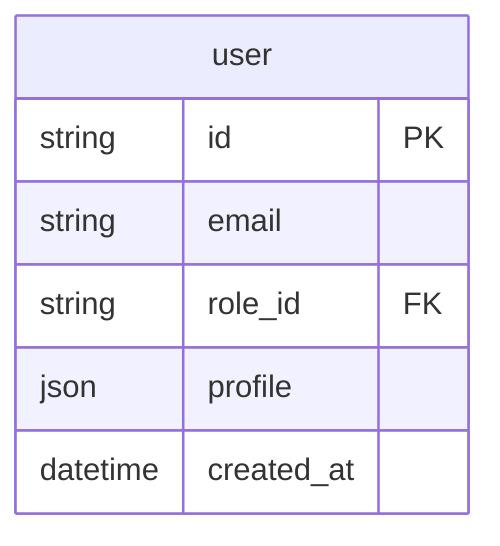
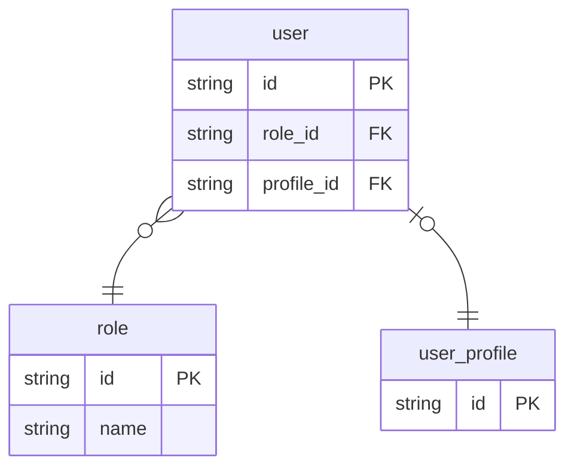
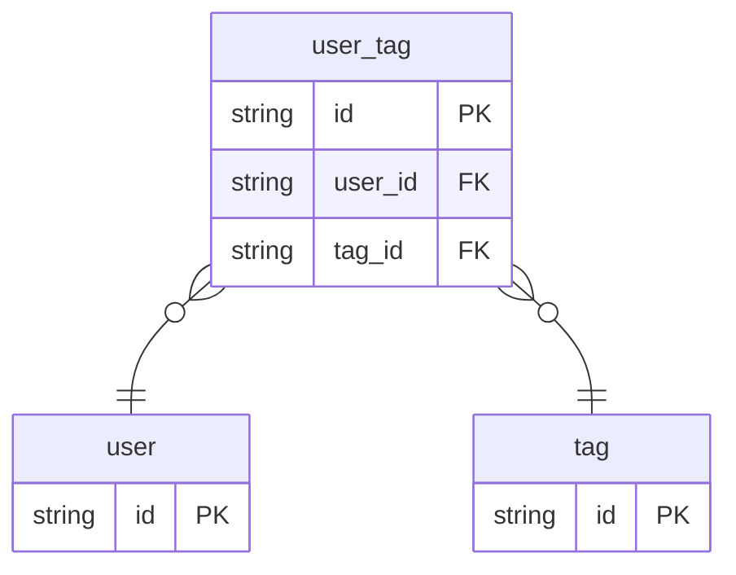
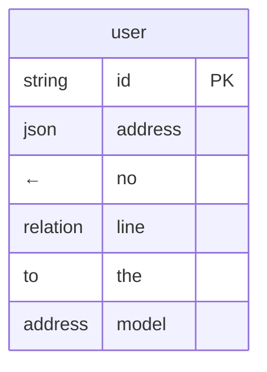

# Contract: ER Diagram render rules

- **id**: `spec:bpdsl.views.er`
- **status**: draft
- **date**: 2026-06-17
- **parent**: `spec:bpdsl.views.overview`
- **contract_class**: `format`

## What this is

Render rules for the ER Diagram: entity, column, and relation notation when generating a Mermaid `erDiagram` by following `store.kind=db` and the models it references. Also supports cross-module composed rendering via view YAML (V01-ADR-039).

> Source: V01-ADR-007, V01-ADR-014, V01-ADR-021, V01-ADR-026, V01-ADR-039, V01-ADR-065, V01-ADR-070

## Current contract

### Target nodes

Only two node kinds appear in an ER Diagram:

| node | role |
|---|---|
| `store.kind: db` | Drawn as an entity (table). |
| `model.kind: struct` (followed from `store.of`) | Used as the entity's column definitions. |

`store.kind: session` / `collection` / `context` do not appear in an ER Diagram. `model.kind: list` / `dict` do not appear as entities (they only appear as struct field types).

An `initializes[]`-declared initialized store does not appear in an ER Diagram either — it has no `kind`, so it doesn't satisfy the `store.kind: db` condition, and it's a file-private runtime instance within a task, not a persistent data structure (V01-ADR-014, V01-ADR-065).

Task-file helper model basic semantics are defined by [`spec:bpdsl.dsl.nodes.data`](../dsl/nodes/data.md). Since the ER Diagram only targets public models followed from `store.kind: db`'s `store.of`, task-file helper models never appear in an ER Diagram.

### Entity derivation

The model referenced by a `store.kind: db`'s `of:` field is drawn as an entity.

```yaml
- id: user_db
  type: store
  kind: db
  of: user        # → the user model is drawn as an entity
```

The entity name uses `model.id` (e.g. `user`), not `store.id` (e.g. `user_db`). If multiple `store.kind: db` reference the same model, the entity is drawn once (no duplication).

### Column derivation

An entity's columns derive from a `model.kind: struct`'s `fields`.

Column type mapping:

| brewprint `type` | ER diagram type notation |
|---|---|
| `str` | `string` |
| `int` | `int` |
| `float` | `float` |
| `bool` | `boolean` |
| `bytes` | `bytes` |
| `datetime` | `datetime` |
| `any` | `any` |
| model ID (with `fk:`) | `string` (regardless of the FK target's actual type) |
| model ID (no `fk:`) | `json` (JSON embed) |
| list-kind model | `json` (variant/JSON embed) |

PK / FK flags:

| field condition | ER diagram notation |
|---|---|
| `pk: true` | `PK` |
| `fk: <model-id>.<field>` | `FK` |
| `pk: true` and has `fk:` | `PK, FK` |

Mermaid output image:



### Relation derivation

A relation line is drawn from a field that has `fk:`.

Cardinality rule (V01-ADR-026):

| condition | cardinality | Mermaid notation |
|---|---|---|
| `fk:` only (default) | many-to-one | `}o--\|\|` |
| `fk:` + `unique: true` | one-to-one | `\|o--\|\|` |

The side holding the FK is "many" or "one (unique)"; the referenced side is "one."

Relation label: always an empty string. brewprint keeps the semantic explanation of an FK in `note`, so no label is needed on the diagram.

Mermaid output image:



### N:M representation

An N:M relationship is explicitly defined as an intermediate model — a struct with two FK fields (V01-ADR-026). The intermediate model also exists as a real DB table, so a corresponding `store.kind: db` must be defined for it. An intermediate model without a `store.kind: db` does not appear in the ER Diagram (per the render-scope exclusion rule below). On the ER Diagram, it's drawn as two N:1 relations through the intermediate entity.



### JSON-embedded field handling

A model-ID reference without `fk:` (JSON embed) is shown only as a `json`-typed column on the ER Diagram. No relation line is drawn to the referenced model (there's no DB-level foreign-key constraint).



## Rules

### Render scope

**Default: module granularity.** When no view YAML is specified, the ER Diagram is drawn at **module granularity** — all `store.kind: db` within the module are collected, and the models they reference are followed into a single diagram.

**Cross-module composed rendering via view YAML (V01-ADR-039).** To generate an ER Diagram spanning multiple modules, define a view YAML:

```yaml
as: er_diagram
id: ec_er
note: ER diagram for the entire EC site
modules:
  - module: auth
  - module: catalog
  - module: cart
  - module: order
  - module: payment
```

| field | description |
|---|---|
| `as` | Fixed: `er_diagram`. |
| `id` | ER Diagram identifier. |
| `note` | Description (optional). |
| `modules[].module` | Module path to aggregate. Only `store.kind: db` directly under that module is targeted (submodules are not auto-collected). |

To include submodules, list them explicitly in `modules[]`.

#### Cross-module FK handling

When a view YAML includes multiple modules, an `fk:` crossing those modules is also drawn as a relation line. An FK to a module not included in the view YAML is shown as a `json`-typed column, with no relation line drawn.

Excluded from rendering (default and cross-module alike):

- A model that is never reached from `store.kind: db` (used only as a type definition, including an N:M intermediate model with no `store.kind: db` defined).
- A JSON-embed reference target model.
- A cross-module FK pointing to a module not included in the view YAML.

The ER Diagram is generated by brewprint's MCP tool (`render_er`) after loading the YAML. Hand-written Mermaid never exists for this view.

## Validation rules

- A `store.kind` other than `db` never produces an ER entity, regardless of whether it has an `of:`.
- An `initializes[]`-declared initialized store is never targeted, since it lacks `kind` entirely.
- A view YAML's `modules[].module` targets only that module's direct `store.kind: db` — submodules require explicit listing, not assumed inclusion.
- An N:M intermediate model lacking a `store.kind: db` is silently excluded from the diagram — this is not a parser error.

## Related specs

| ref | relation |
|---|---|
| `spec:bpdsl.views.overview` | Parent overview; view kind catalog. |
| `spec:bpdsl.dsl.nodes.data` | `store` and `model` node definitions this render follows. |
| `spec:bpdsl.dsl.naming` | FK field reference resolution (bare vs. qualified). |
