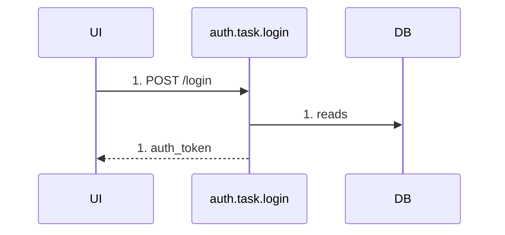
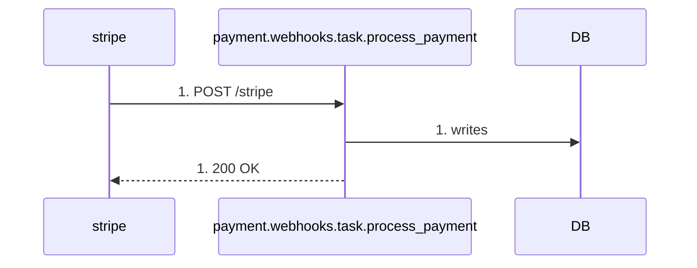

# Contract: Sequence Diagram render rules

- **id**: `spec:bpdsl.views.sequence_diagram`
- **status**: draft
- **date**: 2026-06-17
- **parent**: `spec:bpdsl.views.overview`
- **contract_class**: `format`

## What this is

YAML schema and render rules for the Sequence Diagram scenario file. Takes an `as: sequence_diagram` view definition file as input and generates Mermaid in `sequenceDiagram` form.

> Source: V01-ADR-004, V01-ADR-017, V01-ADR-018, V01-ADR-019, V01-ADR-030, V01-ADR-031, V01-ADR-032, V01-ADR-034, V01-ADR-035, V01-ADR-036, V01-ADR-037, V01-ADR-038, V01-ADR-041

## Current contract

### Scenario file structure

```yaml
as: sequence_diagram
id: login_flow
title: "Login flow"
state_file: auth/state.yaml
steps:
  - from_state: idle
    via: login_submitted

  - from_state: session_expired
    via: login_submitted
```

| field | required | content |
|---|---|---|
| `as` | ✓ | Fixed: `sequence_diagram` (V01-ADR-030). |
| `id` | ✓ | Scenario ID, unique within the project. |
| `title` | optional | Human-facing title. |
| `state_file` | ✓ | Path to the referenced state-definition file. |
| `steps` | ✓ | List of steps (one or more). |

### step object

| field | required | content |
|---|---|---|
| `from_state` | ✓ | State ID before the transition. Not omittable. |
| `via` | ✓ | The event ID that fires. |
| `guard` | optional | Guard string to uniquely pin down the transition (V01-ADR-035). |

### transition resolution rule

`(from_state, via)` narrows down candidate transitions within `state_file`, then `step.guard` and `transition.guard` are compared by **exact match** to uniquely pin one down (V01-ADR-035).

| candidate count | `step.guard` | behavior |
|---|---|---|
| 0 | any | Parser error: no corresponding transition exists. |
| 1 | omitted | Adopt the candidate transition. |
| 1 | specified | Adopt if it exact-matches `transition.guard`; mismatch is an error. |
| 2+ | omitted | Parser error: ambiguous (guard must be specified). |
| 2+ | specified | Adopt the one exact match; zero or multiple matches is an error. |

**Guard string comparison is exact match.** Since brewprint never evaluates guard expressions (V01-ADR-019), superficial differences like whitespace are treated as different strings. Authors should copy the guard string verbatim from `state_file`.

### step continuity

`steps` represents the chronological sequence of FSM transitions for a single scenario. The renderer outputs arrows in `steps` declaration order.

Each step resolves uniquely to a transition within `state_file`. The `to` of the transition resolved by `step[i]` must match `step[i+1].from_state` — a mismatch is a parser error.

Independent scenarios must not be mixed into the same sequence diagram. Represent a separate scenario as a separate `as: sequence_diagram` file.

### Example: a scenario with a guard branch

```yaml
# order/state.yaml (excerpt)
transitions:
  - from: processing
    on: payment_webhook_received
    to: confirmed
    action: payment.webhooks.task.process_payment
    guard: "payload.status == 'succeeded'"

  - from: processing
    on: payment_webhook_received
    to: failed
    guard: "payload.status == 'failed'"
```

```yaml
# scenarios/payment_webhook_success.yaml
as: sequence_diagram
id: payment_webhook_success
title: "Payment webhook success flow"
state_file: order/state.yaml
steps:
  - from_state: processing
    via: payment_webhook_received
    guard: "payload.status == 'succeeded'"
```

There are 2 candidates, but `step.guard` uniquely pins down the transition to `confirmed`.

### Participants

Four participant kinds appear in a sequence diagram (V01-ADR-004 / V01-ADR-036):

| participant | generation condition | brewprint entity |
|---|---|---|
| Actor | At least one step references an event with `source=external`. | `type: actor` node (V01-ADR-031). |
| UI | Implicitly generated if at least one step references an event with `source=ui`. | No explicit node in YAML. |
| API | An endpoint of a task referenced by a scenario step. | `type: task` (`endpoint=true`). |
| DB | A step references `store.kind=db` via either: all tasks in the same file as the task (main + sub) `reads` / `writes` (V01-ADR-038); or a `source=er` event's `watches` (V01-ADR-036). | `type: store` (`kind=db`), aggregated into a single "DB" column. |

Participant display order (left → right): `Actor → UI → API → DB` (only those present).

#### DB participant granularity

Every `store.kind=db` store is collapsed into a single "DB" column. `kind=session` / `kind=collection` / `kind=context` never appear as a participant column.

`store` is a table-granularity definition with no schema/DB-level concept, so columns can't be split per store ID (V01-ADR-004).

### Arrow labels

Event-driven origin arrows follow these patterns based on `event.source` and whether `transition.action` is present (V01-ADR-036 / V01-ADR-037):

| `event.source` | `transition.action` | origin→destination | label | API response arrow |
|---|---|---|---|---|
| `ui` | present | `UI→API` | `METHOD path` (e.g. `POST /login`) | `API→UI`: `returns.name` / `200 OK` |
| `ui` | **absent** | **`UI->>UI`** (self-message) | **event ID** | **none** |
| `external` | present | `Actor→API` | `METHOD path` (e.g. `POST /webhooks/stripe`) | `API→Actor`: `returns.name` / `200 OK` |
| `internal` | — | `API→API` (self-message) | event ID | none |
| `er` (`watches` target is `store.kind=db`) | — | `DB→API` | event ID | none |
| `er` (`watches` target is not `store.kind=db`) | — | `API→API` (self-message) | event ID | none |

A step with `source=ui` and no action generates no API participant. Nothing is output to the DB-operations table either.

DB access from task execution is independent of the above:

| arrow | label |
|---|---|
| API → DB | `reads` or `writes` |

DB access is drawn as a one-way `API->>DB` only — no return arrow `DB-->>API` is drawn. Return-value detail is checked in the DB-operations table instead.

Every message label is prefixed with the scenario `steps:` 1-origin index, in `{step_index}. {label}` form. This is not Mermaid's `autonumber` — it's assigned by the brewprint renderer.

#### Label selection principle

- **`METHOD path` (`ui` with action / `external`)**: represents the physical arrival of an HTTP request. A caller (UI / Actor) exists, and a response arrow `API→UI` / `API→Actor` is also drawn.
- **event ID (`ui` without action / `internal` / `er`)**: no HTTP call is involved, so there's no `METHOD path` source. The event ID shows "what drove this." No response arrow is drawn (V01-ADR-037).

#### Happy path only

The sequence diagram draws the happy path only. Exception/error flows are expressed via `note` or a separate scenario file (V01-ADR-004).

#### `event.payload` is not output to the Mermaid diagram

`event.payload` exists in the definition file as LLM-facing meta information (type reference for code generation), but is never output to the Mermaid diagram. Converting `event.payload` to `task.params` is a UI component's responsibility, outside brewprint's scope.

### Backend auto-resolution

The scenario YAML only declares `(from_state, via, guard?)` explicitly. The backend auto-resolves the following by consulting `state_file`:

| information | resolved from |
|---|---|
| Origin arrow pattern | Branches on the event's `source` and presence of `transition.action` (V01-ADR-036 / V01-ADR-037). |
| Actor participant generation | `event.actor` of an event with `source=external` referenced by a step. |
| UI participant generation | Implicitly generated if any step references an event with `source=ui`. |
| DB participant generation | All tasks in the same file (main + sub) `reads` / `writes`, or a `source=er` event's `watches` containing `store.kind=db` (V01-ADR-038). |
| Task being called | The transition's `action`. |
| `UI→API` / `Actor→API` label | The task's `method` / `path`. |
| API → DB arrow / direction | All tasks in the same file (main + sub) `reads` / `writes` (`kind=db` only, V01-ADR-038). |
| `API→UI` / `API→Actor` label | The task's `returns.name` (or `200 OK` if absent). |
| `DB→API` origin | The `watches` target of a `source=er` event (when `kind=db`). |
| Self-loop occurrence | `source=internal`, or `source=er` whose `watches` target is not `store.kind=db`. |

### Output format

````markdown
# {title or id}

```mermaid
sequenceDiagram
  [participants: declare only what's needed (Actor / UI / API / DB)]

  [origin→API arrow: branches per event.source — see §Arrow labels. label is {step_index}. {label}]
  API->>DB: {step_index}. reads   # if reads is present
  API->>DB: {step_index}. writes  # if writes is present
  [API response arrow: drawn only for source=ui / external. Not drawn for internal / er. label is {step_index}. {label}]
```

## DB operations

| step | task | sub_task | store | operation |
|------|------|----------|-------|------|
| 1 | auth.task.login | - | user_db | reads |
| 1 | auth.task.login | - | session_store | writes |
````

- `step` column = 1-origin index of the scenario's `steps:`.
- `task` column = the qualified ID of the main task pointed to by `transition.action` (V01-ADR-038).
- `sub_task` column = the sub task's short ID; a row from the main task's own `reads` / `writes` shows `-` (V01-ADR-038).
- A store with `kind=session` / `kind=collection` / `kind=context` is never output to the DB-operations table either.

### Mermaid output image

**Login flow (source=ui)**

Input YAML example:

```yaml
# auth/state.yaml (excerpt)
nodes:
  - id: idle
    type: state
    initial: true

  - id: session_expired
    type: state

  - id: loading
    type: state

  - id: login_submitted
    type: event
    source: ui
    payload:
      model: login_form

transitions:
  - from: idle
    on: login_submitted
    to: loading
    action: auth.task.login

  - from: session_expired
    on: login_submitted
    to: loading
    action: auth.task.reauth
```

```yaml
# scenarios/login_flow.yaml
as: sequence_diagram
id: login_flow
title: "Login flow"
state_file: auth/state.yaml
steps:
  - from_state: idle
    via: login_submitted
```

Expected Mermaid output:



DB-operations table:

| step | task | sub_task | store | operation |
|------|------|----------|-------|------|
| 1 | auth.task.login | - | user_db | reads |

**Webhook flow (source=external)**

Mermaid output corresponding to the `scenarios/payment_webhook_success.yaml` example above. Assume the task definition:

```yaml
# payment/webhooks/task/process_payment.yaml (excerpt)
nodes:
  - id: process_payment
    type: task
    endpoint: true
    method: POST
    path: stripe
    writes:
      - order_db
```

Expected Mermaid output:



- The `Stripe` participant resolves from the event's `actor: stripe` (V01-ADR-031 global actor).
- No UI participant is generated, since `source=external`.
- The `API→Actor` response label is `200 OK` since `returns` is undefined.

DB-operations table:

| step | task | sub_task | store | operation |
|------|------|----------|-------|------|
| 1 | payment.webhooks.task.process_payment | - | order_db | writes |

## Rules

Sequence Diagram is generated by brewprint's MCP tool (`render_sequence_diagram`) after loading the YAML. Hand-written Mermaid never exists for this view.

## Validation rules

- Zero matching transition candidates for `(from_state, via)` is a parser error.
- `step.guard` not exact-matching `transition.guard` when exactly one candidate exists is a parser error.
- Ambiguous candidates (2+) with `step.guard` omitted is a parser error.
- A `step[i]` transition's `to` not matching `step[i+1].from_state` is a parser error.
- Mixing independent scenarios into one sequence diagram file is invalid — use a separate `as: sequence_diagram` file per scenario.

## Related specs

| ref | relation |
|---|---|
| `spec:bpdsl.views.overview` | Parent overview; view kind catalog. |
| `spec:bpdsl.dsl.nodes.application` | `event` node and `source` field definitions. |
| `spec:bpdsl.dsl.edges.state_transitions` | `transitions:` syntax this render resolves steps against. |
| `spec:bpdsl.dsl.naming` | Actor global namespace, used for the Actor participant. |
