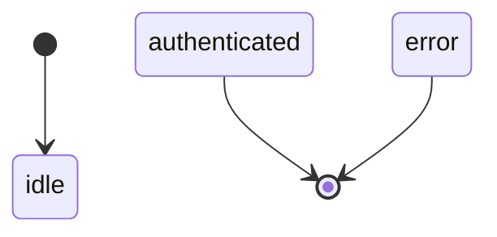
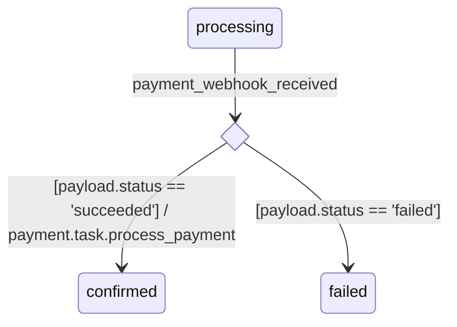
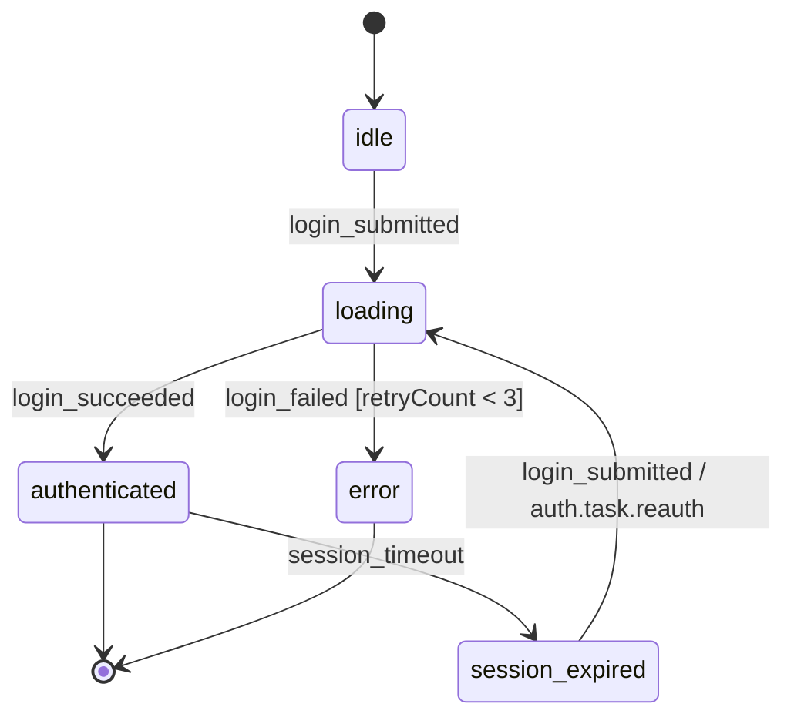
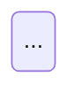

# Contract: State Diagram render rules

- **id**: `spec:bpdsl.views.state_diagram`
- **status**: draft
- **date**: 2026-06-17
- **parent**: `spec:bpdsl.views.overview`
- **contract_class**: `format`

## What this is

Render rules and Mermaid output spec for the State Diagram. Takes `state` nodes, `event` nodes, and the `transitions:` section as input, and generates Mermaid in `stateDiagram-v2` form.

> Source: V01-ADR-017, V01-ADR-018, V01-ADR-019, V01-ADR-035

## Current contract

### Target nodes

Only two node kinds appear in a State Diagram:

| node | role |
|---|---|
| `state` | Drawn as an FSM state. |
| `event` | Used as a transition-trigger label. |

`store` / `task` / `asset` etc. do not appear in a State Diagram (V01-ADR-017).

### Render scope

State Diagram renders at YAML **file granularity**. One file = one FSM = one diagram. Multiple FSMs are never composed into one diagram.

### state rendering

| field | Mermaid representation |
|---|---|
| `initial: true` | Drawn as `[*] --> <state-id>`. |
| `final: true` | Drawn as `<state-id> --> [*]`. |
| Neither | A normal state. |



The state ID is shown as-is for its label. `note` is not output on the diagram (retained as LLM-facing semantic information).

### transition rendering

Each entry in `transitions:` is drawn as one edge.

Edge label format:

```text
<event-id> [<guard>] / <action>
```

| element | output condition |
|---|---|
| `<event-id>` | Always output (the `on` field value). |
| `[<guard>]` | Output only if `guard` is present. |
| `/ <action>` | Output only if `action` is a cross-file reference (dot-separated). Omitted for a same-file reference. |

Cross-file determination: an `action` value containing a dot (`.`) is treated as a cross-file reference.

| `action` value | judgment | label output |
|---|---|---|
| `login_task` | Same-file reference | Omitted. |
| `auth.task.login` | Cross-file reference | `/ auth.task.login` |

Label pattern examples:

```text
login_submitted                                      ← no guard/action (same-file action or omitted)
login_submitted [retryCount < 3]                     ← guard only
login_submitted / auth.task.login                    ← cross-file action only
login_submitted [retryCount < 3] / auth.task.login   ← guard + cross-file action
```

### Guard-branch rendering (choice pseudostate)

When **multiple transitions exist for the same `(from, on)`**, a choice pseudostate (UML `<<choice>>`) is inserted to make the branch explicit (V01-ADR-035).

| `(from, on)` candidate count | render method |
|---|---|
| 1 | Normal direct arrow (follows the label pattern above). |
| 2+ | Branches via choice pseudostate. |

When multiple transitions exist for the same `(from, on)`, the FSM parser guarantees all entries have a `guard` (V01-ADR-019, V01-ADR-035). Mixing guard-present and guard-absent entries is a parser error.

Choice pseudostate generation rule:

- **ID naming**: Auto-generated as `_choice_{from}_{on}`. Authors never write this in YAML.
- **Declaration position**: Emitted together in a leading block directly under `stateDiagram-v2` (Mermaid requires `state X <<choice>>` to be declared before use).
- **Incoming arrow**: `from → _choice_xxx`, labeled with **the event ID only** (no guard).
- **Outgoing arrow**: `_choice_xxx → to`, labeled with **`[guard string]` only** (no event ID).
- A transition's `/ action` (cross-file reference only) is attached to the outgoing arrow from the choice.

Example input YAML (excerpt):

```yaml
transitions:
  - from: processing
    on: payment_webhook_received
    to: confirmed
    action: payment.task.process_payment
    guard: "payload.status == 'succeeded'"

  - from: processing
    on: payment_webhook_received
    to: failed
    guard: "payload.status == 'failed'"
```

Expected Mermaid output (relevant excerpt):



If the leading `state _choice_xxx <<choice>>` declaration is placed after use instead, Mermaid draws it as a normal node rather than a diamond — it **must always be collected into the leading block**.

### Mermaid output image

Input YAML example:

```yaml
nodes:
  - id: idle
    type: state
    initial: true
    note: "User is not interacting"

  - id: loading
    type: state
    note: "Processing the authentication request"

  - id: authenticated
    type: state
    final: true

  - id: error
    type: state
    final: true
    note: "Authentication error state"

  - id: session_expired
    type: state

  - id: login_submitted
    type: event
    source: ui
    payload:
      model: login_form

  - id: login_succeeded
    type: event
    source: internal
    note: "Fired by FSM runtime on auth.task.login success"

  - id: login_failed
    type: event
    source: internal
    note: "Fired by FSM runtime on auth.task.login failure"

  - id: session_timeout
    type: event
    source: external
    actor: scheduler

transitions:
  - from: idle
    on: login_submitted
    to: loading
    action: login_task              # same file → label omitted

  - from: session_expired
    on: login_submitted
    to: loading
    action: auth.task.reauth        # cross-file → label shown

  - from: loading
    on: login_succeeded
    to: authenticated

  - from: loading
    on: login_failed
    to: error
    guard: "retryCount < 3"

  - from: authenticated
    on: session_timeout
    to: session_expired
```

Expected Mermaid output:



### Output format

````markdown
# {file ID}

{file-level note, if any}



## States

| state | note |
|-------|------|
| idle | User is not interacting |
| loading | — |

## Events

| event | source | actor | note |
|-------|--------|-------|------|
| login_submitted | ui | - | Login form submit |
| login_succeeded | internal | - | — |
| login_failed | internal | - | — |
| session_timeout | external | scheduler | — |
````

- H1 = file ID.
- Description text = the file-level `note`; omitted if absent.
- **States table** = all `type: state` nodes; `—` if `note` is absent.
- **Events table** = all `type: event` nodes, listing `source` / `actor` / `note`. `actor` is shown only for `source=external`; otherwise `—`. `—` if `note` is absent.
- Mermaid notation: `stateDiagram-v2`.

## Rules

State Diagram is generated by brewprint's MCP tool (`render_state_diagram`) after loading the YAML. Hand-written Mermaid never exists for this view.

## Validation rules

- Mixing guard-present and guard-absent transitions for the same `(from, on)` pair is a parser error.
- The choice pseudostate's leading declaration must precede all uses in the emitted Mermaid; placing it after use produces an incorrect (non-diamond) render shape, not a parser error, but is treated as a renderer bug if it occurs.
- `note` on `state` / `event` nodes never appears on the diagram itself — only in the Markdown States/Events tables.

## Related specs

| ref | relation |
|---|---|
| `spec:bpdsl.views.overview` | Parent overview; view kind catalog. |
| `spec:bpdsl.dsl.nodes.application` | `state` and `event` node definitions. |
| `spec:bpdsl.dsl.edges.state_transitions` | `transitions:` section syntax this render consumes. |
| `spec:bpdsl.dsl.edges.cross_file_refs` | Cross-file vs. same-file reference rule used for `/ <action>` label output. |
