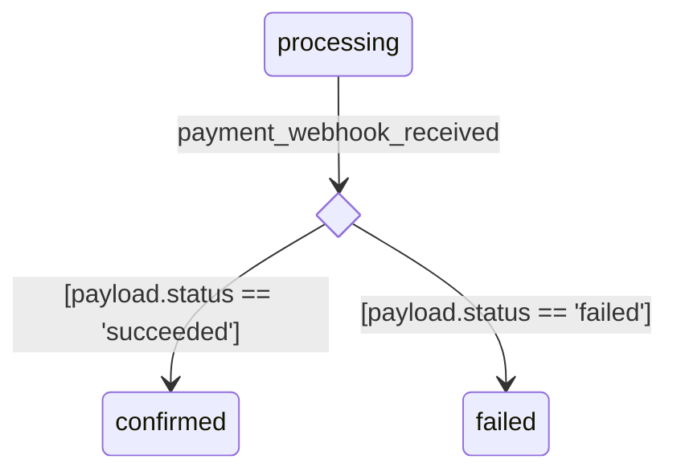

# 035: FSM guard分岐の許容と一意特定（全図共通ルール）

- **status**: accepted
- **date**: 2026-04-24

## 背景

ADR-019でFSMのtransitionに `guard:` フィールドを定義したが、
同一 `(from, on)` ペアに対して複数のtransitionを持てるかどうかを明示していなかった。

実例として `docs/uc/001-ec-checkout-flow/yaml/order/state.yaml` に
以下のguard分岐が存在する：

```yaml
- from: processing
  on: payment_webhook_received
  to: confirmed
  guard: "payload.status == 'succeeded'"

- from: processing
  on: payment_webhook_received
  to: failed
  guard: "payload.status == 'failed'"
```

このとき3つのレイヤーで仕様が不足していた：

1. **FSM定義**（ADR-019）: 同一 `(from, on)` の複数transitionを許容するという明示がない
2. **state diagram render**: guard分岐をどう描画するかのルールがない
3. **sequence diagram scenario**（ADR-032）: `(from_state, via)` で一意特定できないケースへの対処がない

本ADRはこの3点をFSM本体から一貫したルールとして定める。

## 決定

### 1. FSM定義：同一 `(from, on)` の複数transitionを許容する

同一 `(from, on)` ペアに対して、**互いに異なる `guard:` を持つ複数のtransitionを許容する**。

これはMealy machine（UML 2.5.1 StateMachines）の基本セマンティクスに従う。
transitionの識別キーは `(from, on, guard)` の3タプルとする。

制約：

- 同一 `(from, on)` に複数transitionが存在する場合、**全エントリに `guard:` が必須**
- 同一 `(from, on, guard)` の完全一致は許容しない（パーサーエラー）
- guardのない単独transitionと、guardのある複数transitionを混在させることはできない

### 2. state diagram render：guard分岐はchoice pseudostateで描画する

`(from, on)` 候補が2件以上のtransitionを持つ場合、choice pseudostate（UML `<<choice>>`）を挿入して描画する。

**Mermaid 出力ルール：**

- 全 `<<choice>>` ノードの宣言を `stateDiagram-v2` 直下の**冒頭ブロックにまとめて**出力する
  （Mermaid仕様：使用より前に宣言しないとdiamond形状にならないため）
- choice nodeのIDは `_choice_{from}_{on}` の形式で自動生成する
- 元の矢印（`from → choice`）のラベルは event ID のみ（guardなし）
- choice からの矢印ラベルは `[guard文字列]` のみ（event IDなし）



単独transition（候補1件）の場合は従来通り直接矢印で描画する（変更なし）。

### 3. sequence diagram scenario：stepに `guard:` フィールドを追加する

```yaml
as: sequence_diagram
id: payment_webhook_flow
state_file: order/state.yaml
steps:
  - from_state: processing
    via: payment_webhook_received
    guard: "payload.status == 'succeeded'"
```

**stepフィールド定義（更新）：**

| フィールド | 必須 | 内容 |
|-----------|------|------|
| `from_state` | ✓ | 遷移前のstate ID |
| `via` | ✓ | 発火するevent ID |
| `guard` | 任意 | transitionを一意特定するためのguard文字列 |

**transition解決ルール：**

| 候補数 | step.guard | 挙動 |
|-------|------------|------|
| 0 | 任意 | パーサーエラー：対応transitionが存在しない |
| 1 | 省略 | 候補のtransitionを採用 |
| 1 | 指定 | transition.guardと完全一致なら採用。不一致はエラー |
| 2以上 | 省略 | パーサーエラー：曖昧（guard指定必須） |
| 2以上 | 指定 | 完全一致する1件を採用。0件または複数一致はエラー |

**guardの文字列比較はexact match：**

`step.guard` と `transition.guard` は文字列として完全一致で照合する。
brewprintはguard式を評価しない（ADR-019の方針を踏襲）ため、
空白の有無などの表記揺れは別物として扱う。
ユーザーは `state_file` 側のguard文字列をそのままコピーして使う運用とする。

## 理由

### guard分岐を「2つの別transitionの偶然の一致」ではなく「明示的な分岐」として扱う

guardが1本の線（前提条件）か diamond 分岐かは、**同一 `(from, on)` に候補が何件あるか**で自動判定できる。
YAMLに追加フィールドを設けず、候補数のみで切り替えることで：

- FSM定義側（state.yaml）はADR-019のフィールド定義を変えない
- state diagram renderが構造を自動解釈して適切な図を出す

### choice pseudostateのID命名と宣言位置

Mermaid `stateDiagram-v2` の仕様として、`state X <<choice>>` 宣言はXへの矢印より前に書く必要がある。
宣言を後置するとXが通常ノードとして解釈されdiamond形状にならない。

このためrender時は全 `<<choice>>` 宣言を冒頭にまとめて出力する。
IDは `_choice_{from}_{on}` の形式で自動生成し、ユーザーがYAMLで意識しない。

### sequence diagram scenarioのguardをexact matchにする

ADR-019の「brewprintはguardを評価しない」方針に従い、
guard式の意味的等価性（`a==1` と `a == 1` 等）は判定しない。
ユーザーがコピペする運用で十分機能するため、最小限の実装で一意特定を実現する。

### 却下した案

**案A（sequence diagramはhappy pathのみ、guard分岐では常にhappy側を描く）**

どれが「happy」かはシナリオ依存で機械的に判定不能。
「決済失敗時のユーザー体験」を描くシナリオでは `failed` 遷移がhappy pathになりうる。
失敗フローを別シナリオとして明示的に書きたい場合にstep自体が書けなくなる。却下。

**案B（stepに `to_state:` を追加して遷移先で特定）**

`to_state` はguardから従属的に決まる情報であり、scenario YAMLへの記載は重複。
同一 `(from, on)` で異なる `guard` を持つが `to` が同じtransitionを区別できない。
FSMの正当なパターンを潰すため却下。`guard` による特定を採用する。

## 影響

### ADR-019（補強）

「同一 `(from, on)` に複数transitionを許容する（全エントリにguard必須）」を追記する。

### ADR-032（拡張）

- stepオブジェクトのフィールド定義に `guard` を追加
- 「`(from_state, via)` のペアで一意特定」を「`(from_state, via, guard?)` で一意特定」に変更

### spec/views/state-diagram.md（追記）

- guard分岐のchoice pseudostate描画ルールを追加
- Mermaid出力イメージにchoice pseudostateのサンプルを追加

### spec/views/sequence-diagram.md（更新）

- stepフィールド表に `guard` を追加
- 一意特定ルール表を追加
- サンプルYAMLに `guard:` を含むケースを追加

### 実装への影響

**FSMパーサー：**
- 同一 `(from, on)` の複数transitionを許容・収集する
- 同一 `(from, on)` で全エントリにguardがない場合はエラー

**state diagram renderエンジン：**
- `(from, on)` 候補数を判定し、2以上なら choice pseudostate を生成
- `<<choice>>` 宣言ブロックを冒頭に集約して出力

**sequence scenarioパーサー：**
- `(from_state, via)` で候補を絞り、`step.guard` のexact matchで1件に特定
- 解決ルール表に従ってエラー判定

## Evidence
- commit: 6acb6c8
- impl commit: tbd
- 参考: UML 2.5.1 StateMachines（Transition.guard、choice pseudostate）、Mealy machine
