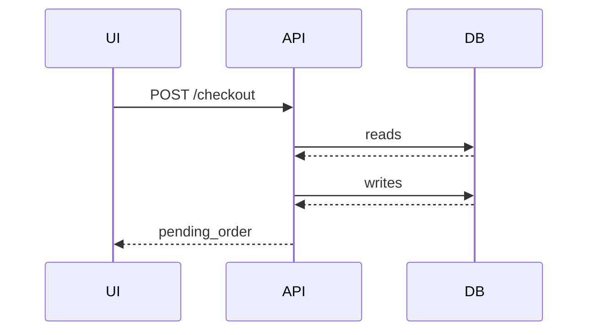
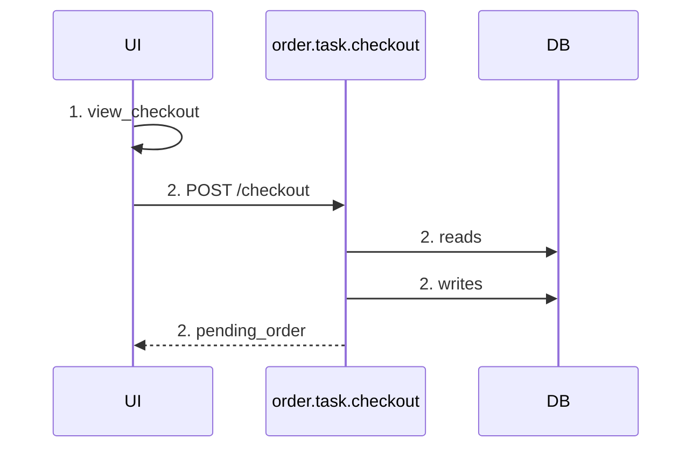
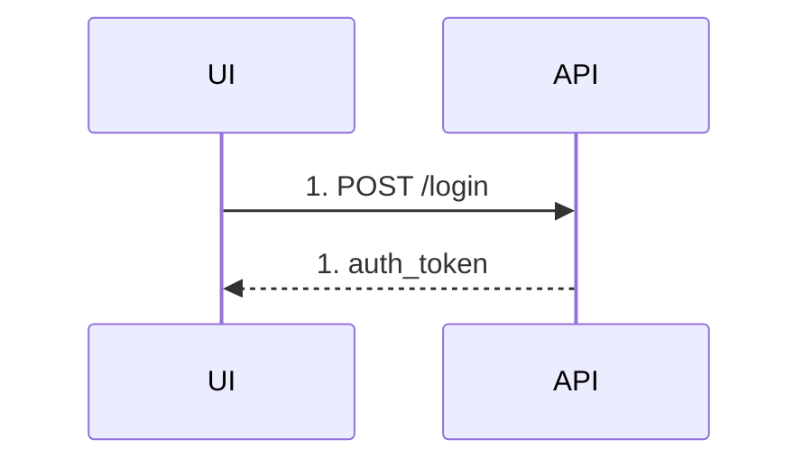
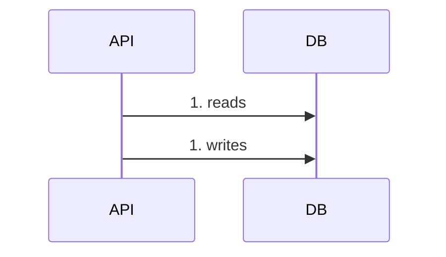

# 041: Sequence Diagram message rendering

- **status**: accepted
- **date**: 2026-04-25

## 背景

ADR-036でevent source別のSequence Diagram矢印ルールを定義し、ADR-037でactionなしtransitionをUI self-messageとして描画することを決めた。
また、ADR-038でtransition.actionが指すtaskファイル内のmain task + sub taskを辿り、DB操作tableに `step` / `task` / `sub_task` / `store` / `操作` を出力することを決めた。

一方で、Mermaid上のmessage labelとDB操作tableの対応関係には曖昧さが残っていた。



上記のようにDB操作の戻り矢印を出すと、実際には戻り値ラベルを持たない空messageが増える。
また、DB操作tableの `step` 列がシナリオ `steps:` のindexを示していても、Mermaid図上のmessage labelに同じindexが出ていなければ、図とtableの対応を追いにくい。

Mermaidの `autonumber` はmessage単位の連番であり、brewprintのシナリオ `steps:` のindexとは意味が異なる。
そのため、`autonumber` を使うと1つのscenario stepから複数messageが生成される場合に番号がずれる。

## 決定

### 1. message labelにscenario step indexを付与する

Sequence Diagram rendererは、すべてのmessage labelにシナリオ `steps:` の1-origin indexをprefixする。

形式は以下とする。

```text
{step_index}. {label}
```

例:



`step_index` は、シナリオYAMLの `steps:` 配列における1-origin indexである。
1つのscenario stepから複数messageが生成される場合、それらのmessageは同じ `step_index` を共有する。

### 2. Mermaid autonumberは使わない

step番号の付与はMermaidの `autonumber` ではなく、brewprint rendererの責務とする。



Mermaidの `autonumber` はmessage単位で連番を振るため、brewprintのscenario step indexとは一致しない。
そのため、Sequence Diagram rendererは明示的にlabel文字列へstep番号を埋め込む。

### 3. DBアクセスは片方向のみ描画する

DBアクセスは `API->>DB` の片方向messageのみ描画する。
`DB-->>API` の戻り矢印は描画しない。



DB操作の詳細はDB操作tableで確認する。
Mermaid図上では、DBアクセスが発生したことと操作種別（`reads` / `writes`）だけを示す。

### 4. UI / Actor へのAPI応答矢印は維持する

`source=ui` / `source=external` で `transition.action` がある場合、API応答矢印は引き続き描画する。
これはDB戻り矢印とは異なり、HTTP応答として意味を持つためである。


`returns` がない場合は、既存ルール通り `200 OK` をlabelに使う。

## 理由

### 図とDB操作tableの対応を追いやすくするため

DB操作tableの `step` 列は、scenario YAMLの `steps:` のindexを示す。
Mermaid図のmessage labelにも同じindexを出すことで、どのmessageがどのscenario stepから生成されたかをすぐに対応付けられる。

特に1つのstepから以下のように複数messageが生成される場合、同一indexを付与することでまとまりが見える。

- 起点message（UI→API / Actor→API / UI self-messageなど）
- task実行に伴うDB reads / writes
- API応答message

### Mermaid autonumberでは意味が合わないため

Mermaidの `autonumber` はmessage出現順の連番である。
一方でbrewprintが示したい番号は、scenario `steps:` のindexである。

例えば2つ目のscenario stepがAPI呼び出し・DB reads・DB writes・API応答を生成する場合、すべて `2.` と表示する必要がある。
`autonumber` ではこれを表現できない。

### DB戻り矢印の情報量が低いため

DBからAPIへの戻り矢印は、現行specではラベルを持たず、戻り値の型や内容も表現しない。
そのため空の `DB-->>API:` を描画しても、図の情報量は増えず線だけが増える。

DB操作の粒度や対象storeはDB操作tableで表現するため、Mermaid図では `API->>DB: reads` / `API->>DB: writes` の片方向messageに集約する。

### HTTP応答矢印とは意味が異なるため

UI / Actor への応答矢印は、外部境界に対するHTTP応答を示す。
これは空のDB戻り矢印とは異なり、API contractの一部である。
そのため `API-->>UI` / `API-->>Actor` は維持する。

## 影響

- `docs/spec/views/sequence-diagram.md` に以下を反映する
  - すべてのmessage labelに `{step_index}. {label}` を付与する
  - step番号はMermaid `autonumber` ではなくbrewprint rendererが付与する
  - DBアクセスは `API->>DB` の片方向のみ描画し、`DB-->>API` は出力しない
- UC-001 の `docs/render-seq.md` を更新する
  - `checkout_flow` のmessage labelに `1.` / `2.` を付与する
  - `payment_webhook_flow` のmessage labelに `1.` を付与する
  - DB戻り矢印を削除する
- Sequence Diagram renderer実装では、scenario step indexを保持したまま各messageを生成する必要がある

## Evidence
- commit: tbd
- impl commit: tbd
- 参考: 特になし
