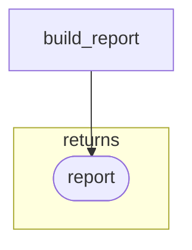
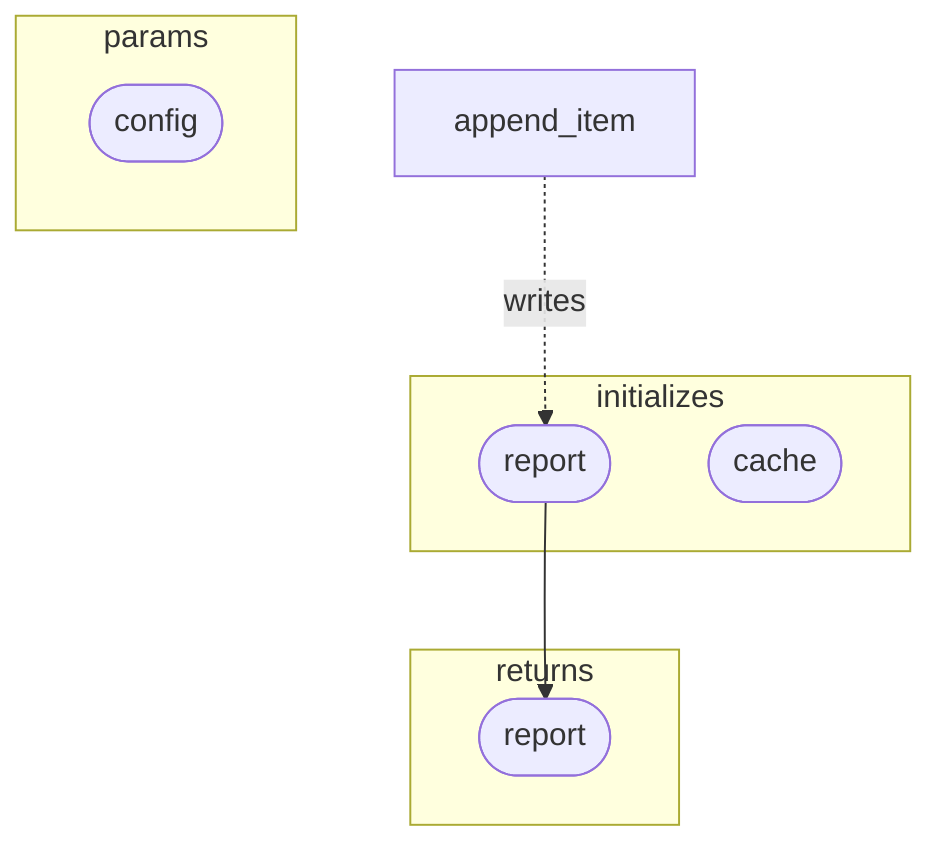

# 064: returns.source の DAG render ルール

- **status**: proposed
- **date**: 2026-05-05

> このADRは起票時点での決定を記録したスナップショットである。
> 現在の仕様は spec を参照すること。

## 背景

ADR-062 で `task.returns.source` が導入され、ADR-063 で initialized source も指定可能になった。
さらに ADR-063 では initialized source を flow 内部 wiring（step.params など）の bare token source としても参照可能とした。

これにより、DAG 上で表現すべき新しい source / edge 種別は以下のとおり拡張された。

`returns.source` から参照される source 種別:

1. node id / QualifiedID
2. collected asset source（`foreach.returns` 由来）
3. initialized source（`initializes[].name` 由来）
4. `$params.<name>`

flow 内部 wiring の bare token source 種別:

1. node id / QualifiedID
2. collected asset source（`foreach.returns` 由来）
3. initialized source（`initializes[].name` 由来）

ADR-024 で DAG render の境界ノード（`subgraph params` / `subgraph returns`）が定義されている。
しかし、`returns.source` および flow 内部 wiring からの initialized source 参照を Mermaid DAG 上でどう可視化するかは未定義である。

具体的には以下の論点がある。

- `returns.source` を source node から returns boundary node への edge として表現するか
- source 名と `returns.name` が同名の場合（例: `initializes[].name == returns.name`）、内部 source node と boundary return node の Mermaid ID 衝突をどう避けるか
- initialized source を DAG 上で可視化する場合、`subgraph initializes` のような boundary 表現を新設するか
- collected asset source を return として参照した場合、foreach 全体と returns boundary をどう接続するか
- flow 内部 wiring から initialized source を参照する edge は、cross-edge `writes` と視覚的にどう区別するか

ADR-062 / ADR-063 では DAG render ルールはスコープ外として保留された。
本ADRはこの未定義領域を扱う。

ただし本ADR起票時点では実装上の詳細検証が不足しており、確定 ADR として書ける状態にない。
論点を proposed として整理し、議論と実装試行を通じて確定させる。

## 検討論点

### 論点1: returns.source の edge 表現

`returns.source: <name>` を指定した場合、DAG 上で source node から returns boundary node へ edge を引くか否か。

#### 案1A: edge を引く

source node から `subgraph returns` 内の boundary node へ実線 edge を引く。
read/write の意図と区別するために専用の edge style（点線 / ラベル付きなど）を使うかは別検討。



メリット: data flow の終点が視覚的に明示される。
デメリット: edge 種類が増え、DAG が密になる。

#### 案1B: edge を引かず、boundary node のラベルだけで表現

`returns.source` を boundary node のメタ情報（tooltip / 補助ラベル）で表現する。

メリット: DAG が簡潔。
デメリット: source との接続が機械的に可視化されない。

#### 案1C: source 種別ごとに表現を変える

- node id 参照: source node から boundary node へ edge
- collected asset: foreach subgraph の境界から boundary node へ edge
- initialized source: initializes 表現と boundary node の接続
- `$params.<name>`: params boundary から returns boundary への edge

メリット: 各 source の意味を視覚的に区別できる。
デメリット: render 実装が複雑化する。

### 論点2: ID 衝突の回避

`returns.name` と source 名が同名のケースは現実に起こりうる。

```yaml
returns:
  name: report
  model: report
  source: report   # initialized source 名と同じ
```

このとき、Mermaid 内で以下の ID 衝突が起きる可能性がある。

- internal source node ID（例: `report` 自身を表すノード）
- returns boundary node ID（`subgraph returns` 内の `report` ノード）

ADR-024 では Start / End の ID を `_start` / `_end` とアンダースコアプレフィックスで衝突回避した先例がある。

#### 案2A: returns boundary node に prefix を付ける

例: `_ret_<name>` / `_returns_<name>`。

メリット: 単純で機械的に衝突回避できる。
デメリット: ラベル（人間向け表示）と ID（Mermaid 内部）が乖離する。ADR-024 の `_start` / `_end` と同方針なので一貫性はある。

#### 案2B: source 種別ごとに prefix を割り当てる

- collected asset source: `_col_<name>`
- initialized source: `_init_<name>`
- returns boundary: `_ret_<name>`
- params boundary: `_param_<name>`

メリット: ID から種別が判別できる。
デメリット: prefix 規則が増える。

#### 案2C: source と returns で同じ ID を使い、edge は subgraph 境界で表現

source node と returns boundary node を同一 Mermaid ID にし、render 時に subgraph 境界をまたぐ edge として描画する。

メリット: ID 衝突を構造的に回避。
デメリット: Mermaid の subgraph セマンティクスとの整合が要検証。同一 ID の node を複数 subgraph に置けない可能性が高く、実装上は破綻するおそれがある。

### 論点3: initialized source の DAG 表現

initialized source を DAG 上で可視化するか、するならどの形式か。

#### 案3A: `subgraph initializes` を新設

`subgraph params` / `subgraph returns` と同列の boundary 表現として `subgraph initializes` を導入する。
initialized store ノードをこの subgraph 内に配置し、cross-edge `writes` で flow 内 task と接続する。



メリット: task の境界（params / initializes / returns）が視覚的に揃う。設計上の3種の境界が一目で見える。
デメリット: DAG が縦に長くなる。既存 UC の見た目が変わる。

#### 案3B: 既存の store 表現に統合

initialized store を通常の store node と同じ形状で配置し、`subgraph` で囲まない。
ADR-014 の file-private 性は note / tooltip で補足する。

メリット: 既存 render との差分が小さい。
デメリット: file-private の境界感が見えにくい。

#### 案3C: returns.source から参照されている initialized source だけ可視化を強化

通常の initialized store は ADR-014 の file-private store として軽い表現で描き、`returns.source` から参照されているものだけ強調する（色を変える、boundary 寄りに配置するなど）。

メリット: return path が強調される。
デメリット: 同じ store でも参照の有無で表現が変わるのはノイズになりうる。

### 論点4: collected asset source を return する場合の edge 起点

`returns.source: <foreach_returns_name>` の場合、edge の起点をどこにするか。

- 案: foreach subgraph 全体の右端から returns boundary へ edge
- 案: foreach 内の最終 step から returns boundary へ edge（foreach が複数 step を内包する場合の挙動が複雑化）
- 案: collected asset を独立した node として subgraph 外に描き、そこから returns boundary へ edge

ADR-061 で foreach.returns は collected asset source として独立した名前を持つので、独立 node として描く案が概念的に整合的かもしれない。

### 論点5: $params.<name> を return する場合の edge

`returns.source: $params.<name>` は pass-through return である。
params boundary node から returns boundary node へ edge を直接引くか、間に identity を示す表現を挟むか。

メリット: pass-through であることが視覚的に明確。
デメリット: params と returns が直結する DAG は珍しいので、慣れるまで読みにくい可能性がある。

### 論点6: flow 内部 wiring から initialized source を参照する edge

ADR-063 で initialized source は flow 内部 wiring（step.params など）からも bare token で参照可能になった。
DAG 上では initialized store node から step node への edge として表現することになる。

このとき、cross-edge `writes`（store への副作用 edge）と視覚的にどう区別するかが問題になる。

#### 案6A: 通常の dataflow edge と同じ実線で描く

flow wiring としての参照なので、通常の step → step / step → assetと同じ実線 edge で描く。

メリット: dataflow としての意味が一貫する。
デメリット: cross-edge `writes`（破線等で描かれている既存表現）との対称性が崩れる場合がある。

#### 案6B: 専用 edge style を使う（点線 + label "init" など）

initialized source からの dataflow であることを edge style で明示する。

メリット: 通常の step output からの参照と区別しやすい。
デメリット: edge style がさらに増える。

#### 案6C: cross-edge `reads` 表現に統合する

ADR-014 / ADR-020 の系譜では initialized store の参照は `reads` cross-edge と概念的に近い。
flow wiring 参照を cross-edge `reads` 風の表現で描くこともありうる。

メリット: 既存の store access 表現と一貫する。
デメリット: ADR-063 で「flow wiring と cross-edge は分担する」と整理した役割分担が DAG 上でぼやける。

## 暫定方針

本ADRが accepted になるまでの間、DAG renderer は以下の暫定方針で動作する。

- `returns.source` は DAG 上に明示的な edge / boundary 表現を持たない
- `returns.name` / `returns.model` の boundary node 表現は ADR-024 通り維持する
- initialized source は既存通り file-private store として render する（案3B 寄り）
- flow 内部 wiring から initialized source を参照する edge は通常の dataflow edge として描く（案6A 寄り）

これは ADR-062 / ADR-063 が render について明示的に「未定義」としているためであり、暫定的な挙動であって確定仕様ではない。

## 進め方

1. UC-001 の `process_report` または同等の composite task で、initialized source / collected asset source / `$params` を `returns.source` に指定したサンプルを揃える
2. 各案について実際に Mermaid render して読みやすさを比較する
3. 比較結果をもとに本ADRを accepted に確定させる
4. 確定後、`docs/spec/views/dag.md` に反映する

確定までの間、本ADRは proposed のまま残し、暫定方針で実装は進める。

## 影響（accepted 後の見込み）

### 既存 spec への影響

- `docs/spec/views/dag.md` に `returns.source` の render ルール節を追加する
- ADR-024 のboundary node 章に initialized source の扱いを追記する可能性がある（採用案次第）

### 既存 ADR への影響

- ADR-024 は本ADRが accepted になった時点で「params / returns boundary」の概念を引き継ぎつつ補追される
- ADR-062 / ADR-063 の DAG render 未定義領域が確定する

### 既存実装への影響

- `internal/render/dag` に `returns.source` 解決と Mermaid edge 出力を追加する
- ID 採番ルール（採用案次第で `_ret_<name>` / `_init_<name>` 等の prefix 体系）を導入する
- collected asset source / initialized source の render 表現を追加する

### 既存 UC への影響

- UC-001 の DAG render が変更される可能性がある（採用案次第）
- golden test に登録された Mermaid 出力を更新する必要がある

## 関連 ADR

- ADR-024: DAG の境界ノード（params / returns subgraph）
- ADR-022: DAG ノード形状と色付け
- ADR-014: initializes フィールド
- ADR-020: cross-edge management
- ADR-061: foreach.returns collected asset
- ADR-062: task return source 明示化
- ADR-063: task return source への initialized source 追加

## Evidence

- commit: tbd
- impl commit: 該当なし（proposed 段階）
- 参考: OMG UML 2.x Activity Parameter Node、ADR-024 boundary subgraph
