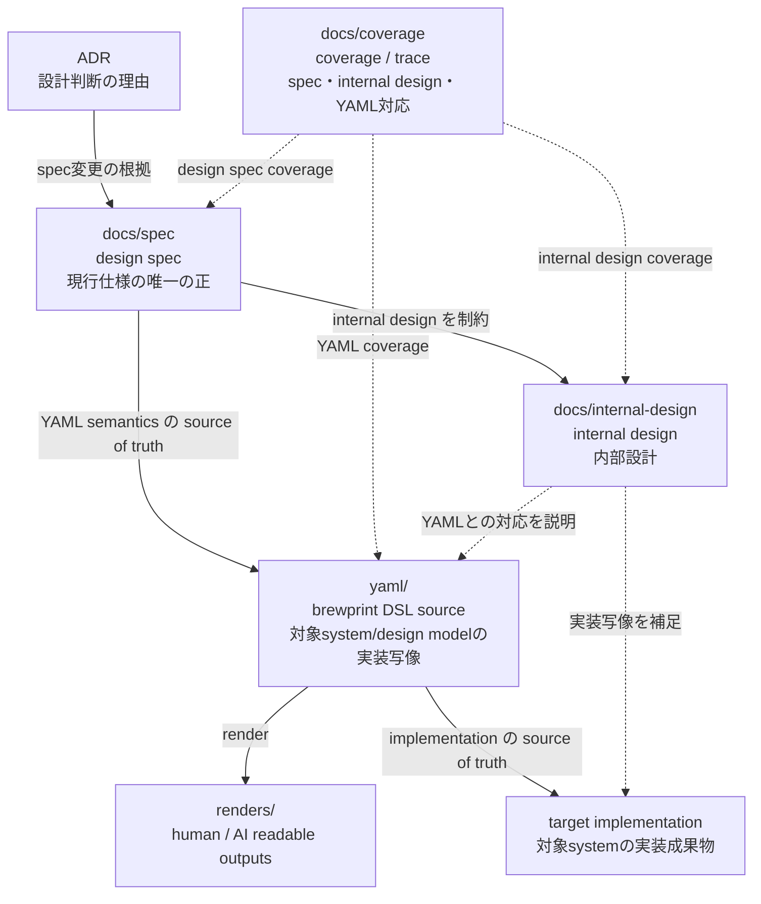
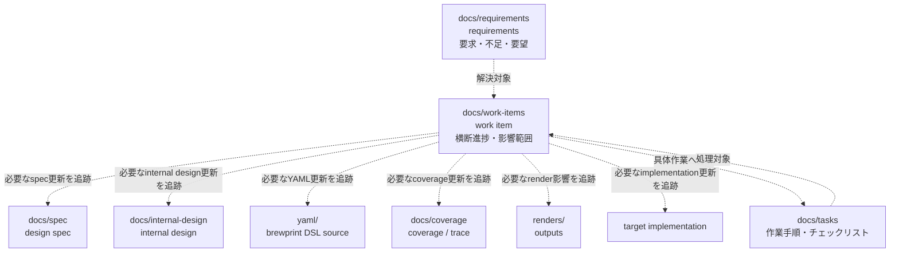
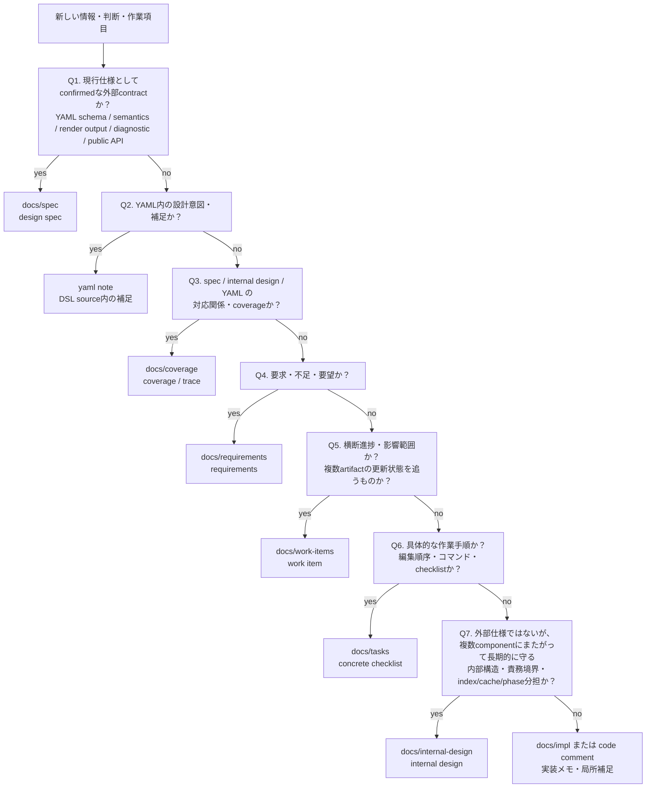

# 083: project artifact boundary と YAML as primary implementation source

- **status**: accepted
- **date**: 2026-05-16
- **depends_on**: ADR-050, ADR-068, ADR-082
- **supersedes**:
- **migrated_to_spec**:

> このADRは起票時点での決定を記録したスナップショットである。
> 現在の仕様は spec を参照すること。

## 背景

ADR-081 では `docs/requirements/` layer と spec traceability を導入する案を起票した。
ADR-082 では UC / fixture を golden fixture に限定し、self-hosting を requirements 側へ移す案を起票した。

その後の検討で、以下の用語と責務境界がまだ曖昧であることが分かった。

- `requirements` は system obligation を所有する仕様文書なのか、進捗・影響範囲を追う backlog なのか
- `spec` と `YAML` の間に中間 layer を置くべきなのか
- brewprint における `YAML` は実装成果物なのか、仕様の一部なのか
- implementation / internal design / task / requirements / work item / coverage の境界はどこか
- 対象 implementation は何を source of truth とすべきか
- internal design の各項目が YAML で cover されているかをどう追うか
- 追加要件や spec gap はどこに置くべきか
- 横断的な進捗管理と具体的な作業チェックリストをどう分けるか

特に重要なのは、brewprint project において `yaml/` が単なる中間文書ではなく、対象 system / design model の implementation source に相当する点である。

通常のソフトウェア開発において code が実装成果物であるのと同様に、brewprint においては YAML が brewprint DSL 上の実装成果物である。
したがって、YAML は spec と直接 link されるべきであり、spec と YAML の間に「仕様を代替する別の中間仕様」を置くと、spec-first の責務が曖昧になる。

一方で、YAML が実装の写像であるなら、対象 implementation が何を source of truth として実装されるべきかも明確にする必要がある。
設計仕様としての spec に、内部 component boundary、data structure、resolver順序、入出力境界、index構造などの implementation detail を混ぜると、spec の責務が濁る。

そのため、design spec と internal design を分離する。
ただし、internal design と YAML は主従関係にはしない。
どちらも design spec に従属し、internal design の各項目が YAML によって cover されているかは、外部の coverage / trace artifact で管理する。

加えて、進捗管理、影響範囲、追加要件、spec 反映待ち、YAML 更新待ち、internal design 更新待ち、implementation 更新待ちを追う layer も必要である。
それは現行仕様の source of truth ではなく、work item / backlog / traceability artifact として位置付ける必要がある。

ただし、追加要件そのものを置く場所、横断的な進捗を置く場所、具体的な作業手順を置く場所は分ける必要がある。
requirements が作業管理まで所有すると、requirements が task list 化し、何が要求で何が作業なのか分からなくなる。
そのため、requirements / work-items / tasks を分離する。

本ADRは、ADR-081 / ADR-082 の用語と責務境界を再検証するため、project artifact の関係と YAML の位置付けを明確化する。

## 決定

### 0. artifact 間の主従関係

本ADRで定める一般 brewprint project の source of truth / 成果物の主従関係は以下である。



この図における `target implementation` は、brewprint で記述される対象 project の実装成果物を指す。
brewprint 本体も、brewprint で記述される対象 project の一例である。
self-hosting 時は、`target implementation` に brewprint の Go implementation / renderer / validator / MCP server などが含まれる。
通常の brewprint project では、`target implementation` はその project の application code / system artifact を指す。

coverage は、design spec / internal design / YAML の対応関係を管理する外部 artifact であり、source of truth ではない。
YAML と internal design は主従関係ではない。
YAML は対象 system / design model の primary DSL source であり、target implementation の source of truth である。
internal design は、spec semantics と YAML model を target implementation へ写像するための wiring route を記録する一次設計 artifact である。
internal design は YAML の source of truth ではなく、target implementation の source of truth でもない。
YAML / spec / internal design の対応関係は、この coverage / trace artifact によって管理する。

fixture / golden は、brewprint 処理系や test harness の検証資産であり、一般 brewprint project の artifact 主従関係には含めない。
ここでいう fixture は入力 YAML、golden は期待 render / diagnostics 出力を指す。
つまり fixture / golden は「この YAML を brewprint で処理したら、この出力になる」ことを確認するための debug / regression test asset である。
fixture / golden の責務境界は ADR-082 で扱う。

requirements / work-items / tasks による管理関係は以下である。



実線は source of truth / 成果物の主従関係を表す。
点線は work item が所有する進捗・影響範囲 tracking を表す。
requirements は要求・不足・要望を所有し、work item はそれを完了させるための横断進捗を所有する。
tasks は具体的な作業手順・チェックリストを所有する。
requirements / work-items / tasks は、決定・仕様・実装内部仕様を所有しない。

### 1. YAML は brewprint project における primary implementation source とする

brewprint project において、`yaml/` は対象 system / design model を brewprint DSL で記述した primary DSL source であり、brewprint上の implementation source である。

YAML は brewprint DSL source として、対象 design model / target implementation への primary implementation source である。
ただし、複数 module / data structure / tool interface にまたがる実装上の wiring decision は YAML 本体には埋め込まず、internal design が記録する。
YAML schema 内で扱える局所的な実装意図・補足は、YAML 内の `note` で担う（artifact placement decision rule の Q2 参照）。
ここでいう primary implementation source は、対象 system / design model の brewprint DSL source という意味であり、brewprint 本体の Go implementation internal の source of truth ではない。

internal design は YAML の親ではない。
internal design は design spec を対象 implementation へ落とすための内部設計であり、YAML とは coverage / trace によって対応付ける。

```text
spec → yaml
spec → internal design
coverage: internal design ↔ yaml
```

YAML と spec の間に、仕様本文を代替する別の中間仕様 layer は置かない。

### 2. spec は internal design と YAML を制約する唯一の design spec である

YAML は ADR や requirements を source of truth として参照しない。
YAML authoring は現行 spec に従う。
internal design も現行 spec に従属する。

ADR は spec 変更の根拠であり、YAML の直接 source ではない。
requirements / backlog は進捗・影響範囲を追うための artifact であり、YAML の仕様 source ではない。

正しい関係は以下である。

```text
ADR → spec → yaml
ADR → spec → internal design
```

以下の関係は採用しない。

```text
ADR → yaml
requirements → yaml   # source of truth としては採用しない
ADR → yaml
```

ただし、requirements / backlog は「どの YAML を更新する必要があるか」を tracking してよい。

### 3. requirements は要求・不足・要望を所有する

ADR-081 で導入する `docs/requirements/` は、決定や現行仕様本文を所有しない。

requirements は、以下のような「何が必要か」を所有する。

- 追加要件
- user need
- self-hosting / fixture 作成中に見つかった不足
- editor / viewer / workflow 上の要望
- spec gap 候補
- 採用判断待ちの要求
- deferred / rejected された要求の履歴

requirements は、具体的な作業手順や layer 別進捗を所有しない。
requirements は「何が必要か」を所有するが、「どう処理するか」「どの artifact がどこまで更新済みか」は work item が所有する。
requirements は「何が正しい仕様か」を所有しない。

### 4. `docs/work-items/` を横断進捗管理 layer として導入する

`docs/work-items/` を導入する。

work item は、requirement / spec gap / design change を完了させるための横断管理単位である。

work item は source requirement を必ず持つ。
純粋なリファクタリング、bugfix、internal design 整理のような ADR を要さない変更も、実装側 requirement（あるべき状態と現状の乖離）として requirements layer で起票し、そこから work item を引く。
work item が requirement なしで自走することは認めない。

この制約は、明示的な手間（requirement 起票）を増やす代わりに、暗黙的な手間（後から経緯を再構築するコスト）を減らすトレードオフである。
人間も AI も、次回 project を開くときには前の文脈をほぼ忘れている。
1 人が広い範囲を担当する状況では、後続作業者（将来の自分・別の人間・AI agent）が trace を辿れる状態を維持することが、暗黙知に頼った運用より長期的に軽い。

work item は、以下のような layer 別の影響範囲と進捗を所有する。

- requirement
- ADR / decision
- design spec
- internal design
- YAML
- coverage / trace
- render output
- target implementation
- fixture / golden impact（該当する場合）
- verification

work item は具体的な作業手順を所有しない。
具体的な作業手順・コマンド・編集順序・チェックリストは `docs/tasks/` が所有する。

例:

```text
WORK-DAG-001:
  title: DAG asset TypeRef hint を導入する
  source_requirement: REQ-DAG-001
  status:
    decision: proposed
    design_spec: pending
    internal_design: pending
    yaml: pending
    implementation: pending
    fixture: pending
    verification: pending
```

work item は「この変更全体がどこまで進んだか」を表す。
task は「次に何を実行するか」を表す。

### 5. requirements と work items は status の意味を分ける

requirements の status は、要求そのものの扱いを表す。

| requirement status | 意味 |
|---|---|
| `captured` | 要求・不足・要望として捕捉済み |
| `decision_needed` | 採用可否や設計判断が必要 |
| `accepted` | 要求として採用する |
| `deferred` | 要求としては認識するが後回し |
| `rejected` | 採用しない |

work item の status は、layer 別の処理状態を表す。

| work item status | 意味 |
|---|---|
| `not_started` | 未着手 |
| `decision_pending` | ADR 等の設計判断待ち |
| `design_spec_pending` | design spec 反映待ち |
| `internal_design_pending` | internal design 反映待ち |
| `yaml_pending` | YAML 更新待ち |
| `implementation_pending` | implementation / renderer / validator / MCP 更新待ち |
| `fixture_pending` | fixture / golden 更新待ち |
| `verification_pending` | 検証待ち |
| `done` | 必要な反映・検証が完了 |
| `blocked` | 依存判断・外部要因で停止中 |

requirement.status と work_item.status は独立に動く。
例えば、`accepted` な requirement に対応する work item が `yaml_pending` のままである状態は正常である。
ある要求が brewprint project 上で実現されたとみなせるのは、対応する work item(s) が `done` に到達した時点である。

requirement.status が deferred / rejected に変わっても、過去の work item status を機械的に巻き戻さない。
work item status は、その work item 自体の作業状態を表す。

requirements の status と work item の status は混ぜない。
requirements は要求の採否を表し、work item は要求や変更を完了させるための進捗を表す。

### 6. `docs/internal-design/` を internal design layer として導入する

brewprint project layout に、internal design を置く場所として `docs/internal-design/` を導入する。

internal design は、YAML と spec の対応や、YAMLで表現された設計モデルを対象 implementation へ写す際の component / boundary / data structure / tool interface 上の補足を記録する。

internal design が扱うものの例:

- parser / rawyaml reader の責務
- semantic model の内部表現
- resolver の名前解決順序
- validator / diagnostic emitter の責務境界
- render output を生成するための入力 object と出力生成方針
- query layer / indexer / tool interface の内部構造
- cache / index / lookup table の所有者
- test harness / fixture comparison の実装方針

internal design は design spec を上書きしない。
internal design は YAML の source of truth ではなく、target implementation の source of truth でもない。

一方で internal design は、単なる補足メモではない。
internal design は、spec semantics と YAML model を target implementation へ写像するための wiring route を記録する一次設計 artifact である。
1 つの spec section が複数の implementation module / data structure / tool interface で担保される多対多 mapping を説明し、影響範囲調査の起点となる。

正しい関係は以下である。

```text
spec → yaml → target implementation
spec → internal design
coverage: internal design ↔ yaml
```

YAML author / design model は spec に従う。
target implementation は YAML に従う。
internal design は、YAML と spec の対応、および YAML から target implementation への写像を wiring story として記録する。
ただし internal design は spec / YAML に反してはならない。

internal design document の分割単位は、人間がレビュー可能な認知単位とする。
spec document の構造と相似形にすることは推奨されるが、強制しない。
複数 spec section / 複数 module にまたがる wiring story は、単一の internal design topic として扱ってよい。
physical layout は project 規模に応じて変更可能であり、trace は semantic ref によって維持する（trace layer common principle 参照）。

### 7. `docs/coverage/` を spec / internal design / YAML の対応管理として導入する

`docs/coverage/` を導入する。

coverage は、design spec、internal design、YAML の対応関係を管理する project-level trace artifact である。
coverage は source of truth ではない。
coverage は semantic ref 間の relation graph であり、path list ではない。

coverage が所有する情報は以下である。

- spec semantic ref
- internal-design semantic ref
- YAML semantic ref / fixture ref
- relation type
- optional note / rationale

coverage の保存形式は YAML / JSON / front matter 等で実装してよい。
ただし、その物理構造は外部 contract ではない。
Markdown table は generated / human-readable view として扱い、source of truth にはしない。

coverage が答える問い:

- この design spec は、どの YAML で表現されているか
- この internal design は、どの YAML で cover されているか
- この YAML は、どの design spec / internal design を cover しているか
- internal design の変更時、どの YAML を compile / validate / render すべきか

本ADRの `docs/coverage/` は project-level trace coverage である。
既存の `docs/uc/**/docs/coverage.md` は fixture-local coverage として扱い、本ADRだけでは移動しない。
MCP response の `coverage` は API response field であり、docs artifact としての coverage とは別概念である。

coverage は YAML 本体に埋め込まない。
YAML は primary implementation source として保ち、coverage / trace metadata は外部 artifact に置く。

semantic ref の具体 schema、relation type の vocabulary、MCP query 形式は後続 spec / ADR で定義する。

### 8. trace layer common principle: semantic ref を primary key とする

brewprint project における trace layer は、physical path ではなく semantic ref を primary key として扱う。

対象には、少なくとも以下を含む。

- spec semantic ref
- requirement ID
- internal-design semantic ref
- YAML semantic ref / fixture ref
- coverage mapping ID

physical path、Markdown heading、directory layout、file split / merge は、semantic ref を解決するための implementation detail である。
file rename、document split、document merge、section move が発生しても、semantic ref が同一概念を指す限り trace は維持されるべきである。

MCP の外部 contract は、coverage YAML や front matter の物理構造ではなく、semantic query interface である。
coverage YAML / front matter / index file は、その semantic query interface を実現するための内部表現として扱う。

semantic ref の具体 schema、relation type の vocabulary、redirect / superseded mapping、MCP response format は後続 spec / ADR で定義する。

### 9. tasks は concrete checklist を所有する

`docs/tasks/` は、work item を実行するための具体的な作業手順を所有する。

タスクが所有するもの:

- 編集対象ファイル
- 実行コマンド
- 作業順序
- チェックリスト
- milestone 内の完了条件
- migration 手順

タスクは requirement や work item の代替ではない。
タスクは、work item を具体的な実行手順へ分解する。

### 10. `docs/impl/` は実装メモ・引き継ぎを所有する

既存の `docs/impl/` は、implementation note / handoff / review / migration memo / 実装後 summary の置き場として扱う。

`docs/impl/` は長期的な design authority ではない。
長期的に維持すべき内部構造・責務境界・index/cache所有・phase分担は `docs/internal-design/` が所有する。

`docs/impl/` は、実装作業中または実装後に、後続作業者やAI agentへ状況を引き継ぐための記録を所有する。

### 11. artifact placement decision rule

新しい情報・判断・要望・作業項目が出た場合、以下の順で置き場所を判定する。



判定基準は以下とする。

1. 現行仕様として confirmed な外部contract は `docs/spec/` が所有する。YAML schema、YAML semantics、render output、diagnostic code / condition、public MCP / API contract は spec に置く。未採用の要求・不足・要望は、外から観測できる期待であっても spec ではなく requirements に置く。
2. YAML内の設計意図や補足は YAML の `note` に置く。
3. spec / internal design / YAML の対応関係、どの YAML がどの仕様を cover するかは `docs/coverage/` に置く。
4. 要求・不足・要望は `docs/requirements/` に置く。
5. 複数 artifact にまたがる横断進捗・影響範囲は `docs/work-items/` に置く。
6. 具体的な作業手順、編集順序、コマンド、チェックリストは `docs/tasks/` に置く。
7. 外部仕様ではないが、複数 implementation component にまたがって長期的に維持すべき内部構造・責務境界・index/cache所有・phase分担は `docs/internal-design/` に置く。公開挙動として観測される limitation、diagnostic behavior、response field、tool guarantee は spec に残す。component ownership、internal phase ordering、cache / index ownership、raw decode structs、resolver implementation order は internal design に置く。
8. 上記に該当しない局所的な実装メモは `docs/impl/` または code comment に置く。`docs/impl/` は handoff / review / migration memo の置き場であり、長期的な design authority ではない。

internal design は、外部仕様ではないが task や code comment に置くには長期性・横断性が高い内部設計判断がある場合にのみ使う。
以下は internal design の対象ではない。

- YAML schema / semantics
- render output rule
- diagnostic code / condition
- spec / YAML / internal design coverage
- YAML note
- task checklist

### 12. ADR-081 / ADR-082 は本ADRを踏まえて再レビューする

ADR-081 / ADR-082 は、本ADRの用語整理を踏まえて再レビューする。

特に ADR-081 は以下の点を修正対象とする可能性がある。

- `requirements` を system obligation 文書として表現している箇所を、要求・不足・要望の layer へ寄せる
- 横断進捗管理は `docs/work-items/` に分離する
- `obligations` という field 候補を再検討する
- `confirmed requirement` のような仕様文書に見える用語を避ける
- YAML が spec に従う primary implementation source であることを明示する
- implementation-facing document を requirements layer 内の補助文書ではなく、`docs/internal-design/` の internal design として分離する
- internal design と YAML の対応は `docs/coverage/` で管理する

ADR-082 は以下の点を再確認する。

- fixture は requirements を所有しない
- fixture は YAML と expected render / diagnostics を所有する
- self-hosting は requirement backlog / work item 群として requirements 側に移す

## 理由

### なぜ YAML を implementation source とするか

brewprint において、YAML は単なる説明文書ではない。
YAML は brewprint DSL で対象 system / design model を定義する source artifact である。

そのため、YAML は spec から直接導かれる実装成果物として扱う方が自然である。
YAML と spec の間に中間仕様を置くと、YAML が何に従うべきかが曖昧になる。

### なぜ requirements を仕様文書にしないか

requirements が仕様本文や決定を持つと、spec と二重管理になる。
これにより、spec-first の原則が形骸化する。

requirements は、要求・不足・要望を所有する artifact として扱う方が安全である。
それを処理する横断進捗は work item が所有し、具体作業は task が所有する。

### なぜ work item layer が必要か

spec / implementation spec / YAML の主従関係を定めるだけでは、追加要件、spec gap、実装待ち、render影響、影響範囲を管理できない。

複雑な project では、変更すべき spec / implementation spec / YAML / render output / target implementation が複数にまたがる。
この処理状態を task file や会話ログだけに置くと、後から追跡できなくなる。

一方で、requirements に進捗管理まで持たせると、requirements が task list 化する。
そのため、requirements と tasks の間に work item layer を置き、横断進捗と影響範囲を所有させる。

### なぜ artifact placement decision rule が必要か

requirements / work-items / tasks / coverage / internal design は、いずれも仕様本文ではないが、近い領域を扱う。
置き場所の判定基準がないと、requirements が task list 化したり、coverage が仕様本文化したり、internal design が何でも置き場になったりする。

そのため、本ADRでは artifact ごとの責務だけでなく、新しい情報が出たときの placement decision rule も定義する。

### なぜ internal design を導入するか

spec は design spec として、YAML language、render output、MCP public contract、diagnostic behavior など、外から見える正しさを所有する。

一方で、implementation は internal data structure、resolver order、component boundary、index ownership、input/output boundary など、外部仕様とは別の内部構造を必要とする。
これらを design spec に混ぜると、spec が「ユーザーが従う現行仕様」なのか「implementation internal contract」なのか曖昧になる。

そのため、internal design を独立させる。
ただし、internal design は target implementation の primary source of truth ではない。
target implementation の primary DSL source は YAML であり、internal design は YAML 本体に埋め込めない wiring route（複数 module にまたがる対応・責務境界・index/cache所有・phase分担）と長期設計判断を所有する。
internal design は design spec と YAML に従属し、それらを上書きしない。
YAML との対応は coverage / trace で管理する。

## 却下した代替案

### 代替案A: requirements を system obligation spec として扱う

- 利点: 実装が満たすべき要求を明確に書ける
- 欠点: spec と二重管理になり、現行仕様の source of truth が曖昧になる

→ 却下。requirements は仕様本文ではなく、要求・不足・要望を所有する。

### 代替案B: spec と YAML の間に requirements layer または internal design layer を置く

- 利点: 実装前に細かい要求や内部仕様を整理できる
- 欠点: YAML がどの仕様に従うべきか曖昧になる。YAML が primary implementation source であるという brewprint の中心が弱まる

→ 却下。YAML は spec に従う。internal design は YAML の親ではなく、coverage / trace によって YAML と対応付ける。requirements は source of truth にはしない。

### 代替案C: progress / impact tracking を task file だけで行う

- 利点: 既存 task 運用に乗せられる
- 欠点: task file は作業順序・チェックリストであり、長期的な影響範囲 tracking には弱い

→ 却下。work item が横断進捗と影響範囲の一次情報を持つ。

### 代替案D: internal design を導入せず requirements だけで implementation impact を追う

- 利点: artifact layer を増やさずに済む
- 欠点: YAML を target implementation へ写す際の内部補足が task / impl summary / code に散る。design spec に implementation detail が混ざりやすい

→ 却下。internal design layer を導入し、requirements は進捗・影響範囲を追う work item layer に限定する。ただし internal design は target implementation の primary source of truth ではなく、複数 module にまたがる wiring route と長期設計判断を所有する。

## 影響

### ADR-081 への影響

ADR-081 は、本ADRを踏まえて accepted 前に revision する必要がある。
特に `requirements` を system obligation 文書として表現している箇所、`obligations` field、implementation-facing document の位置付けを見直す必要がある。
implementation-facing document は requirements layer 内ではなく、`docs/internal-design/` の internal design として扱う。
internal design と YAML の対応は `docs/coverage/` に分離する。
また、横断進捗管理は `docs/work-items/` に分離する。

ADR-081 の `requirements` を system obligation として扱う表現、`requirements → implementation / yaml / fixture` に見える関係、requirements 内の implementation-facing document、`confirmed requirement` などの用語は、本ADRにより refine / replace される。

### ADR-082 への影響

ADR-082 の方向性（self-hosting を fixture から requirement 側へ移す、editor / viewer notes を分離する）は維持される。
ただし ADR-082 §7 の「現在の内容 → 移動先」テーブルは、本ADRの placement rule に従って再生成する必要がある。
具体的には、self-hosting の内容は requirements（要求）、internal design（内部設計）、work-items（横断進捗）、tasks（作業手順）に分散して移動する。
`docs/requirements/self-hosting/` 一箇所に集約する形ではなくなる。

fixture / golden は一般 project の source-of-truth chain には含めないが、work item は fixture / golden impact を追跡してよい。fixture / golden の責務境界は ADR-082 が所有する。

### doc-policy / authoring-guide への影響

`docs/doc-policy.md` の「YAMLは中間表現にすぎない」という記述は、本ADR accepted 後に更新する必要がある。
YAML は対象 system / design model の primary DSL source であり、brewprint 本体 Go implementation internal の source of truth ではない、という限定付き表現へ改める。

requirements の責務は、決定・仕様・work item・task checklist のいずれとも異なる。
work item は requirements と tasks の間にある横断進捗管理 artifact として定義する必要がある。
また、internal design は design spec とも impl summary とも異なる artifact として定義する必要がある。
coverage は design spec / internal design / YAML の対応関係を持つ artifact として定義する必要がある。
accepted 後は `docs/doc-policy.md` と `docs/adr-authoring-guide.md` の責務表へ反映する必要がある。

### Design Records MCP への影響

requirements を index する場合、`kind: requirement` は specification record ではなく要求 record として扱う必要がある。
work item を index する場合は、`kind: work_item` のような別種別として扱う必要がある。
internal design を index する場合は、design spec とは別 kind として扱う必要がある。
coverage を index する場合は、spec / internal design / YAML の対応関係として扱う必要がある。
requirements と work items は status 体系も異なる。

## Evidence

- commit: a80ec7b
- impl commit: tbd
- 参考: ADR-050 spec-first documentation policy, ADR-068 ADR authoring guide, ADR-081 project requirement layer と spec traceability, ADR-082 golden fixture と self-hosting requirement の責務境界
