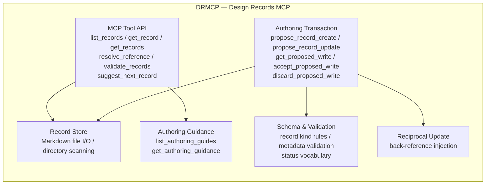
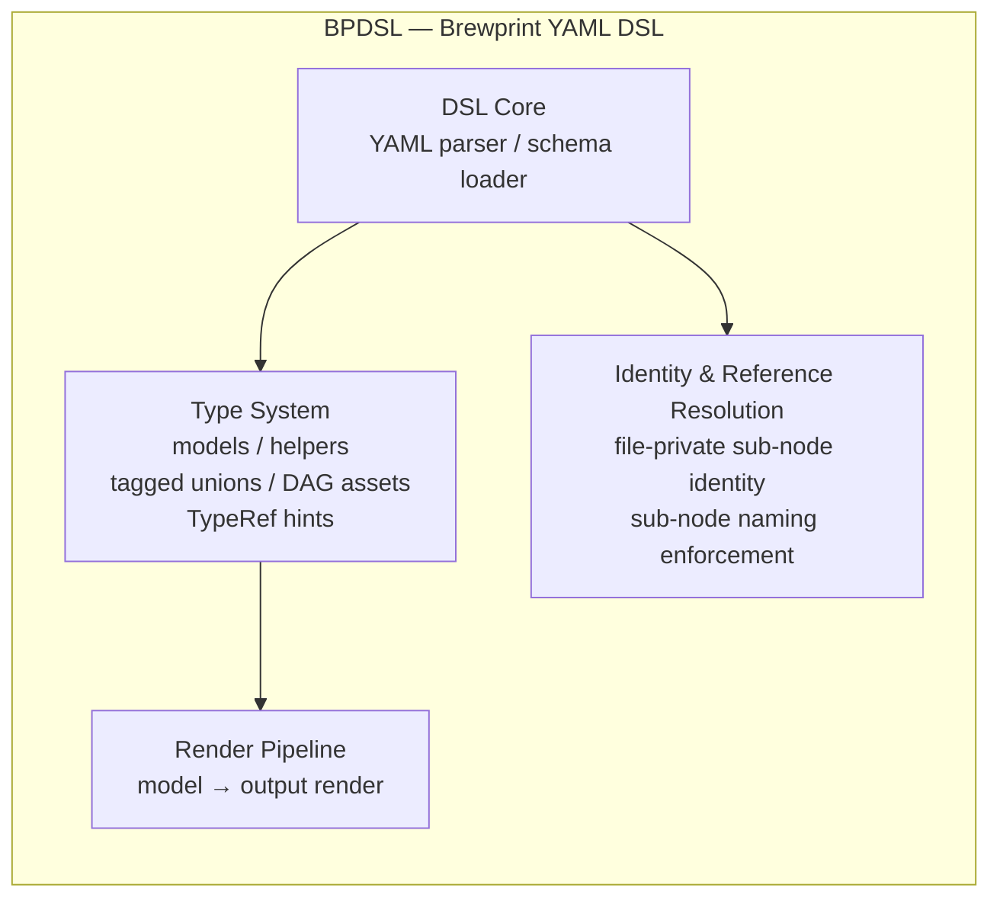

# Namespace model

## 目的

brewprint は複数の独立したアプリケーション群を内包するパッケージとして成長した。本 spec は app namespace と domain namespace の2軸を明示的に分離したモデルを定義し、v2 artifact ID grammar・namespace catalog・将来の namespace-first layout migration の前提条件を提供する。

## この spec が所有するもの / 所有しないもの

所有するもの:

- app namespace と domain namespace の定義
- 各 app namespace のアーキテクチャ概観と domain namespace 割り当て
- 既存 artifact の namespace 帰属方針

所有しないもの:

- 機械可読な namespace registry の formal schema・ファイル形式・物理配置への変換実装
- 機械可読な namespace registry の formal schema・ファイル形式・物理配置
- namespace-aware MCP API の実装仕様
- 物理 directory レイアウトの移行計画
- subdomain モデルの定義（REQ-PRODUCT-002 で追跡）

## 現在の配置と将来の運用配置

本 spec は `docs/spec/concepts/` に置かれた人間可読の概念定義であり、将来の機械可読 namespace registry とは別物である。

将来の運用配置イメージ:

- 近い将来: `docs/` 直下に formal schema と namespace 定義ファイルを置き、MCP が機械的に読んで app / domain を解決できるようにする
- 将来: 各 app フォルダ直下に namespace 宣言ファイルを置く形式（app-local namespace declaration）

この formal schema と配置の定義は本 spec のスコープ外であり、別途要件・仕様として扱う。

## App namespace と domain namespace

**app namespace** はアプリケーション、サブシステム、または cross-application の製品スコープを識別する。

**domain namespace** は app namespace 内の関心領域を識別する。

| 軸 | 例 | 役割 |
|---|---|---|
| app namespace | `DRMCP` / `BPDSL` / `PRODUCT` | 所有アプリ・製品スコープを識別 |
| domain namespace | `MCP` / `DATA` / `RESOLVE` | app 内の関心領域を識別 |

現行の artifact ID（`REQ-MCP-*` / `WORK-DATA-*`）は app namespace が存在しなかった時代の domain-first ID である。これらの帰属方針は [既存 artifact の namespace 帰属](#existing-artifact-ownership) を参照。

## App namespace definitions

brewprint は現在 3 つの app namespace を持つ。

| app namespace | 正式名 | 性質 |
|---|---|---|
| `DRMCP` | Design Records MCP | 設計記録管理 MCP サーバー |
| `BPDSL` | Brewprint YAML DSL | brewprint 設計記述 DSL |
| `PRODUCT` | Product-wide / cross-app | cross-app ポリシー・ガバナンス |

`DRUI`（Design Records UI）は将来の候補であり、BPDSL が運用可能になった後に評価する。現時点では app namespace として確定しない。

## DRMCP

### アーキテクチャ

Design Records MCP は、brewprint の設計記録（ADR / spec / INV / REQ / WORK / TASK）を管理する MCP サーバーである。LLM クライアントに対して、設計記録の探索・取得・起票・更新・検証ツールを提供する。



### Domain namespaces

| domain namespace | 関心領域 | 代表 artifact |
|---|---|---|
| `MCP` | MCP ツール API・authoring transaction・schema・validation の全体 | REQ-MCP-\* / WORK-MCP-\* |

現時点では `MCP` 単一の domain namespace として運用する。artifact 数の増加に伴い、将来 `AUTHORING` / `SCHEMA` / `TOOLS` 等の subdomain への分割を検討する（REQ-PRODUCT-002）。

## BPDSL

### アーキテクチャ

Brewprint YAML DSL は、brewprint の設計モデルを YAML で記述するための DSL である。型システム・identity 解決・レンダリング、および DSL 自身の自己記述（self-hosting）レイヤーを持つ。



### Domain namespaces

| domain namespace | 関心領域 | 代表 artifact |
|---|---|---|
| `DATA` | データモデル・型システム・レンダリング | REQ-DATA-\* / WORK-DATA-\* |
| `RESOLVE` | identity 解決・file-private sub-node 強制 | REQ-RESOLVE-\* / WORK-RESOLVE-\* |

## PRODUCT

### 性質

`PRODUCT` は実行時コンポーネントを持つアプリケーションではなく、cross-application ポリシー・ガバナンス・migration を扱う製品レベルの名前空間である。

担当領域:

- 複数 app namespace をまたぐ要件・判断・ポリシー
- namespace model 自体の定義と維持（本 spec）
- 将来の major-version migration ポリシー
- cross-app governance ルール

### Domain namespaces

| domain namespace | 関心領域 | 代表 artifact |
|---|---|---|
| `NAMESPACE` | namespace model・catalog・v2 ID grammar | REQ-PRODUCT-001 / WORK-PRODUCT-001 |
| `GOVERNANCE` | cross-app ガバナンスルール（将来） | — |
| `MIGRATION` | major-version migration ポリシー（将来） | — |

## Domain namespace catalog

### Canonical domain namespaces

| app namespace | domain namespace | 関心領域 |
|---|---|---|
| `DRMCP` | `MCP` | Design Records MCP の全ツール・authoring・schema・validation |
| `BPDSL` | `DATA` | データモデル・型システム・レンダリング |
| `BPDSL` | `RESOLVE` | identity 解決・sub-node identity 強制 |
| `PRODUCT` | `NAMESPACE` | namespace model・catalog・v2 ID grammar |
| `PRODUCT` | `GOVERNANCE` | cross-app ガバナンス（将来） |
| `PRODUCT` | `MIGRATION` | migration ポリシー（将来） |

### Existing prefixes outside the canonical catalog

canonical domain namespace には属さないが、既存 artifact のプレフィックスとして使われているもの。

| prefix | 既存 artifact | 性質 |
|---|---|---|
| `SELFHOST` | REQ-SELFHOST-\* / WORK-SELFHOST-\* | cross-app 検証活動。特定 app の domain ではなく、任意 app に適用できる dogfooding / verification の試み。将来 DRMCP 等にも適用予定 |

## v2 artifact ID grammar and mapping rule

### Grammar

新規 artifact の ID 形式は以下とする。

**REQ / WORK / INV:**

```
<APP_NAMESPACE>-<ARTIFACT_KIND>-<DOMAIN_NAMESPACE>-<SEQUENCE>
```

例: `DRMCP-REQ-MCP-033`, `BPDSL-WORK-DATA-016`, `PRODUCT-REQ-NAMESPACE-003`

> **Note**: ここで示す domain namespace トークン（`MCP`, `DATA`, `NAMESPACE` 等）は例示である。各 app namespace の domain namespace 詳細分類、および将来の subdomain モデルは REQ-PRODUCT-002 で定義する。

**TASK:**

```
<APP_NAMESPACE>-TASK-<DOMAIN_NAMESPACE>-<WORK_SEQUENCE>-<TASK_SEQUENCE>
```

例: `BPDSL-TASK-DATA-016-01`, `PRODUCT-TASK-NAMESPACE-002-01`

**ADR:**

ADR は現行の sequential format（`ADR-NNN`）を維持する。ADR は設計判断の時系列記録であり、domain 帰属よりも全体の順序参照が優先される。app-specific な ADR を分離する必要が生じた場合は別途 ADR で判断する。

### Sequence format

| artifact | sequence format | 例 |
|---|---|---|
| REQ / WORK / INV | 3桁ゼロパディング | `001`, `016` |
| TASK WORK_SEQUENCE | 親 WORK の 3桁番号を継承 | `016` |
| TASK TASK_SEQUENCE | 2桁ゼロパディング | `01`, `12` |

### Mapping rule from existing IDs

既存の domain-first IDs から v2 namespace-aware IDs への論理マッピング規則。

ADR-096 の決定に従い、既存 artifact の ID 変更は実施しない。この規則は UI / MCP でのグルーピング・表示・帰属解決のための参照規則として使う。

| 既存 domain prefix | app namespace | 変換規則 | 例 |
|---|---|---|---|
| `MCP` | `DRMCP` | `DRMCP-` を先頭に付加 | `REQ-MCP-013` → `DRMCP-REQ-MCP-013` |
| `DATA` | `BPDSL` | `BPDSL-` を先頭に付加 | `WORK-DATA-009` → `BPDSL-WORK-DATA-009` |
| `RESOLVE` | `BPDSL` | `BPDSL-` を先頭に付加 | `REQ-RESOLVE-001` → `BPDSL-REQ-RESOLVE-001` |

#### PRODUCT prefix の扱い

現行の `REQ-PRODUCT-NNN` / `WORK-PRODUCT-NNN` / `TASK-PRODUCT-NNN-NN` は、`PRODUCT` を domain identifier として使った移行期の形式である。

v2 完全形では domain namespace を明示する:

| 現行形式 | v2 完全形 | 備考 |
|---|---|---|
| `REQ-PRODUCT-001` | `PRODUCT-REQ-NAMESPACE-001` | namespace model 要件 |
| `WORK-PRODUCT-001` | `PRODUCT-WORK-NAMESPACE-001` | namespace model 作業 |
| `TASK-PRODUCT-001-01` | `PRODUCT-TASK-NAMESPACE-001-01` | namespace model タスク |

既存の `REQ-PRODUCT-*` / `WORK-PRODUCT-*` / `TASK-PRODUCT-*` は migration しない。新規 PRODUCT-level artifact は、機械可読 namespace registry が整備され MCP が v2 ID を native に解決できるようになった時点で完全 v2 形式への移行を判断する。それまでの間は現行形式（`PRODUCT` を domain prefix として使う）を継続する。

## Existing artifact ownership

ADR-096 の決定に従い、既存の全 artifact は `PRODUCT` namespace が所有するものとして扱う。per-app namespace への振り分け migration は実施しない。

| 既存 ID prefix | 実質的帰属 app | 備考 |
|---|---|---|
| `REQ-MCP-*` / `WORK-MCP-*` / `TASK-MCP-*` | DRMCP | 単一 app 時代の artifact |
| `REQ-DATA-*` / `WORK-DATA-*` / `TASK-DATA-*` | BPDSL | 単一 app 時代の artifact |
| `REQ-RESOLVE-*` / `WORK-RESOLVE-*` | BPDSL | 単一 app 時代の artifact |
| `REQ-SELFHOST-*` / `WORK-SELFHOST-*` | cross-app 検証活動 | self-hosting は特定 app の domain ではなく、任意 app に適用できる検証活動 |

新規 artifact は帰属 app namespace が確定している場合は `<APP_NAMESPACE>-...` 形式、cross-app または帰属不明な場合は `PRODUCT` namespace を使う。v2 ID grammar の詳細は TASK-PRODUCT-001-03 で追加する。

## 由来

- ADR-095: YAML DSL と Design Records MCP の結合境界
- ADR-096: 既存 artifact の PRODUCT namespace 所有と per-app migration 非実施
- REQ-PRODUCT-001: App and domain namespace model for namespace-first design records
