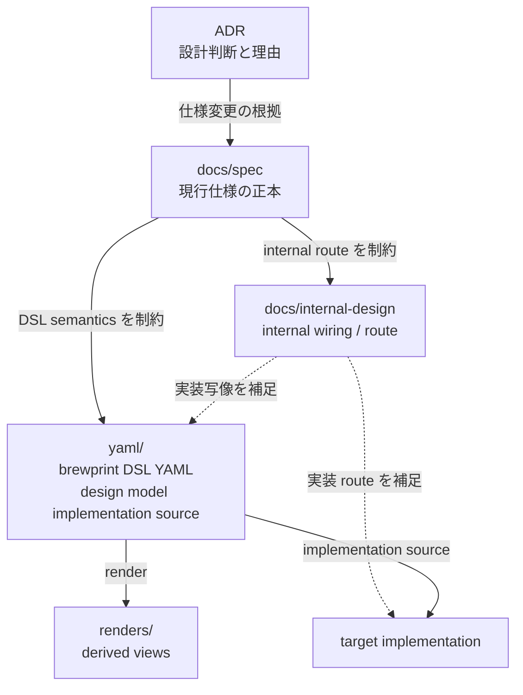
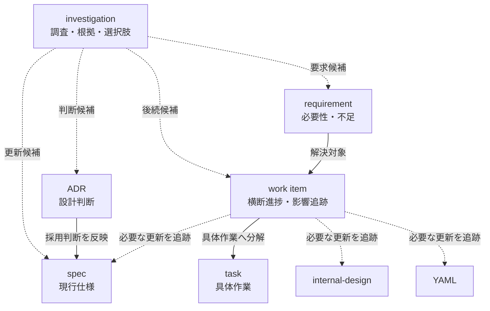
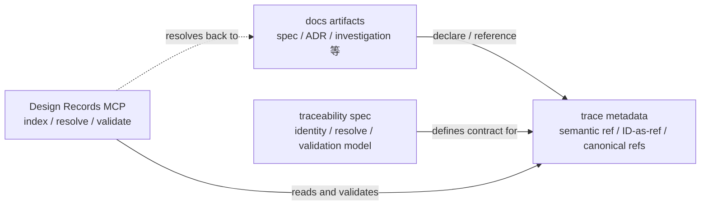

# Project artifact model

## 目的

この concept spec は、brewprint project にどのような artifact が存在し、それぞれが何を所有し、相互にどのような意味関係を持つかを定義する。

この document は、個別 artifact の書式を網羅するためのものではない。artifact system 全体の地図として、次を判断できる状態にする。

- ある情報をどの artifact に置くべきか
- ある変更がどの artifact / layer に影響しうるか
- semantic trace が何を結び、何を結ばないか
- Design Records MCP が artifact system 上でどの責務を担うか

## この concept が所有するもの / 所有しないもの

この concept が所有するもの:

- artifact layer の種類と責務境界
- artifact 間の意味関係と source of truth boundary
- design flow / change flow / traceability flow の全体像
- traceability spec、Design Records MCP spec、各 authoring README の位置付け

この concept が所有しないもの:

- front matter / bullet metadata の完全 schema
- semantic ref grammar、coverage mapping schema、resolver / validation rule の詳細
- MCP request / response schema と diagnostic category の詳細
- 各 artifact の authoring template、file naming、lifecycle 運用手順の詳細
- milestone checklist、implementation follow-up、migration 状態

詳細 contract と authoring guidance は、本 document が示す ownership boundary に従って leaf spec / README / task が所有する。

## Artifact classes

brewprint の artifact system は、大きく以下の3群から成る。

### Design and implementation artifacts

対象 system / design model と、その実現経路を表す artifact 群である。

| artifact | role |
|---|---|
| `docs/spec/` | 現行 design specification の正本 |
| `docs/internal-design/` | spec を実装へ落とす internal wiring / route |
| `yaml/` | brewprint DSL による対象 design model の primary implementation source |
| `renders/` | brewprint DSL YAML から導出される human / AI readable view |
| target implementation | YAML と internal design を踏まえて構築される対象 system の実装成果物 |

### Decision, discovery, and execution artifacts

設計変更を発見し、判断し、実行へ送るための artifact 群である。

| artifact | role |
|---|---|
| `docs/adr/` | 設計判断と理由の記録 |
| `docs/investigations/` | 調査結果、根拠、不確実性、選択肢、後続 artifact 候補の記録 |
| `docs/requirements/` | 要求、不足、要望の stable identity |
| `docs/work-items/` | requirement 由来の横断進捗と layer 別影響追跡 |
| `docs/tasks/` | 具体作業の checklist と milestone completion |
| `docs/impl/` | 実装完了後の引継ぎ・レビューメモ |

### Trace and tooling mechanisms

他 artifact の意味を置き換えず、関係を記録・探索・検証可能にする mechanism / tool boundary である。

| mechanism | role |
|---|---|
| trace metadata | `spec:` semantic ref と investigation canonical reference を宣言・参照する metadata |
| semantic ref / ID-as-ref | path に依存しない参照 identity |
| Design Records MCP | design record / investigation の探索と canonical ref の resolve / validation を担う tool boundary |

MVP は canonical reference resolution foundation に限定する。Active semantic ref は `spec:` とし、record artifact ID-as-ref と investigation の `source_refs` / 記載済み `follow_up_results` の resolve / validation を扱う。

`docs/internal-design/` layer は存続するが、`internal-design:` endpoint、semantic realization relation、および external relation / assurance artifact は MVP の operational trace mechanism として扱わない。これらは navigation / impact analysis、YAML cross-layer trace、gap / evidence / sign-off / lifecycle 管理などの concrete requirement が成立した場合に、配置と責務を含めて新設判断する future candidate とする。

`trace metadata`、`semantic ref`、Design Records MCP は新たな source of truth layer ではない。既存 artifact の責務を機械的に辿るための mechanism / tool boundary である。

## Artifact responsibility matrix

| artifact | owns | does not own |
|---|---|---|
| ADR | 設計判断、採用理由、却下した代替案 | 現行仕様、探索ログ、進捗管理 |
| investigation | 調査結果、根拠、未確定点、選択肢、後続 artifact 候補 | 決定、現行仕様、横断進捗、完了状態 |
| requirement | 必要性、不足、要望、stable requirement identity | 調査過程、実装手順、設計判断 |
| work item | requirement を解決するための横断進捗、layer 別影響追跡 | 現行仕様本文、判断履歴、調査レポート |
| task | concrete checklist、順序、milestone completion | 要求の正本、設計判断、現行仕様 |
| spec | 現行仕様、適用範囲、現在有効な contract | 判断経緯、調査ログ、進捗状態 |
| internal design | spec semantics を implementation へ落とす wiring / route | spec semantics の正本、対象 model の primary source |
| brewprint DSL YAML | 対象 design model の primary implementation source | 設計判断履歴、docs artifact の責務境界 |
| render | YAML から導出された view | 編集可能な source of truth |
| target implementation | 対象 system の実装成果物 | design contract の正本 |
| impl note | 実装済み内容の引継ぎ・レビューメモ | 現行仕様、将来 task |

External relation / assurance artifact は MVP の active artifact ではない。将来、endpoint metadata のみでは表現しにくい completeness / evidence / sign-off / approval 管理が必要になった場合に、配置・名称・責務を含めて独立 artifact を導入するか判断する。

## Design artifact flow

Design / implementation の source of truth と導出関係は以下である。

- `docs/spec/` は現行 design contract の正本である。
- `yaml/` は対象 design model の primary implementation source である。
- `docs/internal-design/` は spec / YAML を target implementation に落とす route を補足し、spec または YAML の代替 source of truth ではない。
- MVP では `docs/internal-design/` を semantic trace endpoint とせず、spec との realization relation も operationalize しない。
- External relation / assurance artifact は MVP の operational scope に設けない。Internal-design navigation、YAML trace、completeness / evidence / sign-off、中央管理すべき relation set の実需が生じた場合に、配置を含めて新設判断する。

> 由来: ADR-083 §0, §1, §2, §6〜§8; ADR-084; ADR-088; INV-DOCS-002; INV-DOCS-003

## Change and investigation flow

設計変更の発見・判断・実行への流れは以下である。

- investigation は、複雑な変更における調査結果を保存するが、すべての変更の必須 gate ではない。
- investigation は判断を所有しない。判断が必要な場合は ADR に送る。
- requirement は何が必要かを所有し、work item はそれを満たすための横断進捗を所有する。
- task は具体作業を所有し、設計判断や現行仕様の正本にはならない。

> 由来: ADR-081, ADR-083, ADR-085, ADR-086

## Traceability and tool boundary

Traceability は独立した design source layer ではなく、MVP では上記 artifact の canonical identity と reference を安定して記録・解決・検証する mechanism である。

MVP における traceability の範囲:

| item | MVP treatment |
|---|---|
| active semantic prefix | `spec:` のみ |
| ID-as-ref | `ADR-*` / `SPEC-*` / `INV-*` の canonical resolution を扱う。`REQ-*` / `WORK-*` の public resolve contract は後続判断。`COV-*` は MVP 外 |
| MVP semantic realization relation | 扱わない。`internal-design:` endpoint とともに future decision へ送る |
| external coverage artifact | MVP では operational に扱わない。導入 trigger が満たされた場合に再判断する |
| investigation trace | `source_refs` / 記載済み `follow_up_results` の resolve validation。`follow_up_candidates` は canonical form を検査するが存在は要求しない |
| implementation boundary | Design Records MCP が resolve / validation を担い、concrete contract / implementation は M19 で追跡する |

`docs/spec/concepts/traceability/` は、この mechanism の semantic ref grammar、canonical metadata boundary、resolve / validation rule を定義する下位 concept spec set である。本 document が所有する artifact system 全体の責務境界を置き換えない。Semantic realization mapping と external coverage artifact は ADR-088 により MVP 外である。

`docs/spec/design-records-mcp/` は、Design Records MCP がこの mechanism をどの record / tool contract として提供するかを定義する tool spec である。Traceability 自体の意味モデルの owner ではない。

> 由来: ADR-084, ADR-087, ADR-088

## Source of truth and documentation ownership boundary

| concern | current owner | note |
|---|---|---|
| artifact layer の存在意義・責務・関係 | 本 concept spec | project artifact system の地図 |
| 現行 design specification | `docs/spec/**` | spec-first policy に従う |
| semantic ref / canonical reference / resolve / validation model | `docs/spec/concepts/traceability/**` | canonical reference foundation の leaf spec |
| Design Records MCP record / tool contract | `docs/spec/design-records-mcp/**` | implementation follow-up は M19 |
| ADR の書き方 | `docs/adr-authoring-guide.md` | authoring guidance |
| investigation の format / lifecycle / authoring guidance | `docs/investigations/README.md` | ADR-086 が委譲した現在の運用 owner |
| requirements / work-items / internal-design の authoring guidance | 各 directory の `README.md` | template / local operation |
| external relation / assurance artifact | MVP owner / directory なし | completeness / evidence / sign-off 等の導入 trigger が確認された場合に、配置と責務を含めて新設判断 |
| 判断理由 | `docs/adr/**` | historical decision snapshot |
| milestone completion / implementation follow-up | `docs/tasks/**` / `docs/impl/**` | 仕様の正本ではない |

ADR-086 により、investigation の format / lifecycle の実務 owner は現時点では `docs/investigations/README.md` とされている。本 concept はその委譲を現行 boundary として記録し、format schema を複製しない。将来、全 artifact format を spec 配下へ集約する判断を行う場合は、この ownership boundary 自体を refinement 対象とする。

## Detail specifications and authoring guides

| 読みたいこと | 参照先 |
|---|---|
| 全 artifact の責務と関係 | 本 document |
| semantic ref / canonical reference / validation の詳細 | [`../traceability/index.md`](../traceability/index.md) |
| Design Records MCP の record / tool contract | [`../../design-records-mcp/overview.md`](../../design-records-mcp/overview.md) |
| investigation の書き方と lifecycle | [`../../../investigations/README.md`](../../../investigations/README.md) |
| internal design の書き方 | [`../../../internal-design/README.md`](../../../internal-design/README.md) |
| external coverage artifact の再検討根拠 | [`../../../investigations/docs/INV-DOCS-002-external-coverage-artifact-necessity.md`](../../../investigations/docs/INV-DOCS-002-external-coverage-artifact-necessity.md) |
| requirements / work-items の authoring entrance | [`../../../requirements/README.md`](../../../requirements/README.md), [`../../../work-items/README.md`](../../../work-items/README.md) |
| なぜこの boundary になったか | ADR-081, ADR-083, ADR-085〜ADR-088 |

## MVP scope and future extensions

M18 / M19 boundary において、artifact layer は上記の責務で存続する。一方、trace / tooling の operational scope は canonical reference resolution foundation に限定する。

Future extension として判断を延期しているもの:

- `internal-design:` endpoint と spec / internal-design realization relation の導入（canonical navigation / impact analysis が実務要件になった場合）
- external relation / assurance artifact の新設（completeness / evidence / sign-off / central matrix / relation lifecycle が実務要件になった場合）
- `yaml:` semantic ref の active 化と YAML relation ownership
- `maps_to` / `covers` relation の operational 導入
- mapping group
- fixture / golden traceability
- requirement / work item の Design Records MCP record kind 化
- MCP writer tools

これらは将来の必要性を否定するものではなく、machine-readable trace / tool contract と external artifact の採否・配置を後続判断へ送るものである。MVP は external artifact 用 directory や authoring entrance を設けない。

## 由来

- ADR-081: requirement artifacts and spec traceability
- ADR-083: project artifact boundary and YAML as primary implementation source
- ADR-085: investigation artifact boundary
- ADR-086: investigation artifact format and lifecycle
- ADR-087: Design Records MCP investigation support and semantic ref resolve
- ADR-088: Reduce semantic trace MVP to a canonical reference resolution foundation
- INV-DOCS-002: external coverage artifact necessity for semantic trace MVP
- INV-DOCS-003: internal-design endpoint necessity for semantic trace MVP
