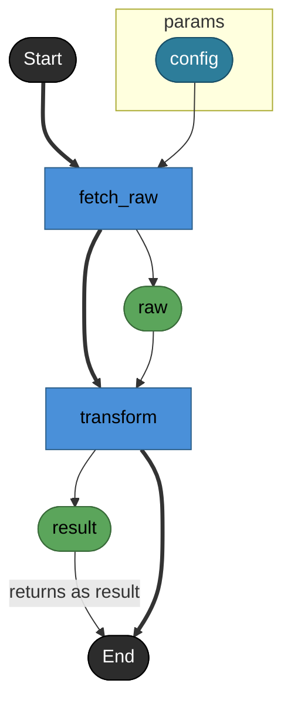
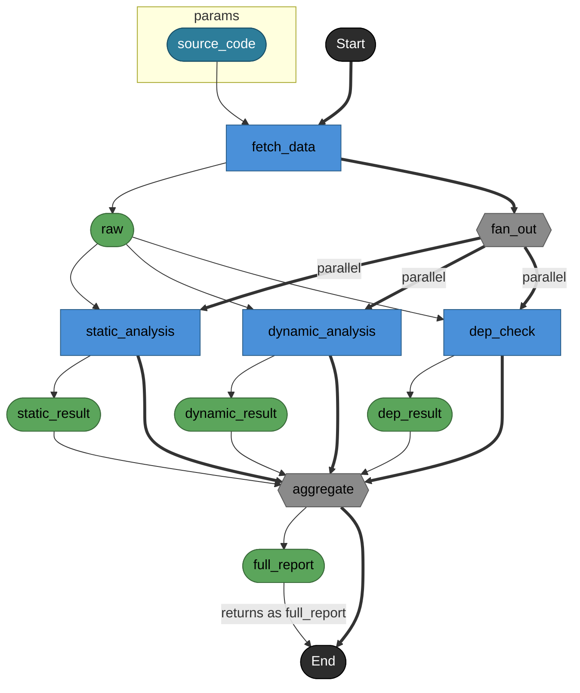
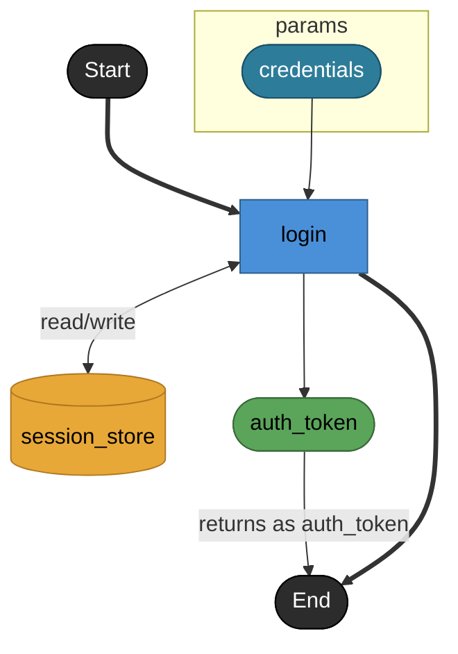
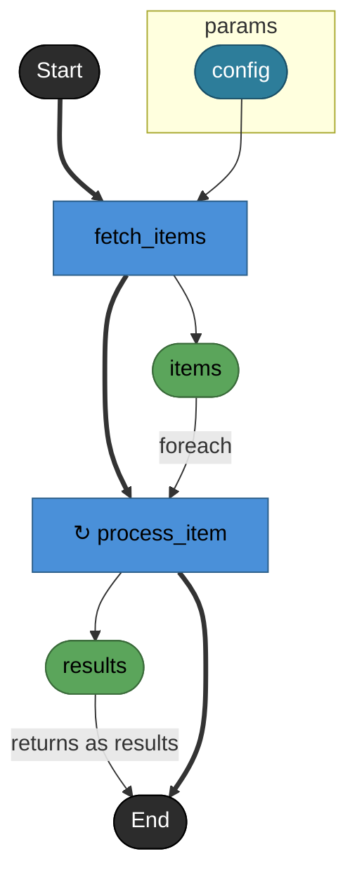
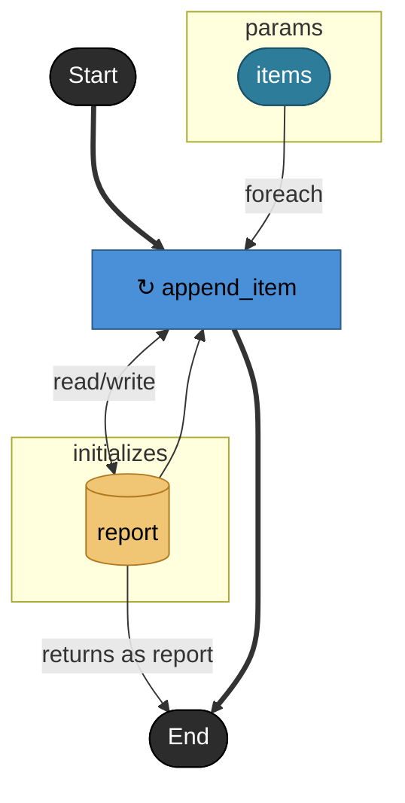
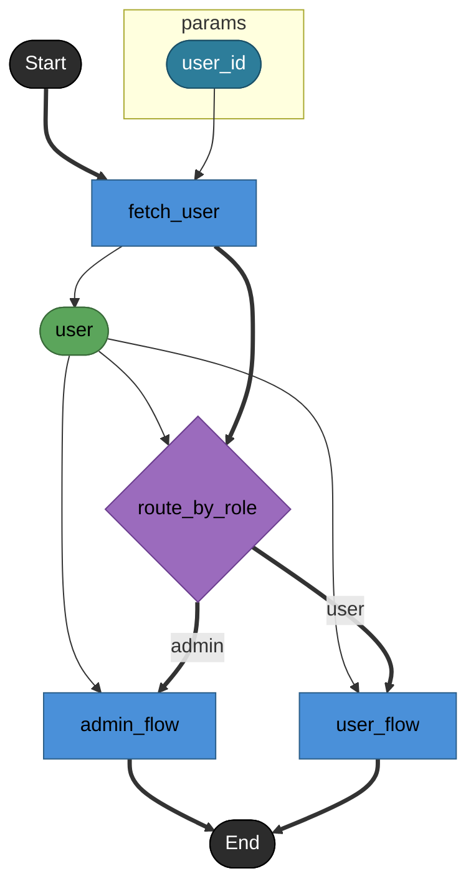

# DAG renderルール

## スコープ

1ファイル = 1DAG。メインノードのファイルを単位としてDAGを描画する（ADR-011）。
複数ファイルをまたぐモジュール全体DAGは定義しない。

他ファイルのメインノードを参照する場合（foreach.applyの外部参照等）は、
参照先ノードを外部ノードとして描画する（→ [外部参照ノード](#外部参照ノード)）。

---

## 出力フォーマット

```markdown
# {メインノードID}

**API**: [{method} {path}](../_cross/api.md)

{メインノードのnote}

​```mermaid
flowchart TD
  ...
​```

## Tasks

### {task_id}
...
```

- H1 = メインノードの `id`
- **API行** = メインノードが `endpoint: true` の場合のみ出力。`note` の前に置く。リンク先は同じ `renders/` 配下の `_cross/api.md` とする
- 説明文 = メインノードの `note`。`note` がない場合は省略
- Mermaid記法: `flowchart TD`（上から下）
- **Tasks詳細セクション** = Mermaid図の後に続く。task / fork / join / branch のsignature・reads/writes・noteを一覧する

### Tasks詳細セクションのフォーマット

```markdown
## Tasks

### login

認証情報を検証しトークンを発行する。

#### Params

| name | model | note |
|---|---|---|
| credentials | credential | ログインフォーム入力 |

#### Returns

| name | model | source |
|---|---|---|
| auth_token | token | login |

#### Store access

| access | store |
|---|---|
| read/write | session_store |
| write | login_log_db |

### other_task

**外部参照**: [auth.task.validate](../../auth/task/validate.md)
```

- 同ファイル内のtask / fork / join / branch: `note` をH3直下の本文として出力し、signature（params/returns）・reads/writesをtableで列挙する
- メインノードの `note` はH1直下の説明文として既に出力されるため、`## Tasks` 内のメインノードH3直下では省略する
- 外部参照taskのみ: `**外部参照**:` でリンクを示し詳細は省略
- `note` がない場合はH3直下の本文を省略する
- `params` がない場合は `#### Params` セクションを省略する
- `returns` がない場合は `#### Returns` セクションを省略する
- `returns.source` がある場合、`Returns` table の `source` 列に source 文字列を表示する。未指定の場合は `—` を表示する
- `reads` / `writes` がない場合は `#### Store access` セクションを省略する
- 同じstoreが `reads` と `writes` の両方に存在する場合、`Store access` の `access` は `read/write` として1行に集約する
- `Params` の `note` がない場合は `—` を表示する

> 由来: ADR-064 §1〜§3

---

## ノードのrender

### start / end

```
_start([Start])
_end([End])
```

形状: スタジアム（Mermaid `([label])`）。ISO 5807:1985 Terminal記号に対応（ADR-022）。
Mermaid ID は `_start` / `_end`（キーワード衝突回避のためアンダースコアプレフィックス付与）（ADR-024）。
DAGの先頭に `_start([Start])` を置き、最後のtaskから `_end([End])` へ制御線（`==>`）を引く。floatingノード（ADR-023）も `_end` へ接続する。

`_end` は ControlFlow 終点に加えて、`returns.source` の ObjectFlow 終点も兼ねる。最後の task / floating node からの制御線（`==>`）と、`returns.source` で指定された値を表す node からの label 付き data line（`-- "returns as <returns.name>" -->`）は同時に `_end` へ入ってよい。task / join / collected asset source のように asset を生成する source では、task node から直接 `_end` へ return data line を引かず、asset node から `_end` へ引く。

**floatingノード**: flow内で後続のwiring参照がないtask。branchの各caseタスクのように、分岐先で処理が完結しそれ以降のstepがない場合に発生する。floatingノードには暗黙的に `==> _end([End])` を追加して描画する。

```
admin_flow ==> _end([End])
user_flow ==> _end
```

（`_end` は1つのノードなので、2本以上の制御線が収束してよい。また、`returns.source` がある場合は data line も収束してよい）

> 由来: ADR-024 §4, ADR-064 §1〜§3

### task

```
task_id[task_id]
```

形状: 矩形（Mermaid `[label]`）

### asset

```
asset_name([asset_name])
```

形状: スタジアム（Mermaid `([label])`）。taskの `returns` から暗黙に生成される中間ノード（ADR-009）。

### store

```
store_id[(store_id)]
```

形状: シリンダー（Mermaid `[(label)]`）。`reads` / `writes` エッジで task と接続される（ADR-020）。

initialized store も DAG 上では store と同じシリンダー形状で描く。ただし通常の module-level store とは区別するため、`subgraph initializes` 内に配置し、`initStoreNode` classDef を適用する。

> 由来: ADR-020, ADR-063, ADR-065, ADR-064 §4〜§6

### branch

```
branch_id{branch_id}
```

形状: ひし形（Mermaid `{label}`）。排他分岐（ADR-012）。

### fork / join

```
fork_id{{fork_id}}
join_id{{join_id}}
```

形状: 六角形（Mermaid `{{label}}`）。並列分岐・合流（ADR-012）。

> UML 2.x標準のfork/joinはバー記号（━━）だが、Mermaid flowchartはバー記号を再現できないため六角形を代替として採用する（ADR-022）。

### 外部参照ノード

同ファイル外のメインノードを参照する場合、classDefで色を変えて区別する。

```
classDef external fill:#e0e0e0,stroke:#999,color:#555
class other_task external
```

外部ノードの形状はノード種別に従う（task → 矩形、等）。

### subgraph params

メインノードの入力を図の境界として `subgraph params` で囲む（ADR-024）。

```
subgraph params
  config([config])
end
```

- メインノードに `params` がある場合、各paramをassetノードとして列挙する
- 境界assetには `boundaryNode` classDef を適用する
- `subgraph returns` は ADR-064 により廃止する。`returns.name` を表す boundary asset node は描かず、`returns.source` で指定された値を表す node から `_end` への label 付き data line（`-- "returns as <returns.name>" -->`）で return を表現する。task / join / collected asset source では asset node を経由する

> 由来: ADR-024 §1〜§4, ADR-064 §1〜§3

### subgraph initializes

`initializes[]` で宣言された file-private store は、`subgraph initializes` で囲って描画する。

```
subgraph initializes
  report[(report)]
  cache[(cache)]
end
```

- `initializes[]` が空の task では `subgraph initializes` を出力しない
- initialized store は store と同じシリンダー形状 `[(label)]` で描く
- initialized store には `initStoreNode` classDef を適用する
- Mermaid source 上の記述順は `subgraph params` → `subgraph initializes` → 本体 → `_end` を推奨する。最終配置は Mermaid renderer に委ねられる

> 由来: ADR-014, ADR-063, ADR-064 §4〜§6

### foreachの↻装飾

`foreach` はnode typeではなく `flow:` の制御構文のため、独立したノードとして描画しない（ADR-016）。
apply先taskのノードラベルに `↻` を付与して表現する。

```
process_item["↻ process_item"]
```

apply先が外部参照ノードの場合は外部ノードのclassDefと組み合わせる。

### ノードの色付け

種別ごとにclassDefで色分けする。WCAG 2.1 Level AA（コントラスト比4.5:1以上）に準拠（ADR-022）。

```
classDef taskNode      fill:#4A90D9,stroke:#2C5F8A,color:#000
classDef assetNode     fill:#5BA55B,stroke:#3A6B3A,color:#000
classDef storeNode     fill:#E8A838,stroke:#B07820,color:#000
classDef initStoreNode fill:#F0C674,stroke:#B07820,color:#000
classDef branchNode    fill:#9B6BBD,stroke:#6B3D8F,color:#000
classDef forkNode      fill:#8A8A8A,stroke:#5A5A5A,color:#000
classDef terminalNode  fill:#2C2C2C,stroke:#000,color:#fff
classDef boundaryNode  fill:#2D7D9A,stroke:#1A5068,color:#fff
classDef external      fill:#E0E0E0,stroke:#999,color:#555
```

`boundaryNode` は `subgraph params` 内の境界assetに適用する。`subgraph returns` は ADR-064 により廃止された。`initStoreNode` は `subgraph initializes` 内の initialized store に適用する。

> 由来: ADR-022, ADR-024, ADR-064 §4〜§9, ADR-066

各ノードに対応するclassを付与する。

```
class login taskNode
class auth_token assetNode
class session_store storeNode
class report initStoreNode
class route_by_role branchNode
class fan_out,aggregate forkNode
class _start,_end terminalNode
class config boundaryNode
```

---

## エッジのrender

エッジはUML Activity DiagramのControlFlow / ObjectFlowの区別に対応する（OMG UML 2.x / ADR-022）。

| 種別 | UML対応 | Mermaid記法 | 用途 |
|------|---------|------------|------|
| データ線 | ObjectFlow | `-->` | データの受け渡し |
| ラベル付きデータ線 | ObjectFlow | `--"label"-->` | foreach等、意味を付与するデータの受け渡し |
| store access線 | ObjectFlow | `-- "read" -->` / `-- "write" -->` / `<-- "read/write" -->` | storeへの読み書きアクセス |
| 制御線 | ControlFlow | `==>` | 実行順序の制御 |
| ラベル付き制御線 | ControlFlow | `== "label" ==>` | branch・forkの条件付き制御フロー |

### データ線（`-->`）

task → asset、asset → task のwiring。`flow:` の `params` wiringから導出する。

```
fetch_data --> raw([raw])
raw --> transform
```

flow wiring から initialized source を参照する場合も、値の受け渡し contract なので通常の data line（`-->`）で描く。cross-edge `reads` 表現に統合しない。

```
report --> append_item
```

### returns.source の data line

`returns.source` が指定されている場合、値を表す node から `_end` へ label 付き data line（`-- "returns as <returns.name>" -->`）を引く。`returns.name` を表す boundary node は作らない。

| source 種別 | `_end` への return data line 起点 | Mermaid例 |
|---|---|---|
| node ID / QualifiedID | 当該 task / join が生成する asset node | `result -- "returns as report" --> _end` |
| collected asset source（`foreach.returns`） | `foreach.returns` 名で生成される collected asset node | `results -- "returns as report" --> _end` |
| initialized source | `subgraph initializes` 内の store node | `report -- "returns as report" --> _end` |
| `$params.<name>` | `subgraph params` 内の boundary asset | `config -- "returns as report" --> _end` |

`returns.source` が未指定の場合、return を表す `_end` への return data line は追加しない。node ID / QualifiedID / collected asset source では、task node から直接 `_end` へ接続せず、asset node を経由する。edge label は source 種別を問わず `returns as <returns.name>` とする。

> 由来: ADR-062, ADR-063, ADR-064 §1〜§3

### store access線

store の `reads` / `writes` は store access線として描く。通常の asset dataflow と区別するため、アクセス種別を edge label で明示する（ADR-044）。

| YAML上の指定 | Mermaid表現 | 意味 |
|-------------|-------------|------|
| `reads: [store]` | `store -- "read" --> task` | task が store を読む |
| `writes: [store]` | `task -- "write" --> store` | task が store に書く |
| `reads` と `writes` の両方 | `task <-- "read/write" --> store` | task が store を読み書きする |

store edge の向きは従来どおり維持するが、意味の主表現はラベルに寄せる。

```
session_store[(session_store)] -- "read" --> login       %% reads のみ
login -- "write" --> audit_log[(audit_log)]              %% writes のみ
login <-- "read/write" --> session_store[(session_store)] %% reads + writes 両方
```

initialized store に対しても、`reads` / `writes` 宣言は通常 store と同じ store access line で描く。一方、flow wiring から initialized source を参照する場合は data line（`-->`）で描く。同じ initialized store node に data line と store access line が両方接続されうる。

flow wiring から initialized source を渡している事実から `reads` / `writes` を推論しない。逆に、`reads` / `writes` が宣言されている事実から flow wiring の data line を省略しない。両者は独立した契約として描画する。

> 由来: ADR-044, ADR-063 §7, ADR-064 §7

### 制御線（`==>`）

以下の全ケースで制御線を引く。

- `_start` → 最初のtask（DAG起点）
- 最後のtask → `_end`（DAG終点）
- floatingノード → `_end`（暗黙終端）
- **flow上で連続するtask間**（data線があっても必ず併記する）
- task → branch / fork（分岐への入り口）
- branch / join → 後続task（分岐・合流の出口）

```
process_report ==> transform       %% 連続するtask間
fetch_user ==> route_by_role       %% task → branch
fetch_data ==> fan_out{{fan_out}}  %% task → fork
```

> データ線（`-->`）だけでは実行順序がLLMに伝わりにくい。UML ControlFlowとして明示することで、DAGの制御構造を機械的に解析可能にする（ADR-022）。

**branch（排他分岐）**

`cases[].label` をエッジラベルに使う（ADR-022, ADR-023）。

```
route_by_role{route_by_role} == "admin" ==> admin_flow
route_by_role{route_by_role} == "user" ==> user_flow
```

**branchのparams wiring（データ線）**: branchノードが受け取るassetは2種のデータ線を引く。
1本はbranchノード自身（ルーティング判断用）、もう1本は各branch task（実行時に使うデータ）。

```
user --> route_by_role      %% ルーティング判断用
user --> admin_flow         %% admin ブランチへのデータ
user --> user_flow          %% user ブランチへのデータ
```

**fork / join（並列実行）**

forkからの各ブランチに `"parallel"` ラベルを付ける（BPMN 2.0 Parallel Gateway準拠 / ADR-022）。
joinノードへは、各branchタスクからの **制御線（合流）とデータ線（結果）の両方** を引く。

```
fan_out{{fan_out}} == "parallel" ==> static_analysis
fan_out{{fan_out}} == "parallel" ==> dynamic_analysis
fan_out{{fan_out}} == "parallel" ==> dep_check
static_analysis --> static_result([static_result])   %% データ線（branchタスクの出力）
static_result --> aggregate{{aggregate}}              %% データ線（joinへの入力）
static_analysis ==> aggregate{{aggregate}}            %% 制御線（合流）
dynamic_analysis --> dynamic_result([dynamic_result])
dynamic_result --> aggregate
dynamic_analysis ==> aggregate
dep_check --> dep_result([dep_result])
dep_result --> aggregate
dep_check ==> aggregate
```

**foreach**

「foreach」はデータがどう流れるか（1件ずつ）の意味なので、データ線（ObjectFlow）にラベルとして乗せる。
タスク間の実行順序は制御線（ControlFlow）で示す（BPMN 2.0 Multi-Instance Activity準拠 / ADR-022）。

```
fetch_items ==> process_item["↻ process_item"]    %% 制御線（実行順序）
items --"foreach"--> process_item                 %% データ線（foreachラベル付きObjectFlow）
```

---

## render例

### 基本的なDAG（2 task + asset）

YAML:
```yaml
nodes:
  - id: process_report
    type: task
    main: true
    params:
      - name: config
        model: app_config
    returns:
      name: result
      model: result_data
      source: transform

  - id: fetch_raw
    type: task
    params:
      - name: config
        model: app_config
    returns:
      name: raw
      model: raw_data

  - id: transform
    type: task
    params:
      - name: raw
        model: raw_data
    returns:
      name: result
      model: result_data

flow:
  - step: fetch_raw
    params:
      config: $params.config
  - step: transform
    params:
      raw: fetch_raw
```

Mermaid出力:


### fork / join を含むDAG

YAML:
```yaml
nodes:
  - id: analyze_code
    type: task
    main: true
    params:
      - name: source_code
        model: source_code
    returns:
      name: full_report
      model: full_report
      source: aggregate

  - id: fetch_data
    type: task
    params:
      - name: source_code
        model: source_code
    returns:
      name: raw
      model: raw_data

  - id: fan_out
    type: fork

  - id: static_analysis
    type: task
    params:
      - name: raw
        model: raw_data
    returns:
      name: static_result
      model: static_result

  - id: dynamic_analysis
    type: task
    params:
      - name: raw
        model: raw_data
    returns:
      name: dynamic_result
      model: dynamic_result

  - id: dep_check
    type: task
    params:
      - name: raw
        model: raw_data
    returns:
      name: dep_result
      model: dep_result

  - id: aggregate
    type: join
    params:
      - name: static_result
        model: static_result
      - name: dynamic_result
        model: dynamic_result
      - name: dep_result
        model: dep_result
    returns:
      name: full_report
      model: full_report

flow:
  - step: fetch_data
    params:
      source_code: $params.source_code
  - fork: fan_out
    branches:
      - steps:
          - step: static_analysis
            params:
              raw: fetch_data
      - steps:
          - step: dynamic_analysis
            params:
              raw: fetch_data
      - steps:
          - step: dep_check
            params:
              raw: fetch_data
    join: aggregate
```

Mermaid出力:


### storeを含むDAG

YAML:
```yaml
nodes:
  - id: authenticate
    type: task
    main: true
    params:
      - name: credentials
        model: credential
    returns:
      name: auth_token
      model: token
      source: login

  - id: login
    type: task
    params:
      - name: credentials
        model: credential
    returns:
      name: auth_token
      model: token
    reads: [session_store]
    writes: [session_store]

  - id: session_store
    type: store
    model: session

flow:
  - step: login
    params:
      credentials: $params.credentials
```

Mermaid出力:


### foreachを含むDAG

YAML:
```yaml
nodes:
  - id: process_reports
    type: task
    main: true
    params:
      - name: config
        model: app_config
    returns:
      name: results
      model: result_list
      source: results

  - id: fetch_items
    type: task
    params:
      - name: config
        model: app_config
    returns:
      name: items
      model: item_list

  - id: process_item
    type: task
    params:
      - name: item
        model: item
    returns:
      name: result
      model: result

flow:
  - step: fetch_items
    params:
      config: $params.config
  - foreach: process_item
    over: fetch_items
    params:
      item: $item
    returns: results
```

Mermaid出力:


### initialized source を含むDAG

YAML:
```yaml
nodes:
  - id: process_report
    type: task
    main: true
    initializes:
      - name: report
        model: report
    params:
      - name: items
        model: item_list
    returns:
      name: report
      model: report
      source: report

  - id: append_item
    type: task
    reads: [report]
    writes: [report]
    params:
      - name: report
        model: report
      - name: item
        model: item

flow:
  - foreach: append_item
    over: $params.items
    params:
      report: report
      item: $item
```

Mermaid出力:


### branchを含むDAG（floatingノードあり）

returnsなし・floatingノードを含むパターン。branch caseタスクが後続なしで完結するため、
両caseタスクがfloatingノードとなり `_end` へ暗黙接続される。

YAML:
```yaml
nodes:
  - id: handle_request
    type: task
    main: true
    params:
      - name: user_id
        model: user_id

  - id: fetch_user
    type: task
    params:
      - name: user_id
        model: user_id
    returns:
      name: user
      model: user

  - id: route_by_role
    type: branch
    params:
      - name: user
        model: user

  - id: admin_flow
    type: task
    params:
      - name: user
        model: user

  - id: user_flow
    type: task
    params:
      - name: user
        model: user

flow:
  - step: fetch_user
    params:
      user_id: $params.user_id
  - branch: route_by_role
    params:
      user: fetch_user
    cases:
      - label: admin
        step: admin_flow
        params:
          user: fetch_user
      - label: user
        step: user_flow
        params:
          user: fetch_user
```

Mermaid出力:


> 由来: ADR-064, ADR-066

