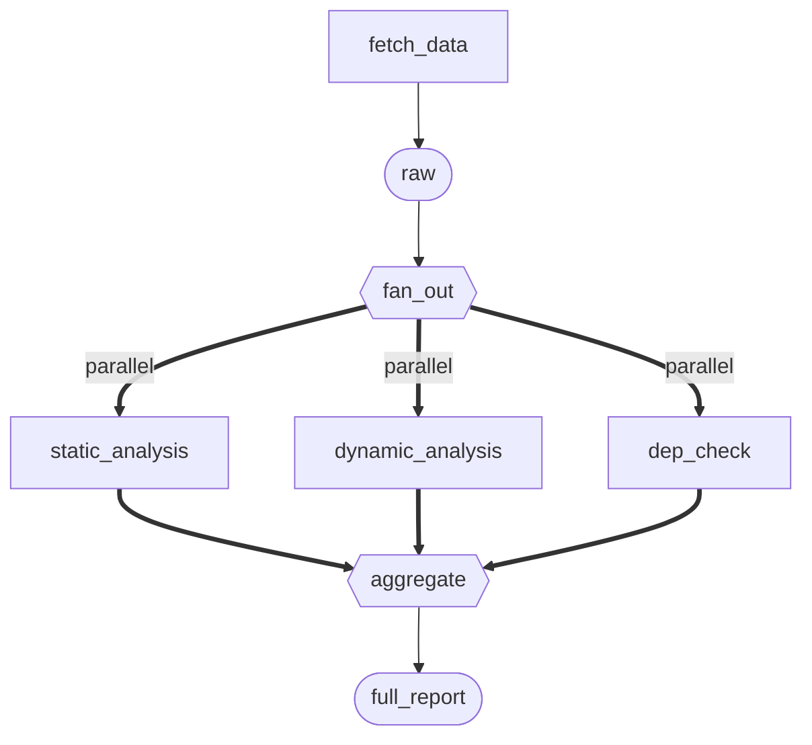

# DAG renderルール

## スコープ

1ファイル = 1DAG。メインノードのファイルを単位としてDAGを描画する（ADR-011）。
複数ファイルをまたぐモジュール全体DAGは定義しない。

他ファイルのメインノードを参照する場合（foreach.applyの外部参照等）は、
参照先ノードを外部ノードとして描画する（→ [外部参照ノード](#外部参照ノード)）。

---

## 出力フォーマット

```markdown
# {メインノードID}

**API**: [{method} {path}](../views/api-table.md)

{メインノードのnote}

​```mermaid
flowchart TD
  ...
​```

## Tasks

### {task_id}
...
```

- H1 = メインノードの `id`
- **API行** = メインノードが `endpoint: true` の場合のみ出力。`note` の前に置く
- 説明文 = メインノードの `note`。`note` がない場合は省略
- Mermaid記法: `flowchart TD`（上から下）
- **Tasks詳細セクション** = Mermaid図の後に続く。各taskのsignature・reads/writes・noteを一覧する

### Tasks詳細セクションのフォーマット

```markdown
## Tasks

### login
**params**: credentials (credential)
**returns**: auth_token (token)
**reads**: session_store
**writes**: session_store
**note**: 認証情報を検証しトークンを発行する

### other_task
**外部参照**: [auth.task.validate](../../auth/task/validate.md)
```

- 同ファイル内のtask: signature（params/returns）・reads/writes・noteを列挙
- 外部参照taskのみ: `**外部参照**:` でリンクを示し詳細は省略
- `reads` / `writes` がない場合は該当行を省略
- `note` がない場合は該当行を省略

---

## ノードのrender

### start / end

```
([Start])
([End])
```

形状: スタジアム（Mermaid `([label])`）。ISO 5807:1985 Terminal記号に対応（ADR-022）。
DAGの先頭に `([Start])`、末尾に `([End])` を置く。`([End])` はfloatingノード（ADR-023）も含む全終端に接続する。

### task

```
task_id[task_id]
```

形状: 矩形（Mermaid `[label]`）

### asset

```
asset_name([asset_name])
```

形状: スタジアム（Mermaid `([label])`）。taskの `returns` から暗黙に生成される中間ノード（ADR-009）。

### store

```
store_id[(store_id)]
```

形状: シリンダー（Mermaid `[(label)]`）。`reads` / `writes` エッジで task と接続される（ADR-020）。

### branch

```
branch_id{branch_id}
```

形状: ひし形（Mermaid `{label}`）。排他分岐（ADR-012）。

### fork / join

```
fork_id{{fork_id}}
join_id{{join_id}}
```

形状: 六角形（Mermaid `{{label}}`）。並列分岐・合流（ADR-012）。

> UML 2.x標準のfork/joinはバー記号（━━）だが、Mermaid flowchartはバー記号を再現できないため六角形を代替として採用する（ADR-022）。

### 外部参照ノード

同ファイル外のメインノードを参照する場合、classDefで色を変えて区別する。

```
classDef external fill:#e0e0e0,stroke:#999,color:#555
class other_task external
```

外部ノードの形状はノード種別に従う（task → 矩形、等）。

### foreachの↻装飾

`foreach` はnode typeではなく `flow:` の制御構文のため、独立したノードとして描画しない（ADR-016）。
apply先taskのノードラベルに `↻` を付与して表現する。

```
process_item["↻ process_item"]
```

apply先が外部参照ノードの場合は外部ノードのclassDefと組み合わせる。

### ノードの色付け

種別ごとにclassDefで色分けする。WCAG 2.1 Level AA（コントラスト比4.5:1以上）に準拠（ADR-022）。

```
classDef taskNode     fill:#4A90D9,stroke:#2C5F8A,color:#fff
classDef assetNode    fill:#5BA55B,stroke:#3A6B3A,color:#fff
classDef storeNode    fill:#E8A838,stroke:#B07820,color:#fff
classDef branchNode   fill:#9B6BBD,stroke:#6B3D8F,color:#fff
classDef forkNode     fill:#8A8A8A,stroke:#5A5A5A,color:#fff
classDef terminalNode fill:#2C2C2C,stroke:#000,color:#fff
classDef external     fill:#E0E0E0,stroke:#999,color:#555
```

各ノードに対応するclassを付与する。

```
class login taskNode
class auth_token assetNode
class session_store storeNode
class route_by_role branchNode
class fan_out,aggregate forkNode
class Start,End terminalNode
```

---

## エッジのrender

エッジはUML Activity DiagramのControlFlow / ObjectFlowの区別に対応する（OMG UML 2.x / ADR-022）。

| 種別 | UML対応 | Mermaid記法 | 用途 |
|------|---------|------------|------|
| データ線 | ObjectFlow | `-->` | データの受け渡し |
| 制御線 | ControlFlow | `==>` | 実行順序の制御 |

### データ線（`-->`）

task → asset、asset → task のwiring。`flow:` の `params` wiringから導出する。

```
fetch_data --> raw([raw])
raw --> transform
```

store の reads / writes も同じデータ線で描く。方向で reads / writes を区別する。
reads と writes が両方ある場合は双方向エッジ `<-->` を使う。

```
session_store[(session_store)] --> login    %% reads のみ
login --> audit_log[(audit_log)]            %% writes のみ
login <--> session_store[(session_store)]   %% reads + writes 両方
```

### 制御線（`==>`）

branch・fork・join を含む制御フローに使う。

**branch（排他分岐）**

`cases[].label` をエッジラベルに使う（ADR-022, ADR-023）。

```
route_by_role{route_by_role} == "admin" ==> admin_flow
route_by_role{route_by_role} == "user" ==> user_flow
```

**fork / join（並列実行）**

forkからの各ブランチに `"parallel"` ラベルを付ける（BPMN 2.0 Parallel Gateway準拠 / ADR-022）。

```
fan_out{{fan_out}} == "parallel" ==> static_analysis
fan_out{{fan_out}} == "parallel" ==> dynamic_analysis
fan_out{{fan_out}} == "parallel" ==> dep_check
static_analysis ==> aggregate{{aggregate}}
dynamic_analysis ==> aggregate{{aggregate}}
dep_check ==> aggregate{{aggregate}}
```

**foreach**

apply先taskへのエッジに `"foreach"` ラベルを付ける（BPMN 2.0 Multi-Instance Activity準拠 / ADR-022）。

```
items([items]) == "foreach" ==> process_item["↻ process_item"]
```

---

## render例

### 基本的なDAG（2 task + asset）

YAML:
```yaml
nodes:
  - id: process_report
    type: task
    main: true
    params:
      - name: config
        model: app_config
    returns:
      name: raw
      model: raw_data

  - id: transform
    type: task
    params:
      - name: raw
        model: raw_data
    returns:
      name: result
      model: result_data

flow:
  - step: process_report
    params:
      config: $params.config
  - step: transform
    params:
      raw: process_report
```

Mermaid出力:
```mermaid
flowchart TD
  subgraph params
    config([config])
  end
  subgraph returns
    result([result])
  end

  ([Start]) ==> process_report
  config --> process_report[process_report]
  process_report --> raw([raw])
  raw --> transform[transform]
  transform --> result
  result ==> ([End])

  classDef taskNode  fill:#4A90D9,stroke:#2C5F8A,color:#fff
  classDef assetNode fill:#5BA55B,stroke:#3A6B3A,color:#fff
  classDef terminalNode fill:#2C2C2C,stroke:#000,color:#fff
  class process_report,transform taskNode
  class raw assetNode
  class Start,End terminalNode
```

### fork / join を含むDAG



### storeを含むDAG


### foreachを含むDAG


