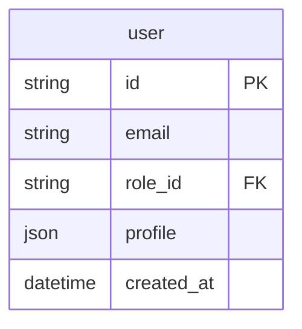
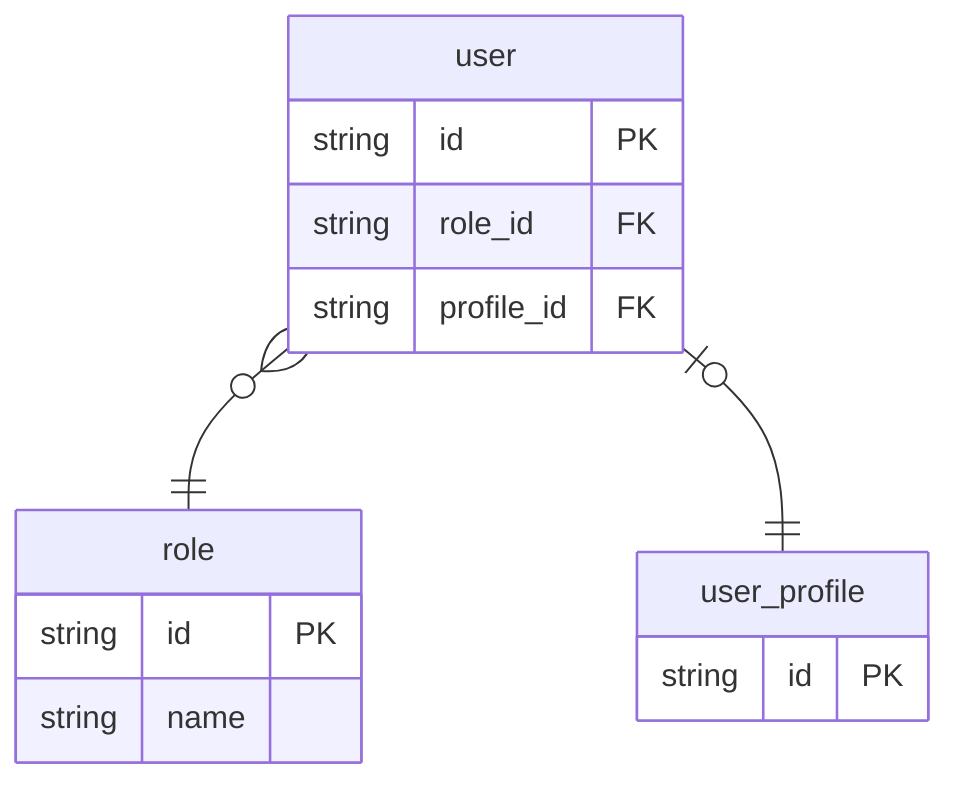
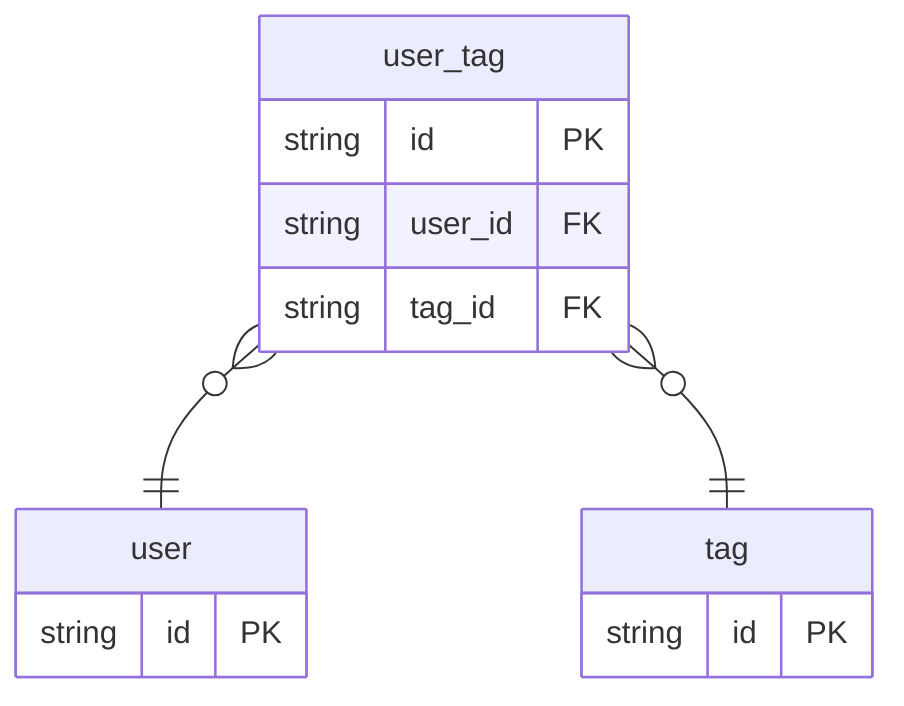
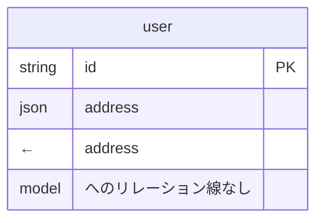

# ER図 renderルール

## 対象ノード

ER図に登場するノードは以下の2種のみ。

| ノード | 役割 |
|--------|------|
| `store.kind: db` | エンティティ（テーブル）として描画 |
| `model.kind: struct`（`store.of` から辿ったもの） | エンティティの列定義として使用 |

`store.kind: session` / `collection` / `context` はER図に登場しない。
`model.kind: list` / `dict` はエンティティとしてER図に登場しない（structのフィールド型として出現するのみ）。

---

## エンティティの導出

`store.kind: db` の `of:` フィールドが参照する model をエンティティとして描画する。

```yaml
- id: user_db
  type: store
  kind: db
  of: user        # → user model をエンティティとして描画
```

エンティティ名は `store.id`（例: `user_db`）ではなく `model.id`（例: `user`）を使う。
1つの model を複数の `store.kind: db` が参照している場合、エンティティは1つとして描画する（重複しない）。

---

## カラムの導出

エンティティのカラムは `model.kind: struct` の `fields` から導出する。

### カラム型のマッピング

| brewprint `type` | ER図上の型表記 |
|-----------------|--------------|
| `str` | `string` |
| `int` | `int` |
| `float` | `float` |
| `bool` | `boolean` |
| `bytes` | `bytes` |
| `datetime` | `datetime` |
| `any` | `any` |
| model ID（`fk:` あり） | `string`（FK先の型は問わず） |
| model ID（`fk:` なし） | `json`（JSON埋め込み） |
| list kindのmodel | `json`（variant/JSON埋め込み） |

### PK / FK フラグ

| フィールド条件 | ER図上の表記 |
|-------------|------------|
| `pk: true` | `PK` |
| `fk: <model-id>.<field>` | `FK` |
| `pk: true` かつ `fk:` あり | `PK, FK` |

### Mermaid 出力イメージ



---

## リレーションの導出

`fk:` を持つフィールドからリレーション線を引く。

### カーディナリティルール（ADR-026）

| 条件 | カーディナリティ | Mermaid記法 |
|------|--------------|------------|
| `fk:` のみ（デフォルト） | many-to-one | `}o--\|\|` |
| `fk:` + `unique: true` | one-to-one | `\|o--\|\|` |

FK を持つ側が「多」または「1（unique）」、参照先が「1」。

### リレーションラベル

Mermaid のリレーションラベルは空文字とする。brewprint は FK の意味的説明を `note` に持つため、図上にラベルは不要。

### Mermaid 出力イメージ



---

## N:M の表現

N:M は中間 model（FK を2本持つ struct）として明示的に定義する（ADR-026）。
ER図上は中間エンティティを介した2本のN:1として描画される。



---

## JSON埋め込みフィールドの扱い

`fk:` なしの model ID 参照（JSON埋め込み）は、ER図上では `json` 型カラムとして表示するのみ。
参照先 model へのリレーション線は引かない（DBレベルの外部キー制約がないため）。



---

## renderスコープ

ER図は**ファイル単位ではなくモジュール単位**で描画する。
モジュール内の全 `store.kind: db` を収集し、それらが参照する model を辿って1枚の図にまとめる。

描画対象外：
- `store.kind: db` に辿り着かない model（型定義として使われているだけのもの）
- JSON埋め込みの参照先 model

---

## 図の生成元

ER図は `spec/views/er.md` のルールに従い、brewprintのMCPツール（`render_er`）が生成する。
YAML を直接 Mermaid に変換するため、手書きの ER 記述は存在しない。
