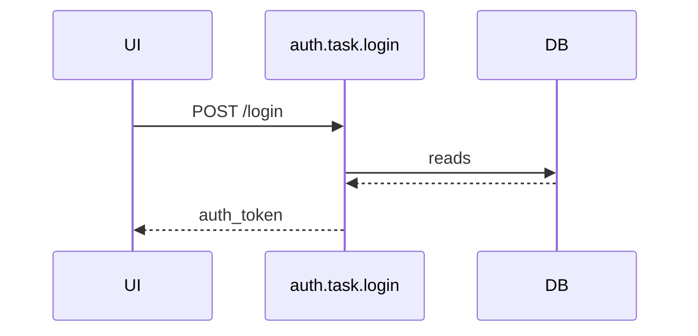

# Sequence Diagram renderルール

## シナリオファイルの構造

```yaml
as: sequence_diagram
id: login_flow
title: "ログインフロー"
state_file: auth/state.yaml
steps:
  - from_state: idle
    via: login_submitted

  - from_state: session_expired
    via: login_submitted
```

### フィールド定義

| フィールド | 必須 | 内容 |
|-----------|------|------|
| `as` | ✓ | `sequence_diagram` 固定（ADR-030） |
| `id` | ✓ | シナリオID。プロジェクト内でユニーク |
| `title` | 任意 | 人間向けタイトル |
| `state_file` | ✓ | 参照するstate定義ファイルのパス |
| `steps` | ✓ | ステップリスト（1件以上） |

### step オブジェクト

| フィールド | 必須 | 内容 |
|-----------|------|------|
| `from_state` | ✓ | 遷移前のstate ID。省略不可 |
| `via` | ✓ | 発火するevent ID |
| `guard` | 任意 | transitionを一意特定するためのguard文字列（ADR-035） |

### transition解決ルール

`(from_state, via)` で `state_file` 内の候補transitionを絞り込み、`step.guard` と `transition.guard` の**完全一致**で一意特定する（ADR-035）。

| 候補数 | `step.guard` | 挙動 |
|-------|--------------|------|
| 0 | 任意 | パーサーエラー：対応transitionが存在しない |
| 1 | 省略 | 候補のtransitionを採用 |
| 1 | 指定 | `transition.guard` と完全一致なら採用。不一致はエラー |
| 2以上 | 省略 | パーサーエラー：曖昧（guard指定必須） |
| 2以上 | 指定 | 完全一致する1件を採用。0件または複数一致はエラー |

**guardの文字列比較はexact match。** brewprintはguard式を評価しない（ADR-019）ため、空白の有無などの表記揺れは別物として扱われる。ユーザーは `state_file` 側のguard文字列をそのままコピーして使う運用とする。

### guard分岐を含むシナリオの例

```yaml
# order/state.yaml（抜粋）
transitions:
  - from: processing
    on: payment_webhook_received
    to: confirmed
    action: payment.task.process_payment
    guard: "payload.status == 'succeeded'"

  - from: processing
    on: payment_webhook_received
    to: failed
    guard: "payload.status == 'failed'"
```

```yaml
# scenarios/payment_webhook_success.yaml
as: sequence_diagram
id: payment_webhook_success
title: "決済ウェブフック成功フロー"
state_file: order/state.yaml
steps:
  - from_state: processing
    via: payment_webhook_received
    guard: "payload.status == 'succeeded'"
```

候補は2件だが `step.guard` により `confirmed` へのtransitionが一意に特定される。

---

## participants

sequence diagramに登場するparticipantは以下の4種（ADR-004 / ADR-036）。

| participant | 生成条件 | brewprintの実体 |
|---|---|---|
| Actor | `source=external` のeventを参照するstepが1つでもある場合 | `type: actor` ノード（ADR-031） |
| UI | `source=ui` のeventを参照するstepが1つでもある場合に暗黙生成 | YAMLに明示ノードなし |
| API | シナリオのstepが参照するtaskのendpoint | `type: task`（endpoint=true） |
| DB | 以下いずれかでstepが `store.kind=db` を参照する場合<br>・taskの `reads` / `writes`<br>・`source=er` eventの `watches`（ADR-036） | `type: store`（kind=db）を「DB」1列に集約 |

participantの表示順（左→右）: `Actor → UI → API → DB`（存在するもののみ）

### DB participantの粒度

`store.kind=db` のstoreは全て「DB」1列にまとめる。
`kind=session` / `kind=collection` / `kind=context` はparticipant列に出ない。

`store` はテーブル粒度の定義であり、スキーマ・DB単位の概念を持たないため、store IDごとに列を分けることはできない（ADR-004）。

---

## 矢印ラベル

event駆動の起点矢印は `event.source` と `transition.action` の有無によって以下のパターン（ADR-036 / ADR-037）:

| `event.source` | `transition.action` | 起点→終点 | ラベル | API応答矢印 |
|---|---|---|---|---|
| `ui` | あり | `UI→API` | `METHOD path`（例: `POST /login`） | `API→UI`: `returns.name` / `200 OK` |
| `ui` | **なし** | **`UI->>UI`（self-message）** | **event ID** | **なし** |
| `external` | あり | `Actor→API` | `METHOD path`（例: `POST /webhooks/stripe`） | `API→Actor`: `returns.name` / `200 OK` |
| `internal` | — | `API→API`（self-message） | event ID | なし |
| `er`（`watches`先が `store.kind=db`） | — | `DB→API` | event ID | なし |
| `er`（`watches`先が `store.kind≠db`） | — | `API→API`（self-message） | event ID | なし |

`source=ui` かつ action なし の step では API participant を生成しない。DB 操作 table への出力もなし。

task実行に伴うDBアクセスは上記と独立:

| 矢印 | ラベル |
|------|--------|
| API → DB | `reads` または `writes` |

### ラベル選択の原則

- **`METHOD path`（`ui` action あり / `external`）**: HTTPリクエストの物理的到達を表す。呼び出し元（UI / Actor）が存在し、応答矢印 `API→UI` / `API→Actor` も描画する
- **event ID（`ui` action なし / `internal` / `er`）**: HTTP呼び出しを伴わないため `METHOD path` のソースが存在しない。「何が駆動したか」を event ID で示す。応答矢印は描画しない（ADR-037）

### happy pathのみ

sequence diagramはhappy pathのみを描画する。例外・エラーフローはnoteまたは別シナリオファイルで表現する（ADR-004）。

### event.payloadはMermaid図に出力しない

`event.payload` はLLM向けのメタ情報（コード生成時の型参照）として定義ファイルに存在するが、Mermaid図には出力しない。`event.payload` から `task.params` への変換はUIコンポーネントの責務であり、brewprintのスコープ外。

---

## バックエンドによる自動解決

シナリオYAMLに明示するのは `(from_state, via, guard?)` のみ。以下はバックエンドが `state_file` を参照して自動解決する。

| 情報 | 解決元 |
|------|--------|
| 起点矢印のパターン | event の `source` と `transition.action` の有無で分岐（ADR-036 / ADR-037） |
| Actor participantの生成 | `source=external` のeventを参照するstepの `event.actor` |
| UI participantの生成 | `source=ui` のeventを参照するstepが1つでもある場合に暗黙生成 |
| DB participantの生成 | taskの `reads` / `writes`、または `source=er` eventの `watches` が `store.kind=db` を含む場合 |
| 呼び出されるtask | transition の `action` |
| `UI→API` / `Actor→API` のラベル | task の `method` / `path` |
| API → DB の矢印・方向 | task の `reads` / `writes`（kind=dbのみ） |
| `API→UI` / `API→Actor` のラベル | task の `returns.name`（なければ `200 OK`） |
| `DB→API` の起点 | `source=er` eventの `watches` 先（kind=db時） |
| 自己ループの発生 | `source=internal`、または `source=er` で `watches` 先が `store.kind≠db` |

---

## 出力フォーマット

````markdown
# {title または id}

```mermaid
sequenceDiagram
  [participants: 必要なもののみ宣言（Actor / UI / API / DB）]

  [起点→API矢印: event.source に応じて分岐 →「矢印ラベル」表参照]
  API->>DB: reads / writes
  DB-->>API:
  [API応答矢印: source=ui / external のみ描画。internal / er は描画しない]
```

## DB操作

| step | task | store | 操作 |
|------|------|-------|------|
| 1 | auth.task.login | user_db | reads |
| 1 | auth.task.login | session_store | writes |
````

- `step` 列はシナリオの `steps:` の1-originインデックス
- `kind=session` / `kind=collection` / `kind=context` のstoreはDB操作tableにも出力しない

---

## Mermaid出力イメージ

### ログインフロー（source=ui）

#### YAMLの入力例

```yaml
# auth/state.yaml（抜粋）
nodes:
  - id: idle
    type: state
    initial: true

  - id: session_expired
    type: state

  - id: loading
    type: state

  - id: login_submitted
    type: event
    source: ui
    payload:
      model: login_form

transitions:
  - from: idle
    on: login_submitted
    to: loading
    action: auth.task.login

  - from: session_expired
    on: login_submitted
    to: loading
    action: auth.task.reauth
```

```yaml
# scenarios/login_flow.yaml
as: sequence_diagram
id: login_flow
title: "ログインフロー"
state_file: auth/state.yaml
steps:
  - from_state: idle
    via: login_submitted
```

#### 期待するMermaid出力



#### DB操作table

| step | task | store | 操作 |
|------|------|-------|------|
| 1 | auth.task.login | user_db | reads |

---

### Webhookフロー（source=external）

「シナリオファイルの構造 > guard分岐を含むシナリオの例」の `scenarios/payment_webhook_success.yaml` に対応するMermaid出力。task定義は以下を想定する:

```yaml
# payment/tasks.yaml（抜粋）
nodes:
  - id: process_payment
    type: task
    endpoint: true
    method: POST
    path: /webhooks/stripe
    writes:
      - order_db
```

#### 期待するMermaid出力

```mermaid
sequenceDiagram
  participant Actor as stripe
  participant API as payment.task.process_payment
  participant DB

  Actor->>API: POST /webhooks/stripe
  API->>DB: writes
  DB-->>API: 
  API-->>Actor: 200 OK
```

- `Actor` はeventの `actor: stripe`（ADR-031のglobal actor）から解決
- UI participantは `source=external` のため生成されない
- API応答矢印 `API→Actor` のラベルは `returns` 未定義のため `200 OK`

#### DB操作table

| step | task | store | 操作 |
|------|------|-------|------|
| 1 | payment.task.process_payment | order_db | writes |

---

## 図の生成元

Sequence DiagramはYAMLを読み込んだbrewprintのMCPツール（`render_sequence_diagram`）が生成する。
手書きのMermaid記述は存在しない。
