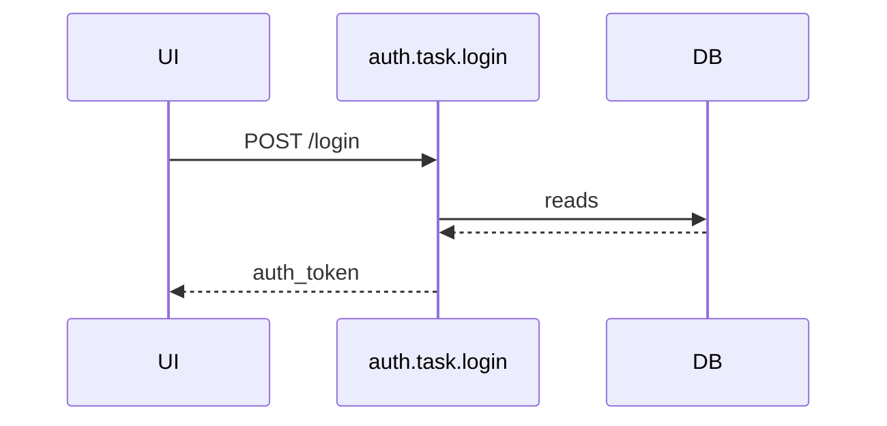

# Sequence Diagram renderルール

## シナリオファイルの構造

```yaml
as: sequence_diagram
id: login_flow
title: "ログインフロー"
state_file: auth/state.yaml
steps:
  - from_state: idle
    via: login_submitted

  - from_state: session_expired
    via: login_submitted
```

### フィールド定義

| フィールド | 必須 | 内容 |
|-----------|------|------|
| `as` | ✓ | `sequence_diagram` 固定（ADR-030） |
| `id` | ✓ | シナリオID。プロジェクト内でユニーク |
| `title` | 任意 | 人間向けタイトル |
| `state_file` | ✓ | 参照するstate定義ファイルのパス |
| `steps` | ✓ | ステップリスト（1件以上） |

### step オブジェクト

| フィールド | 必須 | 内容 |
|-----------|------|------|
| `from_state` | ✓ | 遷移前のstate ID。省略不可 |
| `via` | ✓ | 発火するevent ID |

`(from_state, via)` のペアで `state_file` 内の `transitions:` を一意に特定する。
対応するtransitionが存在しない場合はパーサーエラー。

---

## participants

sequence diagramに登場するparticipantは以下の4種（ADR-004）。

| participant | 生成条件 | brewprintの実体 |
|---|---|---|
| Actor | `source=external` のeventが存在する場合 | `type: actor` ノード（ADR-031） |
| UI | `source=ui` のeventが存在する場合に暗黙生成 | YAMLに明示ノードなし |
| API | シナリオのstepが参照するtaskのendpoint | `type: task`（endpoint=true） |
| DB | シナリオのstepが参照するtaskのreads/writes（kind=dbのみ） | `type: store`（kind=db）を「DB」1列に集約 |

participantの表示順（左→右）: `Actor → UI → API → DB`

### DB participantの粒度

`store.kind=db` のstoreは全て「DB」1列にまとめる。
`kind=session` / `kind=collection` / `kind=context` はparticipant列に出ない。

`store` はテーブル粒度の定義であり、スキーマ・DB単位の概念を持たないため、store IDごとに列を分けることはできない（ADR-004）。

---

## 矢印ラベル

| 矢印 | ラベル |
|------|--------|
| Actor → UI | event ID |
| UI → API | `METHOD path`（例: `POST /login`） |
| API → DB | `reads` または `writes` |
| API → UI | `returns.name`（returnsがない場合は `200 OK`） |

### happy pathのみ

sequence diagramはhappy pathのみを描画する。例外・エラーフローはnoteまたは別シナリオファイルで表現する（ADR-004）。

### event.payloadはMermaid図に出力しない

`event.payload` はLLM向けのメタ情報（コード生成時の型参照）として定義ファイルに存在するが、Mermaid図には出力しない。`event.payload` から `task.params` への変換はUIコンポーネントの責務であり、brewprintのスコープ外。

---

## バックエンドによる自動解決

シナリオYAMLに明示するのは `(from_state, via)` のみ。以下はバックエンドが `state_file` を参照して自動解決する。

| 情報 | 解決元 |
|------|--------|
| 矢印の送信元participant | event の `source` / `actor` |
| 呼び出されるtask | transition の `action` |
| UI → API の矢印ラベル | task の `method` / `path` |
| API → DB の矢印・方向 | task の `reads` / `writes`（kind=dbのみ） |
| API → UI の矢印ラベル | task の `returns.name`（なければ `200 OK`） |
| UI participantの生成 | `source=ui` のeventが存在する場合に暗黙生成 |

---

## 出力フォーマット

````markdown
# {title または id}

```mermaid
sequenceDiagram
  participant Actor as {actor-id}
  participant UI
  participant API as {task-id}
  participant DB

  Actor->>UI: {event-id}
  UI->>API: METHOD path
  API->>DB: reads
  DB-->>API: 
  API-->>UI: returns.name
```

## DB操作

| step | task | store | 操作 |
|------|------|-------|------|
| 1 | auth.task.login | user_db | reads |
| 1 | auth.task.login | session_store | writes |
````

- `step` 列はシナリオの `steps:` の1-originインデックス
- `kind=session` / `kind=collection` / `kind=context` のstoreはDB操作tableにも出力しない

---

## Mermaid出力イメージ

### YAMLの入力例

```yaml
# auth/state.yaml（抜粋）
nodes:
  - id: idle
    type: state
    initial: true

  - id: session_expired
    type: state

  - id: loading
    type: state

  - id: login_submitted
    type: event
    source: ui
    payload:
      model: login_form

transitions:
  - from: idle
    on: login_submitted
    to: loading
    action: auth.task.login

  - from: session_expired
    on: login_submitted
    to: loading
    action: auth.task.reauth
```

```yaml
# scenarios/login_flow.yaml
as: sequence_diagram
id: login_flow
title: "ログインフロー"
state_file: auth/state.yaml
steps:
  - from_state: idle
    via: login_submitted
```

### 期待するMermaid出力



### DB操作table

| step | task | store | 操作 |
|------|------|-------|------|
| 1 | auth.task.login | user_db | reads |

---

## 図の生成元

Sequence DiagramはYAMLを読み込んだbrewprintのMCPツール（`render_sequence_diagram`）が生成する。
手書きのMermaid記述は存在しない。
