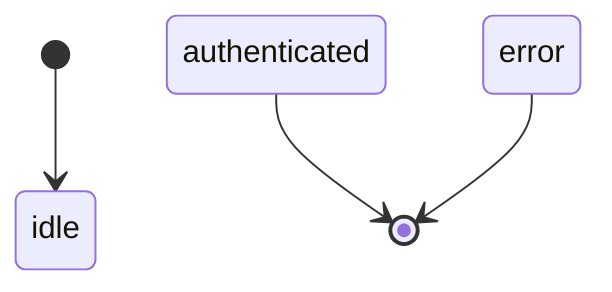
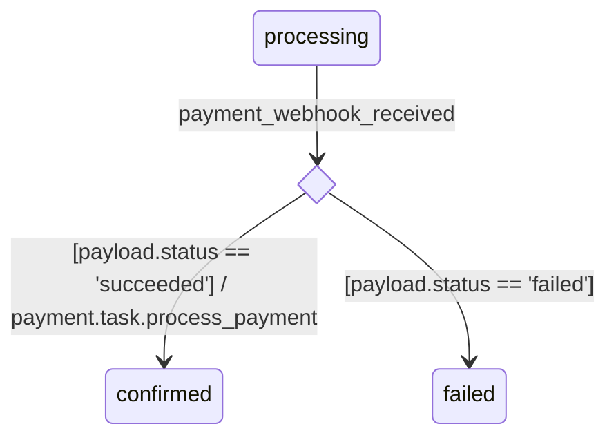
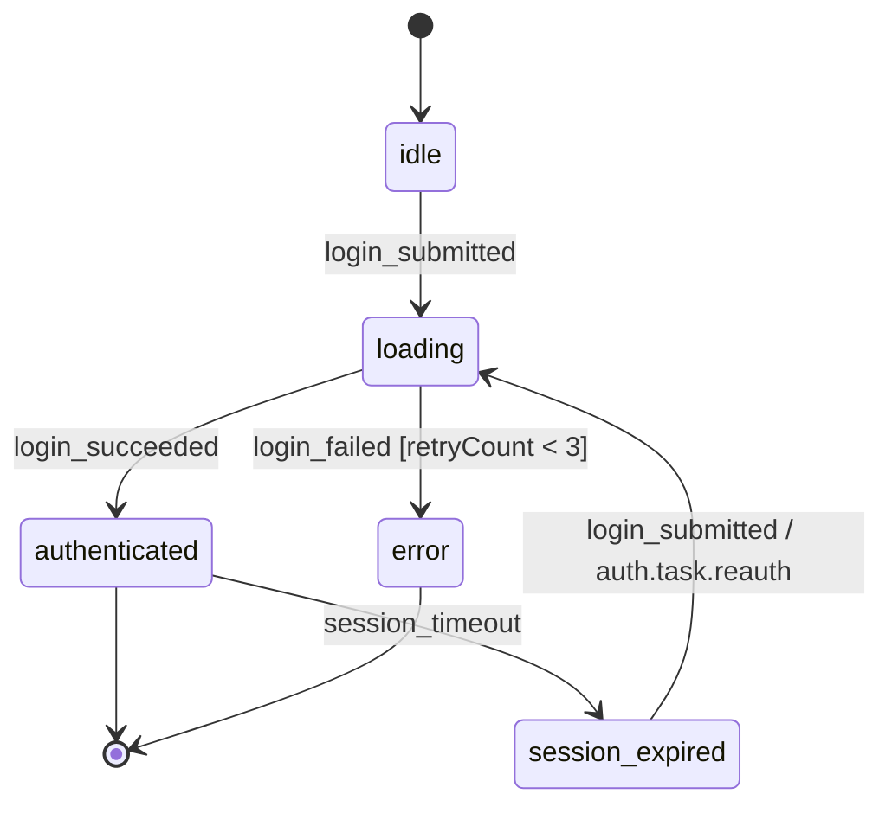
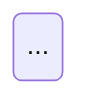

# State Diagram renderルール

## 対象ノード

State Diagramに登場するノードは以下の2種のみ。

| ノード | 役割 |
|--------|------|
| `state` | FSMの状態として描画 |
| `event` | 遷移トリガーのラベルとして使用 |

`store` / `task` / `asset` 等はState Diagramに登場しない（ADR-017）。

---

## renderスコープ

State DiagramはYAML**ファイル単位**で描画する。  
1ファイル = 1FSM = 1枚の図。複数FSMを合成しない。

---

## stateの描画

### initial / final

| フィールド | Mermaid上の表現 |
|-----------|----------------|
| `initial: true` | `[*] --> <state-id>` として描画 |
| `final: true` | `<state-id> --> [*]` として描画 |
| どちらもなし | 通常のstate |



### stateのラベル

state IDをそのまま表示する。`note` は図上には出力しない（LLM向けのセマンティクス情報として保持）。

---

## transitionの描画

`transitions:` セクションの各エントリを1本のエッジとして描画する。

### エッジラベルの構成

エッジラベルは以下の形式で構成する：

```
<event-id> [<guard>] / <action>
```

各要素の出力ルール：

| 要素 | 出力条件 |
|------|---------|
| `<event-id>` | 常に出力（`on` フィールドの値） |
| `[<guard>]` | `guard` フィールドがある場合のみ出力 |
| `/ <action>` | `action` がクロスファイル参照（ドット区切り）の場合のみ出力。同一ファイル内参照は省略 |

### クロスファイル参照の判定

`action` フィールドの値にドット（`.`）が含まれる場合をクロスファイル参照とみなす。

| action の値 | 判定 | ラベル出力 |
|---|---|---|
| `login_task` | 同一ファイル内参照 | 省略 |
| `auth.task.login` | クロスファイル参照 | `/ auth.task.login` |

### ラベルパターン例

```
login_submitted                                      ← guard/actionなし（同一ファイルactionまたはaction省略）
login_submitted [retryCount < 3]                     ← guardのみ
login_submitted / auth.task.login                    ← クロスファイルactionのみ
login_submitted [retryCount < 3] / auth.task.login   ← guard + クロスファイルaction
```

---

## guard分岐の描画（choice pseudostate）

同一 `(from, on)` に**複数のtransitionが存在する**場合、choice pseudostate（UML `<<choice>>`）を挿入して分岐を明示する（ADR-035）。

### 判定ルール

| `(from, on)` 候補数 | 描画方式 |
|---|---|
| 1件 | 通常の直接矢印（上記ラベルパターンに従う） |
| 2件以上 | choice pseudostate経由で分岐 |

FSMパーサーは、同一 `(from, on)` に複数transitionが存在する場合、全エントリに `guard` があることを保証する（ADR-019, ADR-035）。guardなしと混在している場合はパーサーエラー。

### choice pseudostateの生成ルール

- **ID命名**: `_choice_{from}_{on}` の形式で自動生成。ユーザーはYAMLで意識しない
- **宣言位置**: `stateDiagram-v2` 直下の**冒頭ブロックにまとめて**出力する  
  （Mermaid仕様：`state X <<choice>>` は使用前に宣言する必要があるため）
- **入る矢印**: `from → _choice_xxx`、ラベルは **event IDのみ**（guardは付けない）
- **出る矢印**: `_choice_xxx → to`、ラベルは **`[guard文字列]` のみ**（event IDは付けない）
- actionがあるtransitionの `/ action` は、choiceから出る矢印側に付与する（クロスファイル参照のみ）

### 出力例

**入力YAML（抜粋）：**

```yaml
transitions:
  - from: processing
    on: payment_webhook_received
    to: confirmed
    action: payment.task.process_payment
    guard: "payload.status == 'succeeded'"

  - from: processing
    on: payment_webhook_received
    to: failed
    guard: "payload.status == 'failed'"
```

**期待するMermaid出力（該当部分のみ抜粋）：**



冒頭の `state _choice_xxx <<choice>>` 宣言を後置するとdiamond形状にならず通常ノードとして描画されるため、**必ず冒頭ブロックに集約する**。

---

## Mermaid出力イメージ

### YAMLの入力例

```yaml
nodes:
  - id: idle
    type: state
    initial: true
    note: "ユーザーが操作していない状態"

  - id: loading
    type: state
    note: "認証リクエスト処理中"

  - id: authenticated
    type: state
    final: true

  - id: error
    type: state
    final: true
    note: "認証エラー状態"

  - id: session_expired
    type: state

  - id: login_submitted
    type: event
    source: ui
    payload:
      model: login_form

  - id: login_succeeded
    type: event
    source: internal
    note: "auth.task.login 成功時にFSM runtimeが発火"

  - id: login_failed
    type: event
    source: internal
    note: "auth.task.login 失敗時にFSM runtimeが発火"

  - id: session_timeout
    type: event
    source: external
    actor: scheduler

transitions:
  - from: idle
    on: login_submitted
    to: loading
    action: login_task              # 同一ファイル内 → ラベル省略

  - from: session_expired
    on: login_submitted
    to: loading
    action: auth.task.reauth        # クロスファイル → ラベル表示

  - from: loading
    on: login_succeeded
    to: authenticated

  - from: loading
    on: login_failed
    to: error
    guard: "retryCount < 3"

  - from: authenticated
    on: session_timeout
    to: session_expired
```

### 期待するMermaid出力



---

## 出力フォーマット

````markdown
# {ファイルID}

{ファイルのnote（あれば）}



## States

| state | note |
|-------|------|
| idle | ユーザーが操作していない状態 |
| loading | — |

## Events

| event | source | actor | note |
|-------|--------|-------|------|
| login_submitted | ui | - | ログインフォームのsubmit |
| login_succeeded | internal | - | — |
| login_failed | internal | - | — |
| session_timeout | external | scheduler | — |
````

- H1 = ファイルID
- 説明文 = ファイルレベルの `note`。ない場合は省略
- **States表** = `type: state` の全ノード。`note` がない場合は `—`
- **Events表** = `type: event` の全ノード。`source` / `actor` / `note` を列挙。`actor` は `source=external` のみ記載、それ以外は `—`。`note` がない場合は `—`
- Mermaid記法: `stateDiagram-v2`

---

## 図の生成元

State DiagramはYAMLを読み込んだbrewprintのMCPツール（`render_state_diagram`）が生成する。  
手書きのMermaid記述は存在しない。
