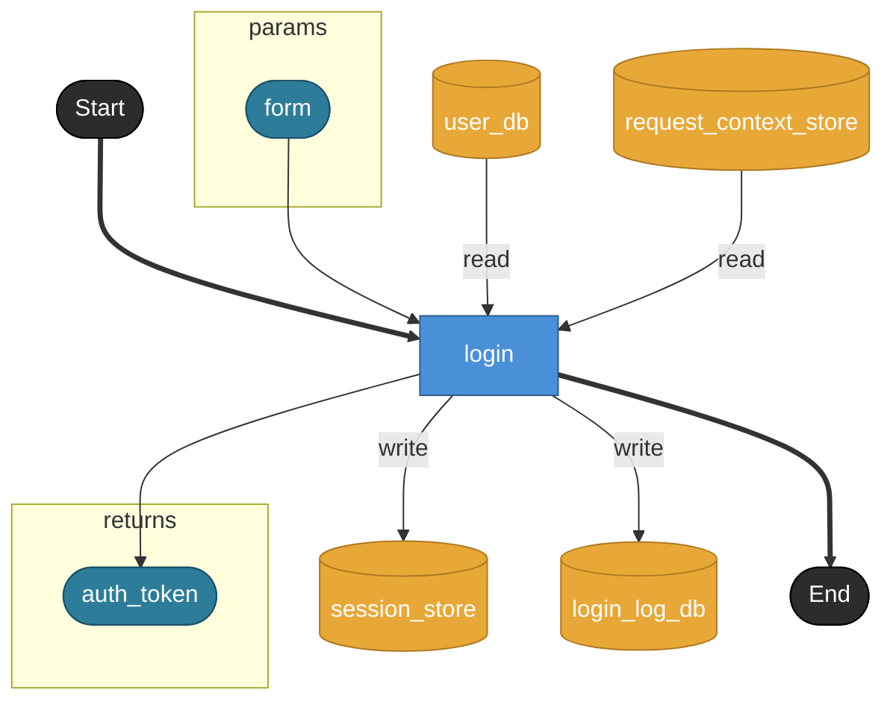
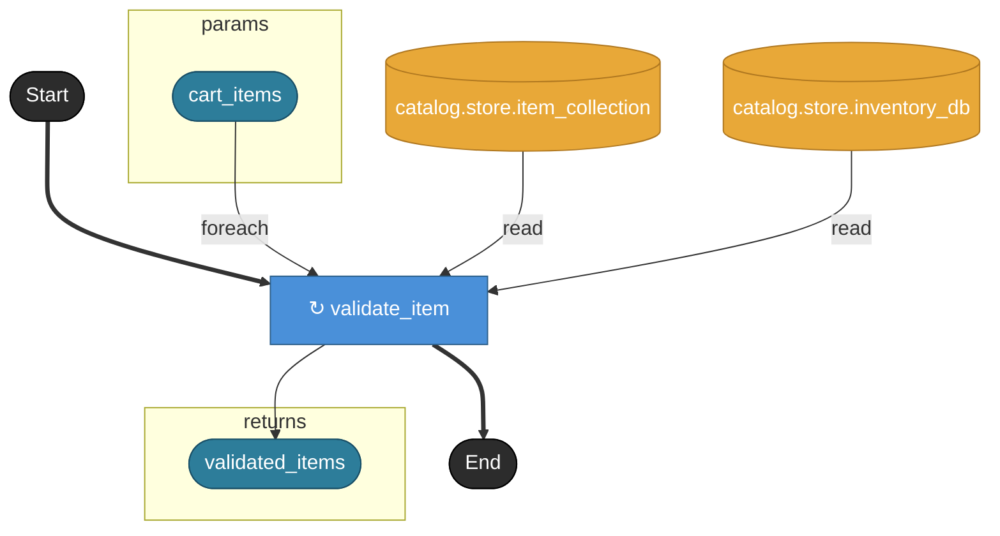
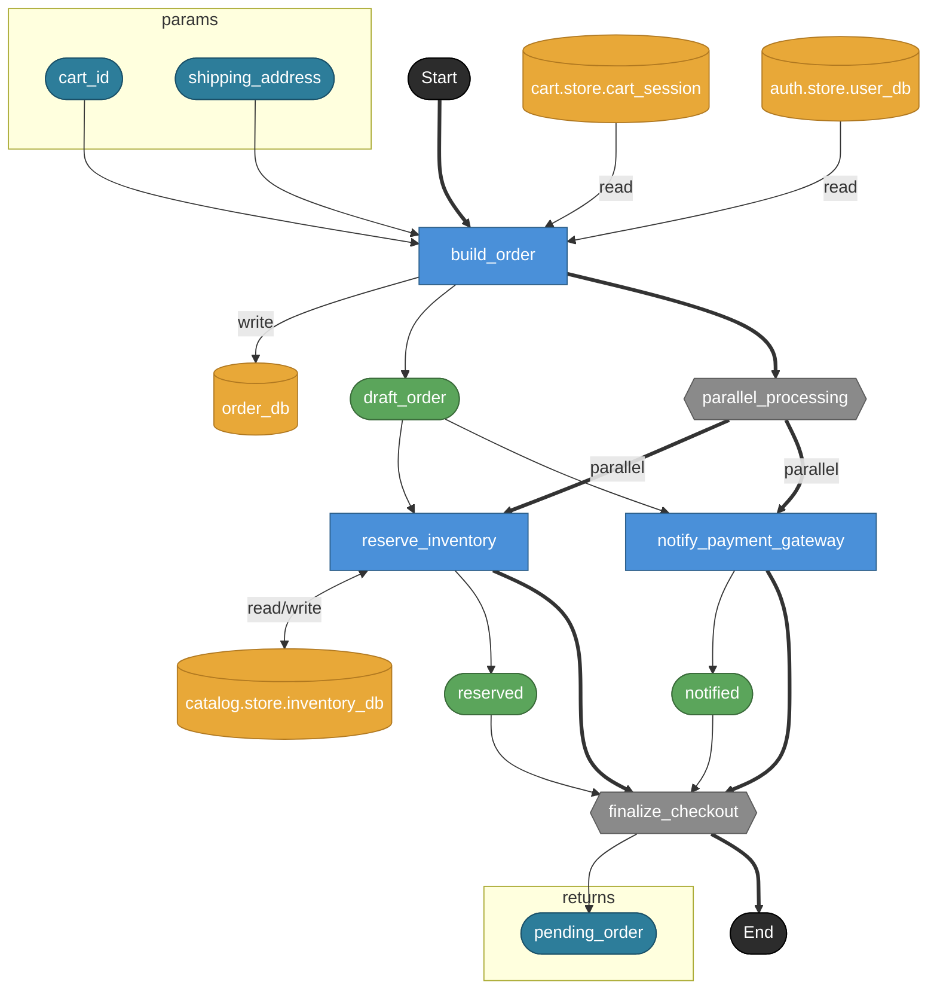
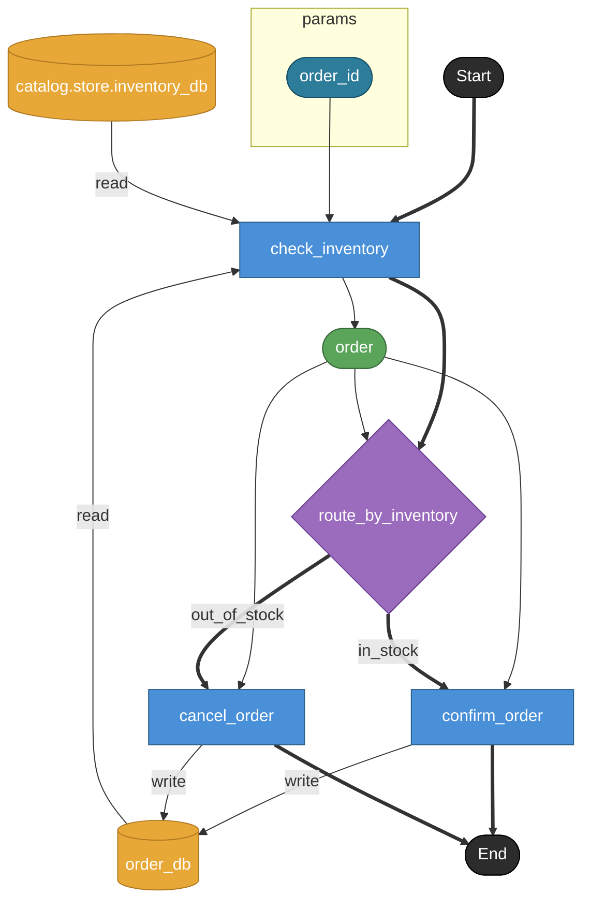

# UC-001: DAG render例

> 注記: このファイルは履歴用に残す旧手書きrender参照であり、canonicalではない。
> 正式なgolden fixtureは `../renders/` 配下を正とする。

## DAG例1: シンプル（auth.task.login）

入力:

- `yaml/auth/task/login.yaml`

## DAG例2: foreach（cart.task.validate_cart）

入力:

- `yaml/cart/task/validate_cart.yaml`

## DAG例3: fork+join（order.task.checkout）

入力:

- `yaml/order/task/checkout.yaml`

## DAG例4: branch（order.task.process_order）

入力:

- `yaml/order/task/process_order.yaml`

