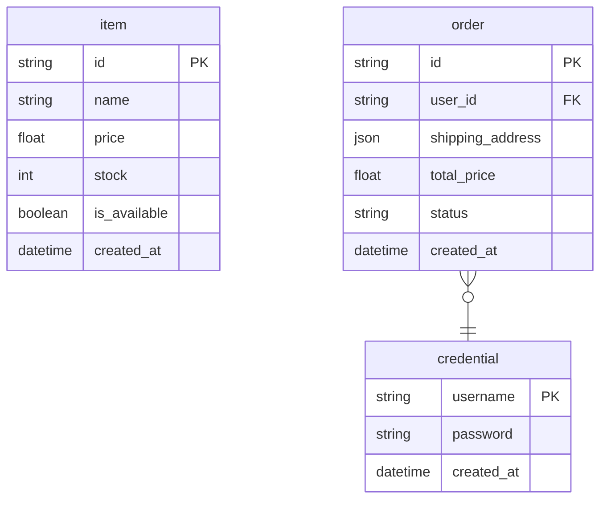

# UC-001: ER Diagram render例

> 注記: このファイルは履歴用に残す旧手書きrender参照であり、canonicalではない。
> 正式なgolden fixtureは `../renders/` 配下を正とする。

## ER Diagram: ec全体

入力:

- `yaml/views/er.yaml`
- `yaml/*/model/*.yaml`
- `yaml/*/store/*.yaml`

`spec/views/er.md` に従い、ER図には `store.kind: db` から辿れる `model.kind: struct` のみを描画する。
このため、現時点のUC-001でER図に出るentityは `credential` / `item` / `order` の3つ。
`cart_item` / `order_item` / `payment_event` はDB storeが未定義のため、この図には登場しない。

