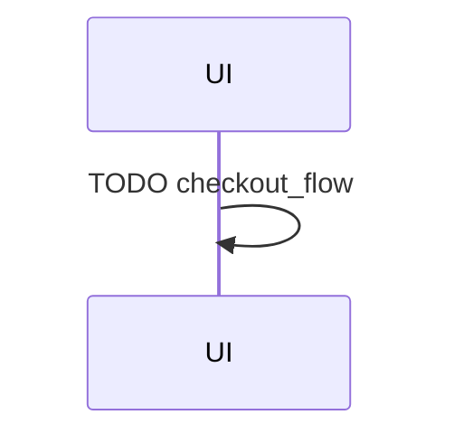
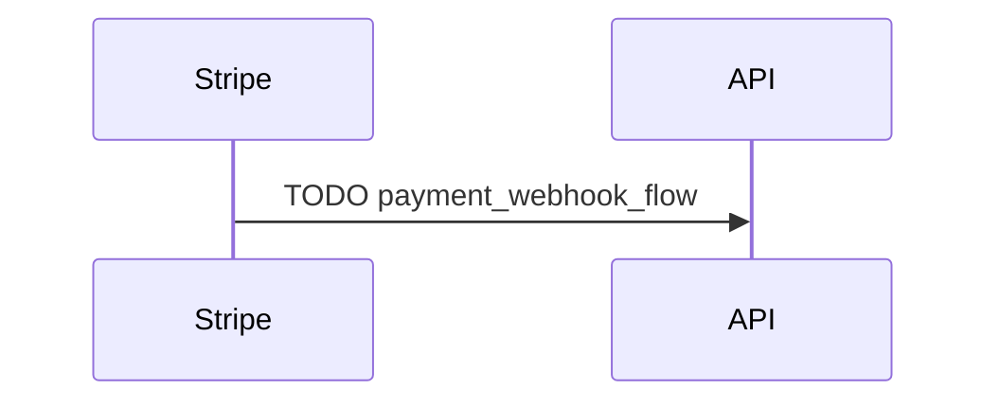

# UC-001: Sequence Diagram render例

## Sequence Diagram: checkout_flow

入力:

- `yaml/views/scenarios/checkout_flow.yaml`
- `yaml/order/state.yaml`
- `yaml/order/task/checkout.yaml`

## Sequence Diagram: payment_webhook_flow

入力:

- `yaml/views/scenarios/payment_webhook_flow.yaml`
- `yaml/order/state.yaml`
- `yaml/payment/webhooks/task/process_payment.yaml`

