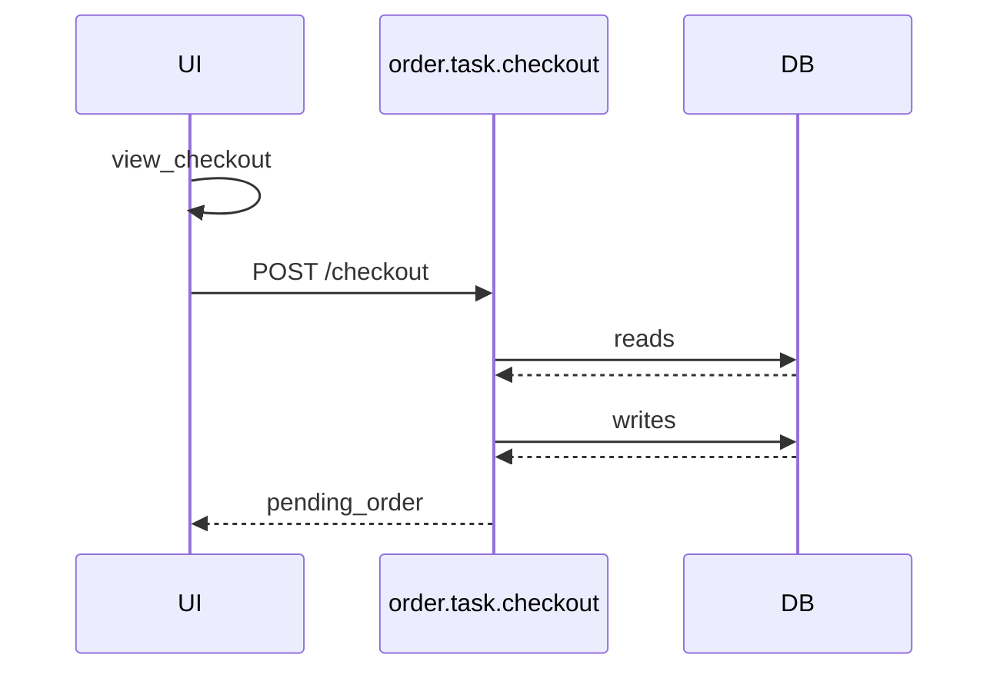

# UC-001: Sequence Diagram render例

## Sequence Diagram: checkout_flow

入力:

- `yaml/views/scenarios/checkout_flow.yaml`
- `yaml/order/state.yaml`
- `yaml/order/task/checkout.yaml`



DB操作:

| step | task | sub_task | store | 操作 |
|---|---|---|---|---|
| 2 | order.task.checkout | build_order | order_db | writes |
| 2 | order.task.checkout | build_order | auth.store.user_db | reads |
| 2 | order.task.checkout | reserve_inventory | catalog.store.inventory_db | reads |
| 2 | order.task.checkout | reserve_inventory | catalog.store.inventory_db | writes |

## Sequence Diagram: payment_webhook_flow

入力:

- `yaml/views/scenarios/payment_webhook_flow.yaml`
- `yaml/order/state.yaml`
- `yaml/payment/webhooks/task/process_payment.yaml`

```mermaid
sequenceDiagram
  participant Actor as stripe
  participant API as payment.webhooks.task.process_payment
  participant DB

  Actor->>API: POST /stripe
  API->>DB: writes
  DB-->>API:
  API-->>Actor: 200 OK
```

DB操作:

| step | task | sub_task | store | 操作 |
|---|---|---|---|---|
| 1 | payment.webhooks.task.process_payment | - | order.store.order_db | writes |
