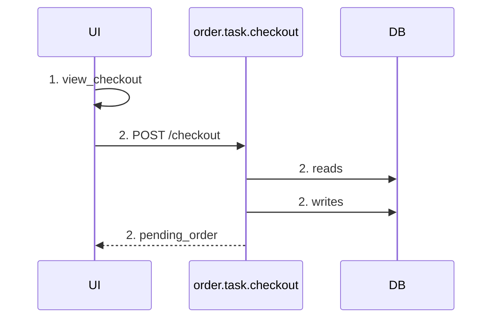
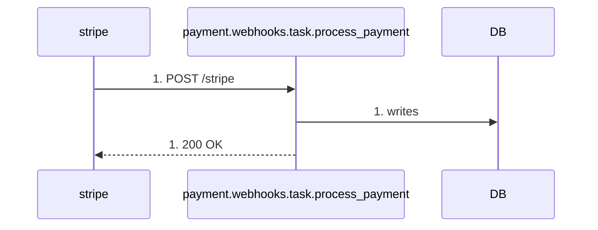

# UC-001: Sequence Diagram render例

> 注記: このファイルは履歴用に残す旧手書きrender参照であり、canonicalではない。
> 正式なgolden fixtureは `../renders/` 配下を正とする。

## Sequence Diagram: checkout_flow

入力:

- `yaml/views/scenarios/checkout_flow.yaml`
- `yaml/order/state.yaml`
- `yaml/order/task/checkout.yaml`

DB操作:

| step | task | sub_task | store | 操作 |
|---|---|---|---|---|
| 2 | order.task.checkout | build_order | order_db | writes |
| 2 | order.task.checkout | build_order | auth.store.user_db | reads |
| 2 | order.task.checkout | reserve_inventory | catalog.store.inventory_db | reads |
| 2 | order.task.checkout | reserve_inventory | catalog.store.inventory_db | writes |

## Sequence Diagram: payment_webhook_flow

入力:

- `yaml/views/scenarios/payment_webhook_flow.yaml`
- `yaml/order/state.yaml`
- `yaml/payment/webhooks/task/process_payment.yaml`

DB操作:

| step | task | sub_task | store | 操作 |
|---|---|---|---|---|
| 1 | payment.webhooks.task.process_payment | - | order.store.order_db | writes |
