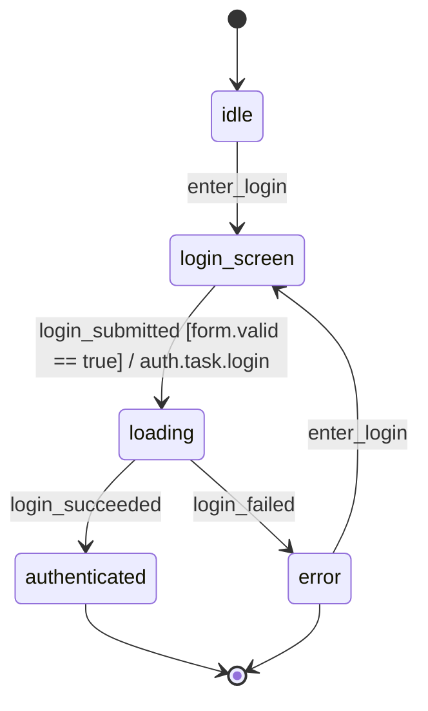
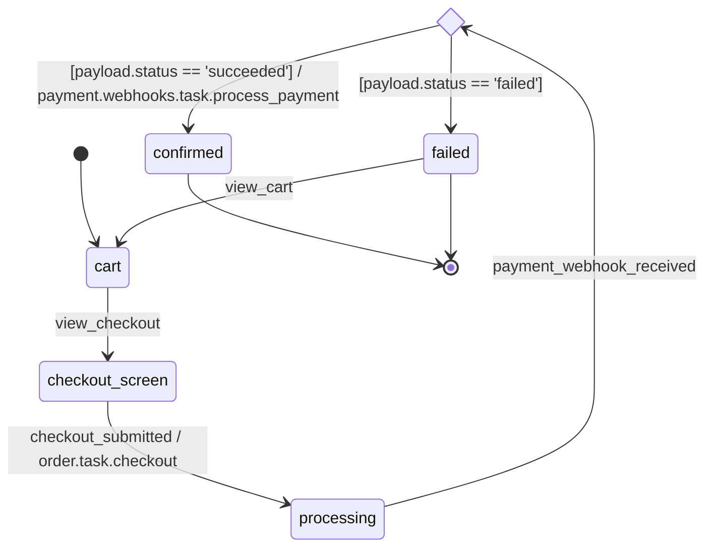
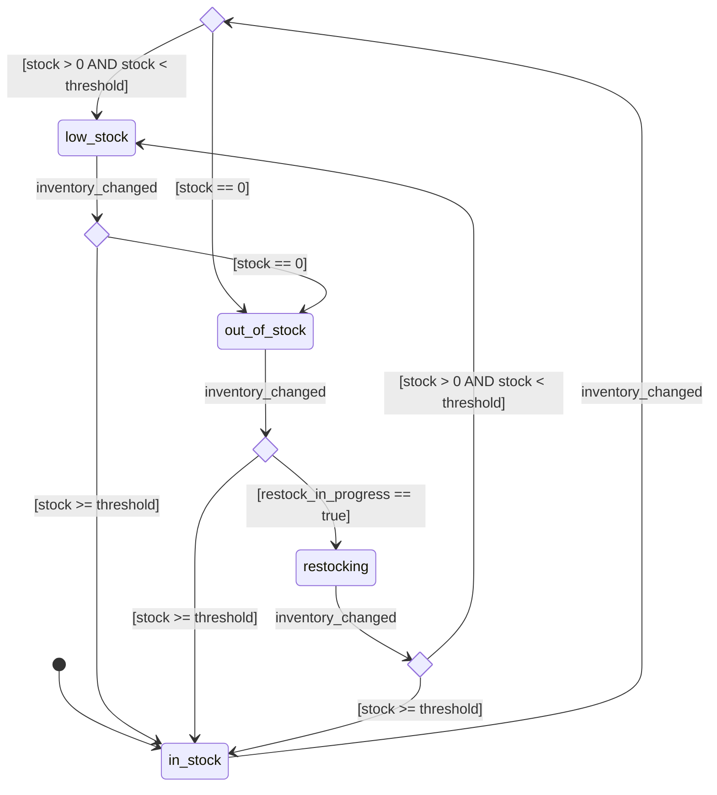

# UC-001: State Diagram render例

## State Diagram: auth

入力:

- `yaml/auth/state.yaml`

## State Diagram: order

入力:

- `yaml/order/state.yaml`

## State Diagram: inventory

入力:

- `yaml/inventory/state.yaml`

