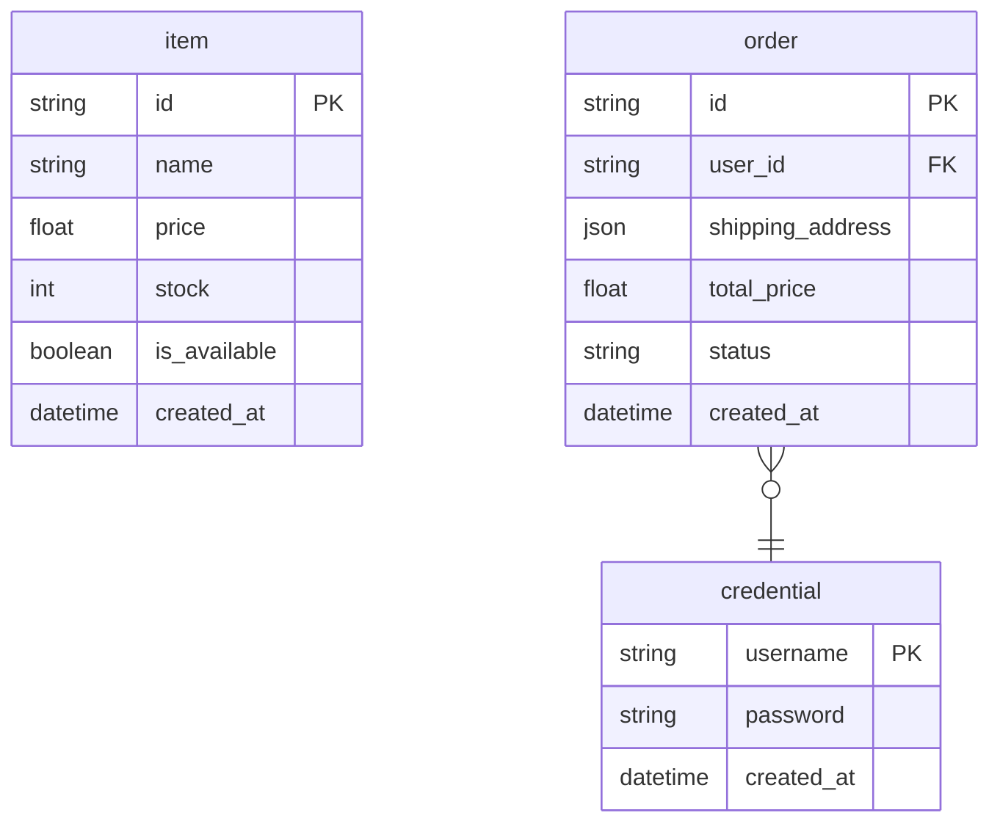

# ec_er

ECサイト全体のER図

```mermaid
erDiagram
  credential {
    string username PK
    string password
    datetime created_at
  }

  item {
    string id PK
    string name
    float price
    int stock
    boolean is_available
    datetime created_at
  }

  order {
    string id PK
    string user_id FK
    json shipping_address
    float total_price
    string status
    datetime created_at
  }

  order }o--|| credential : ""
```
