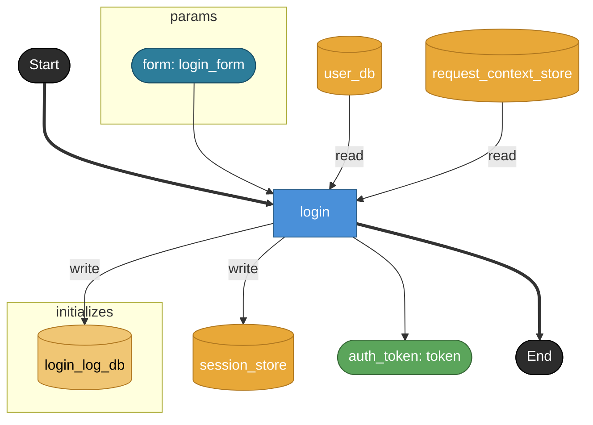

# login

**API**: [POST /api/login](../_cross/api.md)

認証情報を検証しアクセストークンを発行する。
実装メモ:
- user_db で credential を引き当て、form.password と照合
- 成功時 session_store に token を発行・保存
- 試行履歴は成否に関わらず login_log_db に記録
- request_context_store からリクエスト元情報（IP等）を取得しログに付与

## Tasks

### login

#### Params

| name | model | note |
|---|---|---|
| form | login_form | UIフォーム入力。auth.model.login_form |

#### Returns

| name | model | source |
|---|---|---|
| auth_token | token | — |

#### Store access

| access | store |
|---|---|
| read | user_db |
| read | request_context_store |
| write | session_store |
| write | login_log_db |
