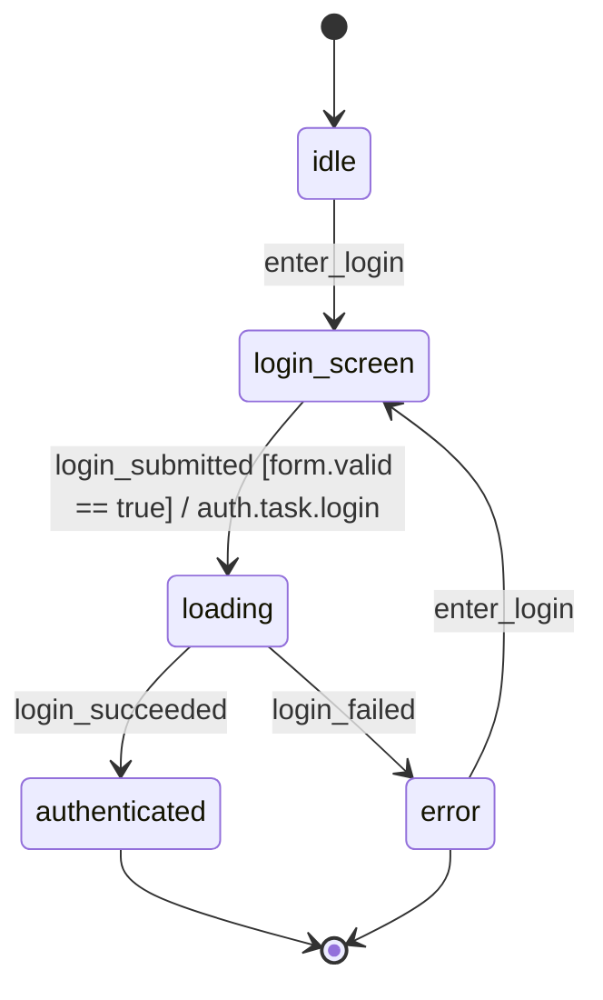

# auth

## States

| state | note |
|---|---|
| idle | 未ログイン・ログイン画面未遷移の初期状態 |
| login_screen | ログイン画面表示中。ユーザー入力待ち |
| loading | 認証API呼び出し中。ユーザー操作はブロック |
| authenticated | 認証済み。以降のアプリ機能が利用可能 |
| error | 認証失敗の終端状態。再ログインは error → login_screen の enter_login で行う |

## Events

| event | source | actor | note |
|---|---|---|---|
| enter_login | ui | — | ログイン画面への遷移トリガー。idle からの初回遷移と error からの再ログイン復帰遷移の両方で使用する。 |
| login_submitted | ui | — | ログインフォームのsubmit操作。認証APIを起動する |
| login_succeeded | internal | — | auth.task.login 成功時にFSM runtimeが発火。返却された token を運ぶ（ADR-034） |
| login_failed | internal | — | auth.task.login 失敗時にFSM runtimeが発火（ADR-034） |

