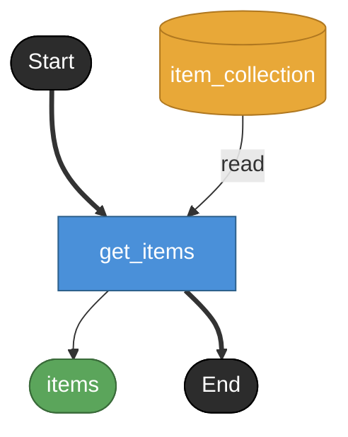

# get_items

**API**: [GET /api/catalog_items](../_cross/api.md)

販売中の商品一覧を返す。
item_collection の note にある `list_available` クエリ（is_available = true）を使用。
params なし（フィルタ無しで全件返す簡易仕様。検索/ページングは別endpointへ）。

## Tasks

### get_items

#### Returns

| name | model | source |
|---|---|---|
| items | item_list | — |

#### Store access

| access | store |
|---|---|
| read | item_collection |
