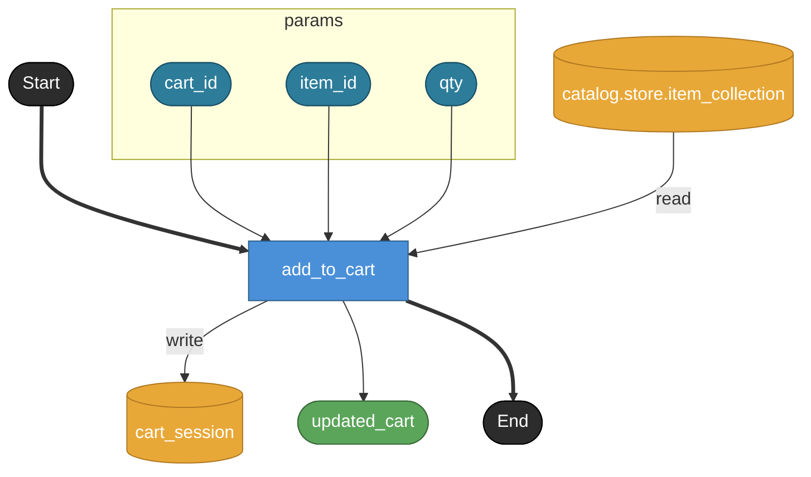

# add_to_cart

**API**: [POST /api/cart_items](../_cross/api.md)

指定商品をカートに追加する。
実装メモ:
- catalog.store.item_collection で item_id の存在を確認（find_by_id）
- cart_session から既存cartを取得し、cart_item を append または qty を加算
- 同一トランザクションで cart_session を更新

## Tasks

### add_to_cart

#### Params

| name | model | note |
|---|---|---|
| cart_id | str | 対象カートID（primitive str） |
| item_id | str | 追加する商品ID（catalog.model.item.id へのID参照） |
| qty | int | 数量（primitive int） |

#### Returns

| name | model | source |
|---|---|---|
| updated_cart | cart | — |

#### Store access

| access | store |
|---|---|
| read | catalog.store.item_collection |
| write | cart_session |
