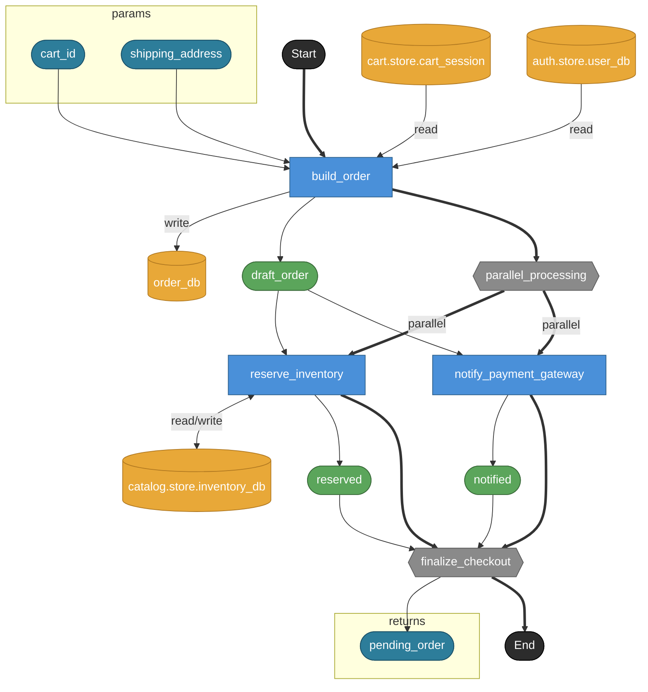

# checkout

**API**: [POST /api/checkout](../_cross/api.md)

カート確定 → 注文レコード作成 → 在庫確保 + 決済要求送信 を並列実行し、
pending状態の注文（決済webhook待ち）を返す。

## Tasks

### checkout

#### Params

| name | model | note |
|---|---|---|
| cart_id | str | 対象カートID |
| shipping_address | address | 配送先（JSON埋め込み model、ADR-021） |

#### Returns

| name | model |
|---|---|
| pending_order | order |

### build_order

cart_session から cart を取得し、user_db でユーザー存在を確認した上で
draft order（status: pending）を order_db に新規作成して返す。

#### Params

| name | model | note |
|---|---|---|
| cart_id | str | — |
| shipping_address | address | — |

#### Returns

| name | model |
|---|---|
| draft_order | order |

#### Store access

| access | store |
|---|---|
| read | cart.store.cart_session |
| read | auth.store.user_db |
| write | order_db |

### reserve_inventory

draft_order の order_item から item_id / qty を読み出し、
catalog.store.inventory_db の stock を減算して在庫確保。
読み込みと書き込みは同一トランザクション境界（ADR-008/020）。

#### Params

| name | model | note |
|---|---|---|
| draft_order | order | — |

#### Returns

| name | model |
|---|---|
| reserved | order |

#### Store access

| access | store |
|---|---|
| read/write | catalog.store.inventory_db |

### notify_payment_gateway

Stripe API に決済要求を送信（外部HTTP呼び出し）。
決済の最終結果は payment.webhooks.task.process_payment が webhook で受信。
ここでは送信完了のみを保証して draft_order を passthrough で返す。

#### Params

| name | model | note |
|---|---|---|
| draft_order | order | — |

#### Returns

| name | model |
|---|---|
| notified | order |

### parallel_processing

在庫確保と決済要求送信を並列実行する分岐点。

#### Params

| name | model | note |
|---|---|---|
| draft_order | order | — |

### finalize_checkout

両ブランチ完了を待ち合わせ、結果統合済みの pending_order を返す。
在庫確保済み + 決済GW通知済み = pending（webhookで confirmed/failed に確定）。

#### Params

| name | model | note |
|---|---|---|
| reserved | order | — |
| notified | order | — |

#### Returns

| name | model |
|---|---|
| pending_order | order |
