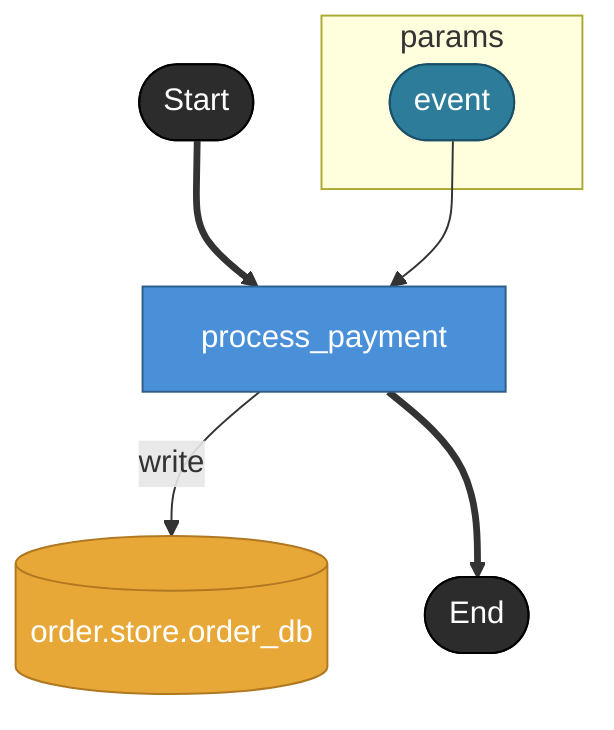

# process_payment

**API**: [POST /api/stripe](../_cross/api.md)

決済完了/失敗 webhook を受信し、対応する注文ステータスを更新する。
実装メモ:
- event.event_id は冪等性キー。同一 event_id の再送は idempotent に扱う
- event.order_id を主キーに order.store.order_db の order を引き当て
- event.status に応じて order.status を confirmed / failed に更新
- returns なし（webhookは200/空ボディ応答が一般的）

## Tasks

### process_payment

#### Params

| name | model | note |
|---|---|---|
| event | payment.model.payment_event | Webhook payload。同 model は event.payload.model としても再利用される |

#### Store access

| access | store |
|---|---|
| write | order.store.order_db |
