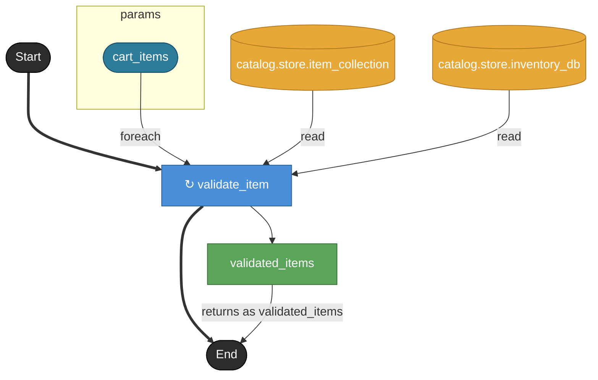

# validate_cart

カート内アイテムを 1 件ずつ validate_item で検証し、
検証通過したアイテムのリストを返す。
mode: sequential（1件ずつ順に処理。後続でロールバック単位を揃えるため）

## Tasks

### validate_cart

#### Params

| name | model | note |
|---|---|---|
| cart_items | cart_item_list | バリデート対象のカートアイテム一覧（list kind） |

#### Returns

| name | model | source |
|---|---|---|
| validated_items | cart_item_list | validated_items |

### validate_item

1件の cart_item について商品存在確認と在庫確認を行う。
- catalog.store.item_collection.find_by_id で cart_item.item_id の商品存在を確認
- catalog.store.inventory_db で item.stock >= cart_item.qty を確認
失敗時は実装で例外を上げる（YAML上は成功パスのみ表現）。

#### Params

| name | model | note |
|---|---|---|
| cart_item | cart_item | 1件のカートアイテム |

#### Returns

| name | model | source |
|---|---|---|
| validated | cart_item | — |

#### Store access

| access | store |
|---|---|
| read | catalog.store.item_collection |
| read | catalog.store.inventory_db |

