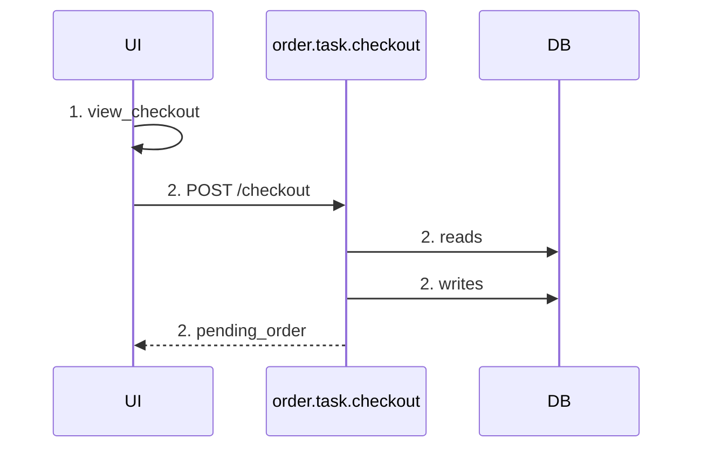

# チェックアウトフロー

## DB操作

| step | task | sub_task | store | 操作 |
|---|---|---|---|---|
| 2 | order.task.checkout | build_order | order_db | writes |
| 2 | order.task.checkout | build_order | auth.store.user_db | reads |
| 2 | order.task.checkout | reserve_inventory | catalog.store.inventory_db | reads |
| 2 | order.task.checkout | reserve_inventory | catalog.store.inventory_db | writes |

