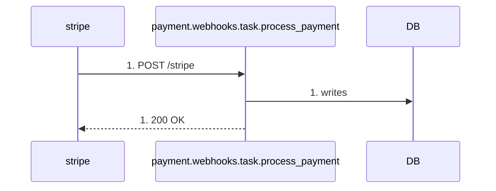

# 決済ウェブフックフロー（成功）

```mermaid
sequenceDiagram
  participant Stripe as stripe
  participant API as payment.webhooks.task.process_payment
  participant DB

  Stripe->>API: 1. POST /stripe
  API->>DB: 1. writes
  API-->>Stripe: 1. 200 OK
```

## DB操作

| step | task | sub_task | store | 操作 |
|---|---|---|---|---|
| 1 | payment.webhooks.task.process_payment | - | order.store.order_db | writes |

