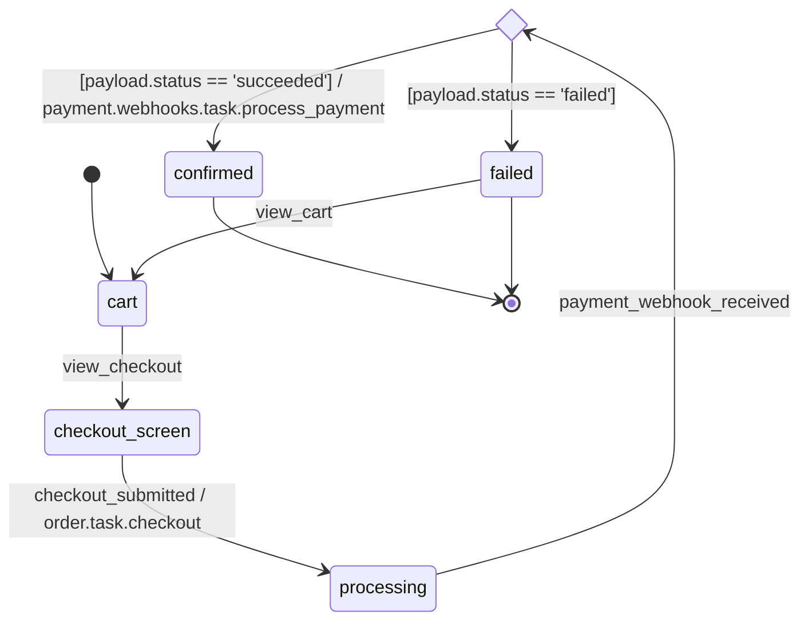

# order

## States

| state | note |
|---|---|
| cart | カート内容を確認する画面（購入手続き開始前） |
| checkout_screen | 配送先・支払い方法の入力画面 |
| processing | order.task.checkout 起動後、Stripe webhook 受信待ち |
| confirmed | 決済成功・注文確定の終端状態 |
| failed | 決済失敗の終端状態。再購入には view_cart で cart 状態へ戻る |

## Events

| event | source | actor | note |
|---|---|---|---|
| view_checkout | ui | — | 「購入手続きへ」ボタンクリックによる画面遷移 |
| view_cart | ui | — | カート画面への復帰（failed からの再試行パス） |
| checkout_submitted | ui | — | 「注文を確定する」ボタンクリック。送信データはshipping情報・支払い方法選択・同意フラグ・カート内容などの複合だが、brewprintのpayloadは単一model参照のため、ここではpayloadを省略してnoteで記述する。実装上はorder.task.checkoutのparams（cart_id, shipping_address 等）が対応する。 |
| payment_webhook_received | external | stripe | Stripe webhook受信（POST /api/stripe）。actor: stripe はプロジェクトglobalなactors.yamlに定義（ADR-031）。payload.status で成否を判定し、guardで分岐する。 |

