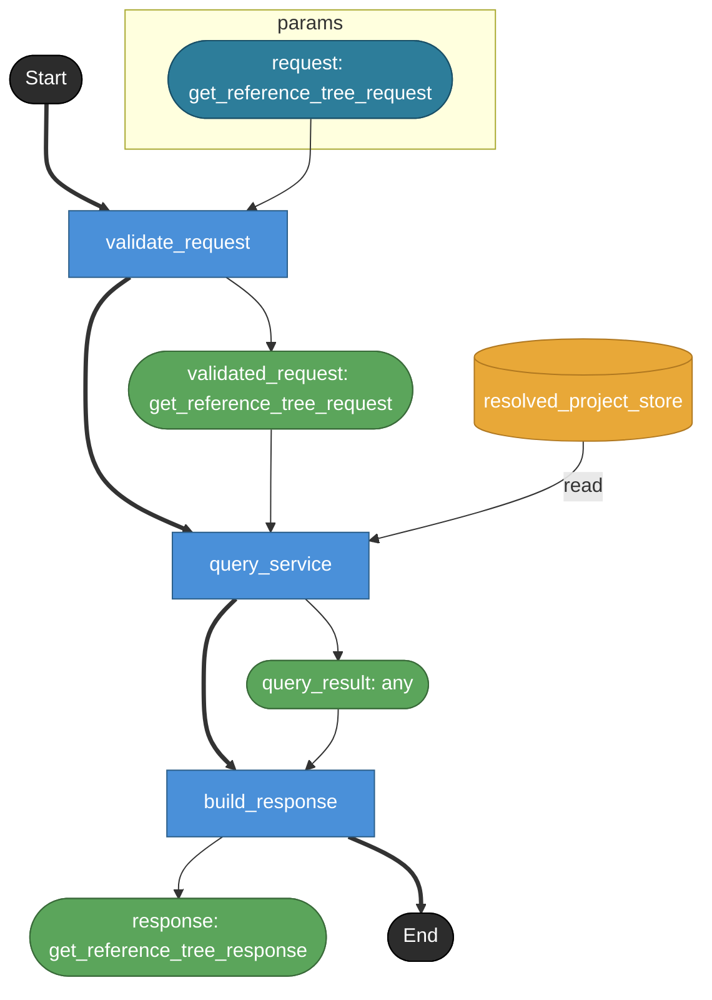

# get_reference_tree

MCP tool `get_reference_tree` の公開contract。
MCP toolでありHTTP endpointではないため endpoint: true は付けない。
対象objectをrootとして、direct referencesをdepth制限つきでBFS traversalする。
tool名はtreeだが、返却形式はnodes[] / edges[] からなるbounded reference graph。

## Tasks

### get_reference_tree

#### Params

| name | model | note |
|---|---|---|
| request | get_reference_tree_request | — |

#### Returns

| name | model | source |
|---|---|---|
| response | get_reference_tree_response | — |

### validate_request

tool input schemaとselector / direction / depth / kinds / max_nodes / max_edgesを検証する。
direction は out / in / both の必須enum。
depth は 0..4。範囲外は invalid_depth error。
enum値集合と数値範囲制約はv1 modelでは表現できないためrequest model側のnoteで保持する。

#### Params

| name | model | note |
|---|---|---|
| request | get_reference_tree_request | — |

#### Returns

| name | model | source |
|---|---|---|
| validated_request | get_reference_tree_request | — |

### query_service

QueryService境界。
Raw YAML ASTではなくResolvedProject上のsemantic object reference indexを読む。
BFS固定で、depth=0はrootのみ、depth=Nは0..N hopまでの到達nodeとedgeを返す。
same objectへの再訪は停止するがdiagnosticにはしない。
max_nodes / max_edges による打ち切りはtruncated / truncated_reasonsとして返す。
traversal対象selectorやunsupported selectorの細かな差分はresponse model側のnoteで保持する。

#### Params

| name | model | note |
|---|---|---|
| request | get_reference_tree_request | — |

#### Returns

| name | model | source |
|---|---|---|
| query_result | any | — |

#### Store access

| access | store |
|---|---|
| read | resolved_project_store |

### build_response

QueryService結果をMCP response payloadへ整形する。
root / direction / depth / nodes / edges / truncated / truncated_reasons / diagnostics を返す。
nodes[].via は最短かつ最初に探索されたBFS経路のみを表す。

#### Params

| name | model | note |
|---|---|---|
| query_result | any | — |

#### Returns

| name | model | source |
|---|---|---|
| response | get_reference_tree_response | — |

