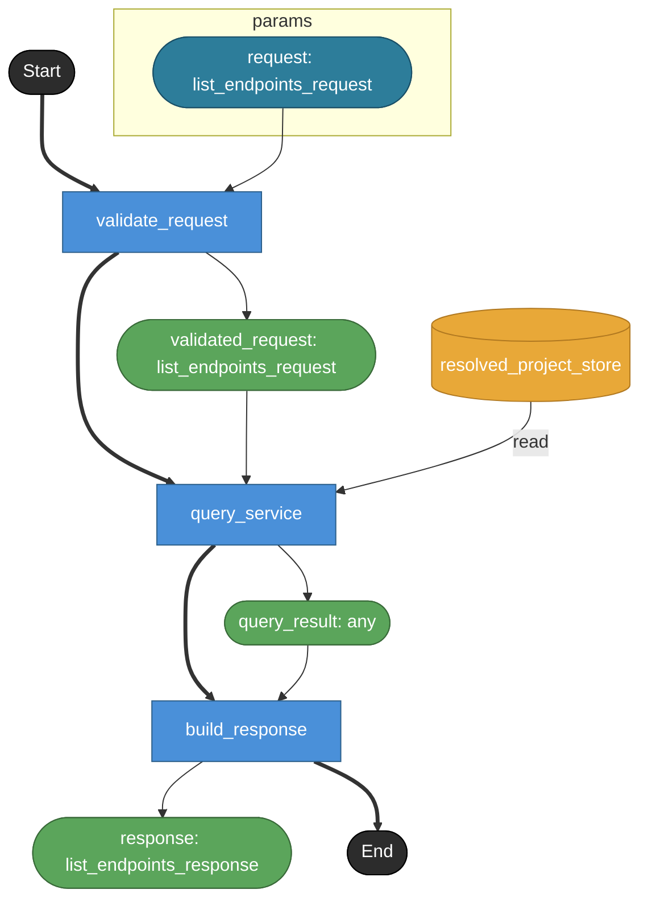

# list_endpoints

MCP tool `list_endpoints` の公開contract。
MCP toolでありHTTP endpointではないため endpoint: true は付けない。
API Table view YAMLに基づいてendpoint一覧を返す。
list_endpoints自体はHTTP endpointではなく、HTTP endpoint一覧を返すquery toolである。

## Tasks

### list_endpoints

#### Params

| name | model | note |
|---|---|---|
| request | list_endpoints_request | — |

#### Returns

| name | model | source |
|---|---|---|
| response | list_endpoints_response | — |

### validate_request

tool input schemaとapi_table_idを検証する。
api_table_id は任意。
API Tableが複数存在し、api_table_idが省略された場合は全API Tableをtables[]に分けて返す。

#### Params

| name | model | note |
|---|---|---|
| request | list_endpoints_request | — |

#### Returns

| name | model | source |
|---|---|---|
| validated_request | list_endpoints_request | — |

### query_service

QueryService境界。
Raw YAML ASTではなくResolvedProject上のAPI Table viewとendpoint task情報を読む。
task(endpoint=true)の単純列挙ではなく、API Table view定義とADR-028のroute合成規則に従いfull pathを計算する。
収集対象endpointが0件のmodule-entryはsectionsには出さない。

#### Params

| name | model | note |
|---|---|---|
| request | list_endpoints_request | — |

#### Returns

| name | model | source |
|---|---|---|
| query_result | any | — |

#### Store access

| access | store |
|---|---|
| read | resolved_project_store |

### build_response

QueryService結果をMCP response payloadへ整形する。
tables[] / sections[] / endpoints[] / diagnostics を返す。
endpoint objectにはmethod / path / leaf_path / task / params / returns / sourceを含めうる。

#### Params

| name | model | note |
|---|---|---|
| query_result | any | — |

#### Returns

| name | model | source |
|---|---|---|
| response | list_endpoints_response | — |

