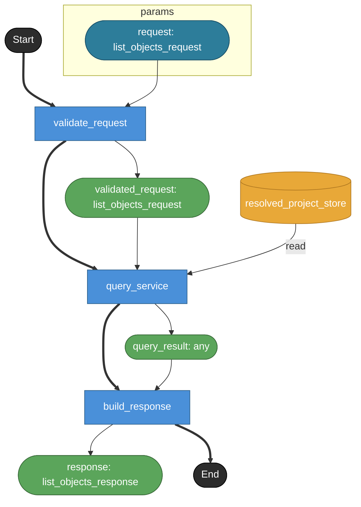

# list_objects

MCP tool `list_objects` の公開contract。
MCP toolでありHTTP endpointではないため endpoint: true は付けない。
project内のsemantic object一覧を返す探索用tool。
詳細なsignature / references / inspect情報は別toolへ委ねる。

## Tasks

### list_objects

#### Params

| name | model | note |
|---|---|---|
| request | list_objects_request | — |

#### Returns

| name | model | source |
|---|---|---|
| response | list_objects_response | — |

### validate_request

tool input schemaを検証する。
object / kind / module / file はすべて任意filter。
object / kind のenum制約はv1 modelでは表現できないためrequest model側のnoteで保持する。

#### Params

| name | model | note |
|---|---|---|
| request | list_objects_request | — |

#### Returns

| name | model | source |
|---|---|---|
| validated_request | list_objects_request | — |

### query_service

QueryService境界。
Raw YAML ASTではなくResolvedProject上のsemantic object indexを読む。
node / view / transition / field をfilter条件に応じて列挙する。

#### Params

| name | model | note |
|---|---|---|
| request | list_objects_request | — |

#### Returns

| name | model | source |
|---|---|---|
| query_result | any | — |

#### Store access

| access | store |
|---|---|
| read | resolved_project_store |

### build_response

QueryService結果をMCP response payloadへ整形する。
objects[] と diagnostics[] を返す。

#### Params

| name | model | note |
|---|---|---|
| query_result | any | — |

#### Returns

| name | model | source |
|---|---|---|
| response | list_objects_response | — |

