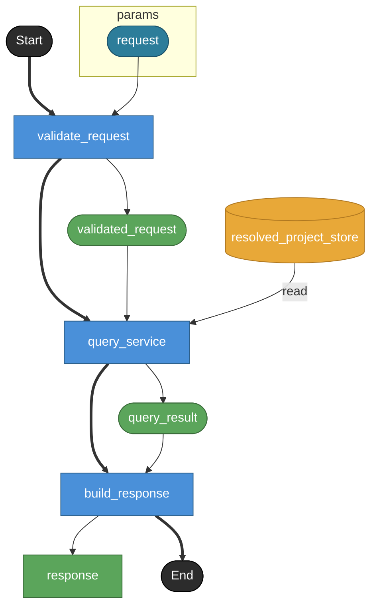

# analyze_impact

MCP tool `analyze_impact` の公開contract。
MCP toolでありHTTP endpointではないため endpoint: true は付けない。
対象objectとchange kindから、意味づけ済みのimpact listを返す。
raw reference graphはget_reference_tree、source snippetはget_sourceに委ねる。

## Tasks

### analyze_impact

#### Params

| name | model | note |
|---|---|---|
| request | analyze_impact_request | — |

#### Returns

| name | model | source |
|---|---|---|
| response | analyze_impact_response | — |

### validate_request

tool input schemaとselector / change / scope_modules / max_impactsを検証する。
change はkindをdiscriminatorとするobject。
rename / remove / change_type / change_contract / change_transition_target / add のpayload制約はv1 modelでは表現できないためrequest model側のnoteで保持する。
kindとpayloadの不正な組み合わせは invalid_change_payload tool error。
unsupported selectorはtool errorではなく、空impacts + unsupported_selector diagnostic + coverageを含む通常responseとして返す。

#### Params

| name | model | note |
|---|---|---|
| request | analyze_impact_request | — |

#### Returns

| name | model | source |
|---|---|---|
| validated_request | analyze_impact_request | — |

### query_service

QueryService境界。
Raw YAML ASTではなくResolvedProject上のsemantic object / reference / render output mappingを読む。
change kindごとに探索深さとcollectorをtool側が決める。
severity / fixability / coverage / recommended_action / suggested_fixes を付与する。
flow wiring、sequence step、render output file粒度、型signature identityなどのcoverage差分はv1 modelでは厳密表現できないためresponse model側のnoteで保持する。
複雑なcollector分岐は現時点ではnoteで表現し、flowのbranch化はしない。

#### Params

| name | model | note |
|---|---|---|
| request | analyze_impact_request | — |

#### Returns

| name | model | source |
|---|---|---|
| query_result | any | — |

#### Store access

| access | store |
|---|---|
| read | resolved_project_store |

### build_response

QueryService結果をMCP response payloadへ整形する。
target / change / summary / impacts / coverage / assumptions / truncated / truncated_reasons / diagnostics を返す。
fixability=mechanical はsource locationと置換内容が一意に決まる場合のみ返す。

#### Params

| name | model | note |
|---|---|---|
| query_result | any | — |

#### Returns

| name | model | source |
|---|---|---|
| response | analyze_impact_response | — |

