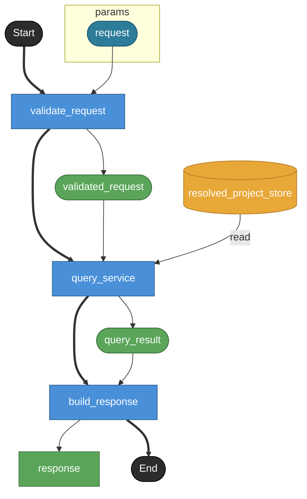

# get_signature

MCP tool `get_signature` の公開contract。
MCP toolでありHTTP endpointではないため endpoint: true は付けない。
対象object単体の外形、signature、doc、diagnosticsを返す。

## Tasks

### get_signature

#### Params

| name | model | note |
|---|---|---|
| request | get_signature_request | — |

#### Returns

| name | model | source |
|---|---|---|
| response | get_signature_response | — |

### validate_request

tool input schemaとselectorを検証する。
selectorの有効な組み合わせや対象kind別の制約はv1 modelでは表現できないためrequest model側のnoteで保持する。

#### Params

| name | model | note |
|---|---|---|
| request | get_signature_request | — |

#### Returns

| name | model | source |
|---|---|---|
| validated_request | get_signature_request | — |

### query_service

QueryService境界。
Raw YAML ASTではなくResolvedProject上のsemantic objectを読む。
node / transition / field などselector対象ごとにsignatureを取得する。
対象kind別signatureのshape差分はv1 modelでは厳密表現できないためresponse model側のnoteで保持する。

#### Params

| name | model | note |
|---|---|---|
| request | get_signature_request | — |

#### Returns

| name | model | source |
|---|---|---|
| query_result | any | — |

#### Store access

| access | store |
|---|---|
| read | resolved_project_store |

### build_response

QueryService結果をMCP response payloadへ整形する。
object / signature / doc / diagnostics を返す。

#### Params

| name | model | note |
|---|---|---|
| query_result | any | — |

#### Returns

| name | model | source |
|---|---|---|
| response | get_signature_response | — |

