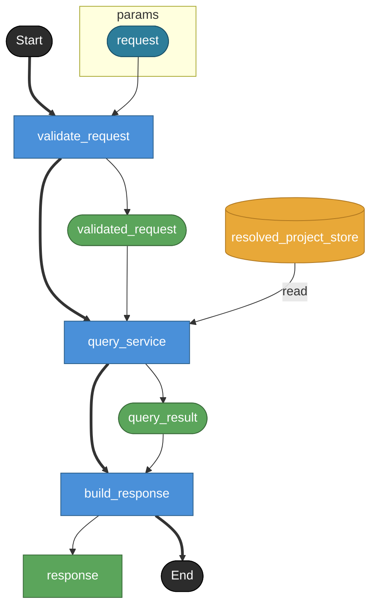

# inspect

MCP tool `inspect` の公開contract。
MCP toolでありHTTP endpointではないため endpoint: true は付けない。
対象objectの実装判断に必要な周辺文脈をkind別にまとめて返す。
get_signatureより濃い文脈取得toolとして扱う。

## Tasks

### inspect

#### Params

| name | model | note |
|---|---|---|
| request | inspect_request | — |

#### Returns

| name | model | source |
|---|---|---|
| response | inspect_response | — |

### validate_request

tool input schemaとselector / detailを検証する。
detail は brief / normal / full のenumで、省略時normal。
MCP v1ではdetailによる厳密な返却差分は実装任意だが、未知値はerror。
enum制約はv1 modelでは表現できないためrequest model側のnoteで保持する。

#### Params

| name | model | note |
|---|---|---|
| request | inspect_request | — |

#### Returns

| name | model | source |
|---|---|---|
| validated_request | inspect_request | — |

### query_service

QueryService境界。
Raw YAML ASTではなくResolvedProject上のsemantic object、members、references、source補助情報を読む。
task / store / model / state / event / transition / field / view / file など対象kindごとに返却shapeが変わる。
kind別のmembers構造、flow entries、sequence hints、view集約結果などの差分はv1 modelでは厳密表現できないためresponse model側のnoteで保持する。
対象kind別分岐は現時点ではnoteで表現し、flowのbranch化はしない。

#### Params

| name | model | note |
|---|---|---|
| request | inspect_request | — |

#### Returns

| name | model | source |
|---|---|---|
| query_result | any | — |

#### Store access

| access | store |
|---|---|
| read | resolved_project_store |

### build_response

QueryService結果をMCP response payloadへ整形する。
object / signature / doc / source / members / references / diagnostics を返す。
members / references は対象kindとdetailに応じて可能な範囲で含める。

#### Params

| name | model | note |
|---|---|---|
| query_result | any | — |

#### Returns

| name | model | source |
|---|---|---|
| response | inspect_response | — |

