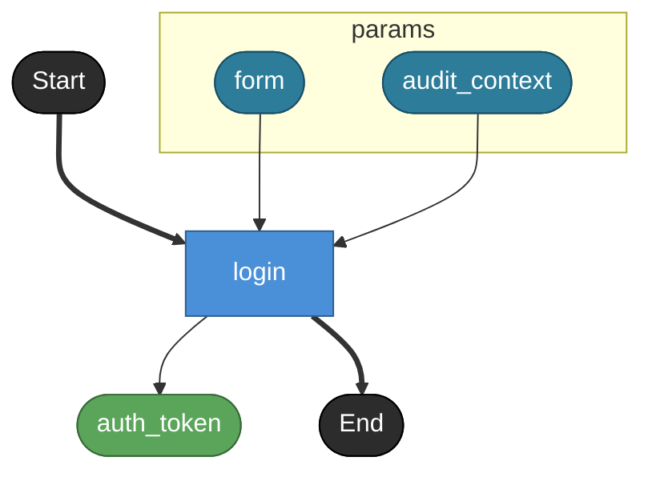

# login

**API**: [POST /api/login](../_cross/api.md)

Authenticate a user and return a token.
This task file intentionally declares helper models below the main task
so renderer behavior for `## Private models` can be inspected.

## Tasks

### login

#### Params

| name | model | note |
|---|---|---|
| form | login_form | Login form submitted by the client. |
| audit_context | login_audit_context | Task-local helper schema used only by this login task file. |

#### Returns

| name | model | source |
|---|---|---|
| auth_token | login_token | — |

