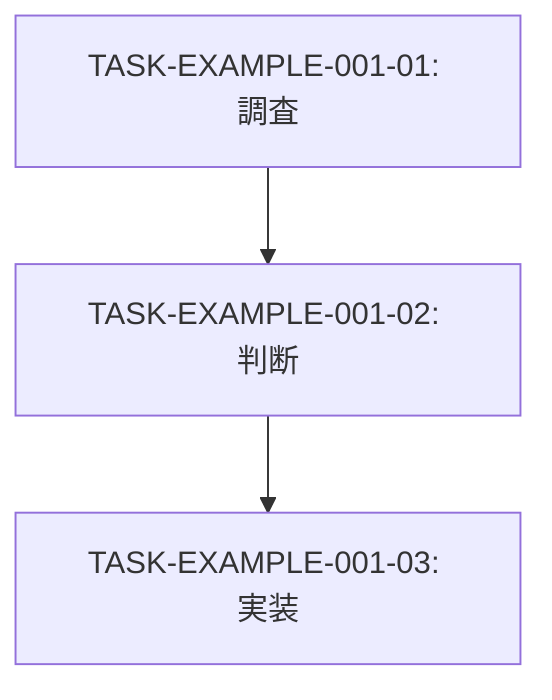

# Work items

> Authoring guide ID: `work-item-authoring`
> Boundary guide ID: `artifact-boundary`

`docs/work-items/` は、accepted または追跡対象となった requirement を完了させるための到達点、作業フロー全体、横断進捗、影響範囲、task graph を記録する artifact layer である。従来 `milestone` と呼んでいた実行計画の役割は、新形式では work item が担う。

Work item は、必要に応じて investigation、ADR 判断、spec 更新、internal design、YAML 更新、implementation、fixture、verification、close / evidence 同期の task を束ねる。Implementation 専用の artifact ではない。

Work item は現行仕様本文、設計判断の長い理由、具体的な作業手順、個別 task の status 正本を所有しない。
現行仕様は `docs/spec/`、設計判断は `docs/adr/`、具体作業と個別 status / evidence は `docs/tasks/` が所有する。

## Required relationship

すべての work item は source requirement を必ず持つ。
Requirement が「何が必要か」を所有し、work item が「それを解消するために、どの artifact をどこまで更新し、どの task flow で進めるか」を所有する。

## ID and layout

Work item ID は domain-scoped sequence とする。

```text
WORK-<DOMAIN>-NNN
```

初期 layout は domain 単位とする。

```text
docs/work-items/<domain>/WORK-<DOMAIN>-NNN-<slug>.md
```

## Minimal metadata

初期運用では Markdown 冒頭の bullet metadata を使う。
Design Records MCP の parser / public record schema / validation diagnostic は `docs/spec/design-records-mcp/` が所有し、この README は authoring guidance を所有する。

```markdown
# WORK-<DOMAIN>-NNN: <title>

- **id**: WORK-<DOMAIN>-NNN
- **status**: not_started / decision_pending / design_spec_pending / internal_design_pending / yaml_pending / implementation_pending / fixture_pending / verification_pending / done / blocked
- **date**: YYYY-MM-DD
- **source_requirement**: REQ-<DOMAIN>-NNN
- **impact_refs**:
  - <canonical reference>
- **tasks**:
  - TASK-<DOMAIN>-NNN-01
```

`id` は H1 の work item ID と一致させる。
`source_requirement` と `tasks` は `REQ-*` / `TASK-*` の ID-as-ref を用いる。
Workflow artifact 間の canonical relation として physical path は support しない。
`impact_refs` など workflow 外の artifact への参照は、既存の canonical reference 方針に従い、この guide で新たな参照種別を追加定義しない。

## Status

Work item status は、要求の採否ではなく横断作業の処理状態を表す。

| status | meaning |
|---|---|
| `not_started` | 未着手 |
| `decision_pending` | ADR 等の設計判断待ち |
| `design_spec_pending` | design spec 反映待ち |
| `internal_design_pending` | internal design 反映待ち |
| `yaml_pending` | brewprint DSL YAML 更新待ち |
| `implementation_pending` | implementation / renderer / validator / MCP 更新待ち |
| `fixture_pending` | fixture / golden 更新待ち |
| `verification_pending` | 検証待ち |
| `done` | 必要な反映・検証が完了 |
| `blocked` | 依存判断・外部要因で停止中 |

## Task flow

Work item は、配下 task の順序・分岐・blocker・並列可能性を示す Mermaid `flowchart` を持てる。Task flow は進行構造を示す view であり、個別 task の status の正本ではない。

````markdown
## Task flow


````

## Completion condition

Work item は、requirement を解消するための全体的な完了条件を `Completion condition` または `Close condition` section として持つことを推奨する。

- Work item の completion condition は、その work item 全体を `done` にできる条件を示す。
- 各 task の `Done condition` は、その task 単独を `done` にできる条件を示す。
- 配下 task がすべて `done` であっても、必要な evidence、status synchronization、requirement への結果反映が未完了であれば、work item を `done` としない。
- Completion condition は配下 task の checkbox や status copy ではなく、work item が所有する到達点と close 判定を記述する。

## Progress state boundary

- Work item の `status` は requirement 解消フロー全体の処理段階を表す。
- 各 task の完了状態の正本は task artifact の `status` とする。
- Work item 本文に、配下 task の完了 checkbox または status copy を手動複製しない。
- Status 集約 view が必要な場合は、将来の MCP support による derived projection として扱う。

## Boundary

- work item は source requirement なしで自走しない。
- work item は requirement 解消に向けた到達点、複数 artifact にまたがる進捗、影響範囲、task graph を所有する。
- task file は work item を実行する短期 concrete work、完了条件、個別 status、verification evidence を所有する。
- `milestone` を新しい artifact layer、canonical identity、metadata field、または work item 間の relation として導入しない。旧 M-series 記録を説明する歴史的ラベル、または人間向け表示上の見出しとしてのみ扱いうる。
- work item を coverage edge endpoint として扱うことは semantic trace MVP の scope 外である。

> 由来: ADR-081, ADR-083, ADR-084, ADR-091
