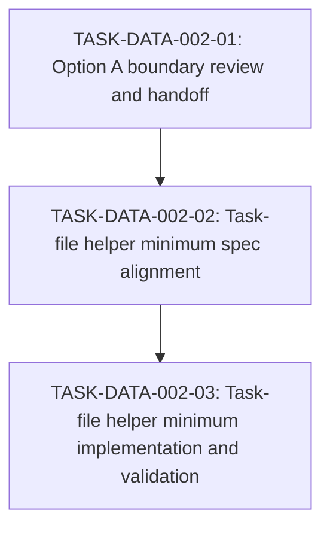

# WORK-DATA-002: Implement task-file helper model minimum

- **id**: WORK-DATA-002
- **status**: done
- **date**: 2026-05-31
- **source_requirement**: REQ-DATA-002
- **impact_refs**:
  - INV-DATA-001
  - INV-DATA-002
  - REQ-DATA-001
  - WORK-DATA-001
  - WORK-DATA-003
  - ADR-070
  - ADR-071
- **tasks**:
  - TASK-DATA-002-01
  - TASK-DATA-002-02
  - TASK-DATA-002-03

## Goal

Implement the first executable helper-model capability as the Option A task-file helper model minimum without reopening M15 / `v1.1.0-spec`.

This work item owns only the ADR-070 / ADR-071 path needed for task files: file-private helper models, same-file TypeRef resolution, validation for the task-file minimum, and DAG Markdown render exposure through `## Private models`.

## Boundary

### Included

- Apply ADR-070 file-private helper model semantics to task files only.
- Apply ADR-071 task-file helper model render exposure in DAG Markdown.
- Align the relevant specs for task-file helper model placement, visibility, same-file TypeRef resolution, diagnostics, and render format.
- Implement and validate task-file helper model parsing / resolution / diagnostics.
- Implement and verify DAG Markdown `## Private models` exposure for task files containing helper models.
- Keep helper models out of Mermaid DAG flow nodes.

### Deferred to WORK-DATA-003 or Later

- ADR-072 model / schema catalog follow-up.
- ADR-075 model file render acceptance, revision, or split.
- Model-file helper model migration and model-file helper render exposure.
- UC-002 model response helper-shape migration, including `get_source_response.snippet`, `get_reference_tree_response.nodes`, and `get_reference_tree_response.edges`.
- MCP helper model exposure schema.

### Excluded

- ADR-073 tagged union model.
- ADR-074 DAG asset TypeRef hint.
- ADR-078 / ADR-079 / ADR-080 MCP / state identity work.
- M15 / `v1.1.0-spec` reopening.
- REQ-DATA-001 / WORK-DATA-001 edits.
- Treating all UC-002 notes retreat debt as one required migration.

## Impact Scope

| layer | current state | handling in this work item |
|---|---|---|
| source requirement | `REQ-DATA-002` captured | This work item owns only the task-file helper model minimum |
| investigation evidence | `INV-DATA-001` / `INV-DATA-002` concluded | Use as boundary evidence, not as task status |
| previous data work | `WORK-DATA-001` done | Preserve the M15 F1 close boundary |
| decision | ADR-070 / ADR-071 accepted | Use as the implementation basis for task-file helper models |
| deferred decisions | ADR-072 accepted; ADR-075 proposed | Send catalog, model-file render, and UC-002 model response migration to `WORK-DATA-003` or later |
| spec | task-file helper model rules require alignment | `TASK-DATA-002-02` owns spec alignment |
| implementation / validation | implemented and verified for task-file helper minimum | `TASK-DATA-002-03` completed implementation, renderer exposure, and verification |
| UC-002 YAML | helper-shape notes remain | No UC-002 model response YAML migration in this work item |

## Task Flow

## Tasks

- `TASK-DATA-002-01`: Complete. Select Option A and record deferred model-file / catalog / UC-002 migration scope.
- `TASK-DATA-002-02`: Align specs for task-file helper model placement, visibility, TypeRef resolution, diagnostics, and DAG Markdown render format.
- `TASK-DATA-002-03`: Implement and verify task-file helper parsing / validation / TypeRef resolution and DAG Markdown `## Private models` render exposure.

## Follow-up Work

`WORK-DATA-003` owns the model-file side of the helper-model chain. It receives ADR-072 catalog follow-up, ADR-075 model file render resolution, model-file helper render exposure, and UC-002 model response helper-shape migration candidates.

## Completion Condition

This work item can be marked `done` when the Option A task-file helper model minimum is reflected in the relevant specs, implementation, validation behavior, DAG Markdown render output, and verification evidence.

Completion does not require ADR-072 catalog work, ADR-075 model-file render work, model-file helper migration, UC-002 model response YAML migration, ADR-073 tagged union work, ADR-074 DAG TypeRef hint work, ADR-078 MCP identity work, or any M15 / `v1.1.0-spec` reopening.

## Close Outcome

WORK-DATA-002 is closed as `done` for the Option A task-file helper model minimum.

Closed scope:

- TASK-DATA-002-01 selected and recorded the Option A boundary.
- TASK-DATA-002-02 aligned the relevant specs for task-file helper placement, visibility, same-file TypeRef resolution, diagnostics, DAG Markdown `## Private models`, and ER exclusion.
- TASK-DATA-002-03 implemented and verified task-file helper model parsing / indexing, same-file helper TypeRef resolution, external QualifiedID rejection by unresolved public lookup, `duplicate_model_id` diagnostics, DAG Markdown private model table rendering, and ER exclusion.
- TASK-DATA-002-03 post-review corrections tightened helper model local identity collisions, rejected task-file `model main: true`, and kept private helper synthetic IDs out of public query reference targets.

Verification evidence:

- Close evidence commit: e1a70dc
- `gofmt -w ...`: completed for modified Go files.
- `go test ./internal/resolve ./internal/render/dag ./internal/render/er ./internal/query ./internal/mcp`: pass.
- `go test ./...`: pass.
- `validate_records(kind="task")`: pass.
- `validate_records(kind="work_item")`: pass.
- `git diff --check`: pass.

Deferred scope remains owned by WORK-DATA-003 or later:

- ADR-072 model / schema catalog follow-up.
- ADR-075 model-file render resolution.
- Model-file helper render exposure.
- UC-002 model response helper-shape migration.
- ADR-073 tagged union, ADR-074 DAG TypeRef hint, ADR-078 MCP helper exposure / semantic identity, and M15 / `v1.1.0-spec` reopening.
