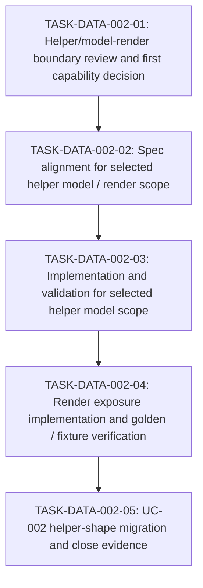

# WORK-DATA-002: Define and implement helper model / model render follow-up boundary

- **id**: WORK-DATA-002
- **status**: not_started
- **date**: 2026-05-31
- **source_requirement**: REQ-DATA-002
- **impact_refs**:
  - INV-DATA-001
  - INV-DATA-002
  - REQ-DATA-001
  - WORK-DATA-001
  - ADR-070
  - ADR-071
  - ADR-072
  - ADR-075
- **tasks**:

## Goal

Turn the M15 deferred helper model / model render chain into a bounded execution flow that can decide and implement the next useful capability without reopening M15.

## Boundary

### Included

- Review the accepted / proposed ADR chain:
  - ADR-070 file-private helper model
  - ADR-071 task-file helper model render exposure
  - ADR-072 model / schema catalog view
  - ADR-075 model file render
- Decide the first implementation boundary for helper model and model render follow-up.
- Identify UC-002 MCP contract shapes that are candidates for helper model migration.
- Track required spec, implementation, renderer, UC-002 YAML, fixture, and verification work.

### Excluded

- ADR-073 tagged union model.
- ADR-074 DAG asset TypeRef hint.
- ADR-078 / ADR-079 / ADR-080 MCP / state identity work.
- M15 / `v1.1.0-spec` reopening.
- Treating all UC-002 notes retreat debt as one required migration.

## Impact Scope

| layer | current state | handling in this work item |
|---|---|---|
| source requirement | `REQ-DATA-002` captured | This work item owns the helper/model-render follow-up flow |
| investigation evidence | `INV-DATA-001` / `INV-DATA-002` concluded | Use as boundary evidence, not as task status |
| previous data work | `WORK-DATA-001` done | Preserve the M15 F1 close boundary |
| decision | ADR-070 / 071 / 072 accepted; ADR-075 proposed | Decide executable implementation boundary before implementation |
| spec | helper model and render surfaces may require spec updates | Future tasks own spec changes |
| implementation / render | not yet implemented for this follow-up | Future tasks own implementation and render verification |
| UC-002 YAML | helper-shape notes remain | Migrate only selected shapes after boundary decision |

## Task flow

## Task Candidates

- `TASK-DATA-002-01`: Helper/model-render boundary review and first capability decision.
- `TASK-DATA-002-02`: Spec alignment for selected helper model / render scope.
- `TASK-DATA-002-03`: Implementation and validation for selected helper model scope.
- `TASK-DATA-002-04`: Render exposure implementation and golden / fixture verification.
- `TASK-DATA-002-05`: UC-002 helper-shape migration and close evidence.

Task artifacts are intentionally not created in this migration step. Therefore these candidate IDs are shown only in the body and are not listed in the metadata `tasks` field.

## Completion Condition

This work item can be marked `done` when the selected helper model / model render follow-up is reflected in the relevant specs, implementation, render outputs, UC-002 migration, and verification evidence, while tagged union, DAG TypeRef hint, MCP identity, and M15 reopen scope remain excluded.

