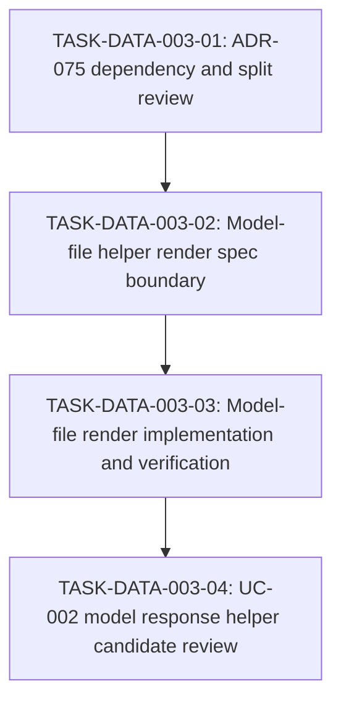

# WORK-DATA-003: Resolve model-file helper render boundary

- **id**: WORK-DATA-003
- **status**: implementation_pending
- **date**: 2026-05-31
- **source_requirement**: REQ-DATA-002
- **impact_refs**:
  - INV-DATA-002
  - ADR-070
  - ADR-072
  - ADR-073
  - ADR-075
- **tasks**:
  - TASK-DATA-003-01
  - TASK-DATA-003-02
  - TASK-DATA-003-03
  - TASK-DATA-003-04

## Goal

Resolve the model-file helper model and render exposure boundary separately from the task-file helper minimum path.

This work item exists to prevent model response helper migration from being pulled into WORK-DATA-002 before model-file render exposure is decided.

WORK-DATA-002 explicitly sends ADR-072 catalog follow-up, ADR-075 model file render resolution, model-file helper render exposure, and UC-002 model response helper-shape migration review to this work item. Actual UC-002 migration is delegated to WORK-DATA-004 or later follow-up work.

## Boundary

### Included

- Receive deferred scope from WORK-DATA-002 after the Option A task-file helper model minimum boundary.
- Decide whether ADR-075 should be accepted as-is, revised, or split.
- Decide whether ADR-072 model / schema catalog follow-up is needed before or after model-file render exposure.
- Decide the minimum model-file helper render capability needed to satisfy ADR-070's human-visible render constraint for model-file helper models.
- Determine whether the ADR-075 dependency on ADR-073 is intrinsic to model-file render, or only needed for tagged-union rendering details.
- Classify UC-002 model response helper-shape candidates and delegate actual migration to WORK-DATA-004 or later follow-up work.
- Track any required spec, render, YAML, fixture, and verification follow-up for model-file helper render.

### Excluded

- WORK-DATA-002 Option A task-file helper minimum.
- ADR-071 task-file DAG Markdown private model exposure, except as contrast.
- Implementing ADR-073 tagged union model.
- Implementing ADR-074 DAG asset TypeRef hint.
- Implementing ADR-078 MCP semantic identity or helper model MCP exposure schema.
- M15 / v1.1.0-spec reopening.
- REQ-DATA-001 / WORK-DATA-001 edits.

## Impact Scope

| layer | current state | handling in this work item |
|---|---|---|
| source requirement | REQ-DATA-002 captured | This work item owns the model-file helper render sub-boundary |
| helper model decision | ADR-070 accepted | Keep helper models human-visible; do not migrate model-file helpers without render exposure |
| catalog decision | ADR-072 accepted | Treat model catalog as opt-in curated view, not automatic model-file render |
| model file render decision | ADR-075 proposed | Resolve before implementation or migration |
| tagged union | ADR-073 proposed | Do not implement here; classify whether ADR-075 depends on it intrinsically |
| UC-002 migration | INV-DATA-002 model response candidates exist | Classify candidates here; delegate actual migration to WORK-DATA-004 or later follow-up work |

## Task flow

## Task Candidates

- `TASK-DATA-003-01`: ADR-075 dependency and split review.
- `TASK-DATA-003-02`: Model-file helper render spec boundary.
- `TASK-DATA-003-03`: Model-file render implementation and verification.
- `TASK-DATA-003-04`: UC-002 model response helper candidate review.

`TASK-DATA-003-01`, `TASK-DATA-003-02`, `TASK-DATA-003-03`, and `TASK-DATA-003-04` are created task artifacts and are listed in metadata `tasks`.

## Completion Condition

This work item can be marked `done` when model-file helper render exposure is decided, reflected in the relevant spec and renderer behavior, verified with fixture / golden evidence, and UC-002 model response helper candidates are classified without pulling in tagged union, DAG TypeRef hint, MCP identity, M15 reopen scope, or actual UC-002 migration.

## Close-readiness Evidence

TASK-DATA-003-04 provides the final UC-002 candidate-classification input for this work item.

Close-readiness judgment:

- Model-file helper render exposure has been decided, specified, implemented, and verified by the DATA-003 task chain.
- UC-002 response helper-shape candidates are classified into model-file helper migration candidates, REQ-DATA-003 / WORK-DATA-004 wait candidates, and unchanged candidates.
- Actual UC-002 YAML migration remains delegated to WORK-DATA-004 or later follow-up work.
- Tagged union, DAG TypeRef hint, MCP helper exposure / identity, M15 reopening, WORK-DATA-002 reopening, and remaining UC-002 notes-retreat debt remain outside this work item.
- No UC-002 YAML or render output change is required to close WORK-DATA-003.

Therefore WORK-DATA-003 is close-ready after TASK-DATA-003-04, provided close means completion of the model-file render boundary and candidate classification rather than execution of the deferred UC-002 migration.
