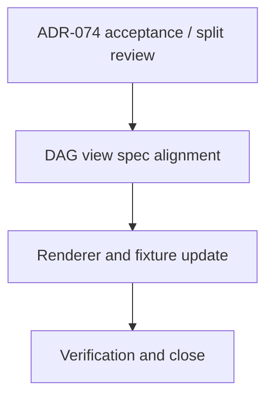

# WORK-DATA-007: Implement DAG asset TypeRef hint render support

- **id**: WORK-DATA-007
- **status**: not_started
- **date**: 2026-06-01
- **source_requirement**: REQ-DATA-005
- **impact_refs**:
  - REQ-DATA-005
  - ADR-074
  - WORK-DATA-001
  - TASK-DATA-005-02
- **tasks**:

## Goal

Implement DAG asset TypeRef hint render support as a focused DATA render / view successor to ADR-074.

## Boundary

### Included

- Review ADR-074 and decide whether it can be accepted as-is, revised, or split before implementation.
- Define the exact DAG asset label TypeRef hint render boundary.
- Align relevant view specs and render behavior.
- Add or update fixture / golden evidence for asset node and params boundary asset hint rendering.
- Verify that full container TypeRef details remain outside Mermaid label output when required by the accepted boundary.

### Excluded

- ADR-073 tagged union / discriminator payload support.
- ADR-078 / ADR-079 / ADR-080 MCP semantic identity / state machine identity.
- UC-002 duplicate task QID / unresolved flow task issue.
- Remaining UC-002 notes retreat cleanup.
- Reopening M15, WORK-DATA-001, WORK-DATA-002, WORK-DATA-003, or WORK-DATA-004.

## Impact Scope

| layer | current state | handling in this work item |
|---|---|---|
| source requirement | REQ-DATA-005 captured | Owns DAG TypeRef hint render support |
| decision | ADR-074 proposed | Review and accept / revise / split before implementation |
| completed M15 work | WORK-DATA-001 done | Preserve M15 close boundary; implement only as successor work |
| render views | DAG Markdown / Mermaid | Update only the accepted TypeRef hint surfaces |

## Task Flow

No task artifacts are created at initial capture time.

Expected later split:

## Completion Condition

This work item can be marked `done` when DAG asset TypeRef hint behavior is accepted, specified, implemented, fixture/golden-covered, verified, and closed without mixing in tagged union, MCP identity, UC-002 diagnostic blockers, or broad notes retreat cleanup.
