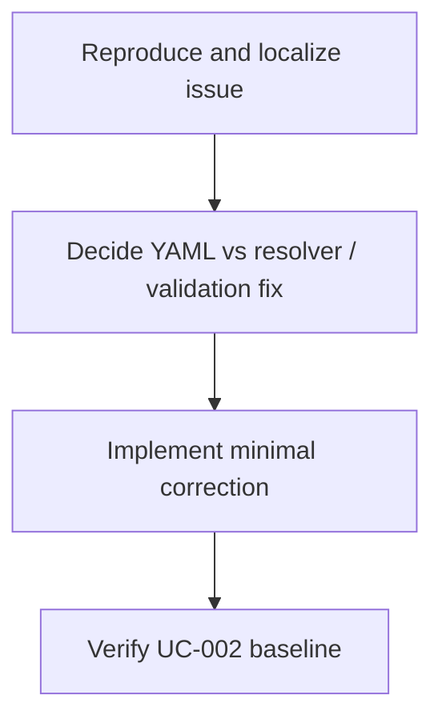

# WORK-DATA-008: Resolve UC-002 duplicate task QID and unresolved flow task issue

- **id**: WORK-DATA-008
- **status**: not_started
- **date**: 2026-06-01
- **source_requirement**: REQ-DATA-002
- **impact_refs**:
  - REQ-DATA-002
  - WORK-DATA-001
  - TASK-DATA-005-01
  - TASK-DATA-005-02
- **tasks**:

## Goal

Resolve the pre-existing UC-002 duplicate task QID / unresolved flow task issue that blocks clean UC-002 validation / render verification.

This work item is a targeted diagnostic / fixture blocker follow-up, not a new DATA expressiveness feature.

## Boundary

### Included

- Reproduce and locate the UC-002 duplicate task QID / unresolved flow task issue.
- Decide whether the root cause is YAML identity, validation behavior, resolver behavior, fixture drift, or diagnostic cascade.
- Apply the minimal fix needed to restore clear UC-002 validation / render behavior.
- Add regression evidence for the fixed behavior.

### Excluded

- ADR-073 tagged union support.
- ADR-074 DAG asset TypeRef hint.
- ADR-078 / ADR-079 / ADR-080 MCP identity series.
- Broad UC-002 notes retreat cleanup.
- Helper model / model-file render redesign.
- Reopening M15, WORK-DATA-001, WORK-DATA-002, WORK-DATA-003, or WORK-DATA-004.

## Impact Scope

| layer | current state | handling in this work item |
|---|---|---|
| source requirement | REQ-DATA-002 captured | Owns DATA follow-up umbrella for this blocker |
| M15 close | WORK-DATA-001 done | Treat issue as pre-existing and outside M15 close |
| UC-002 validation / render | blocked by duplicate task QID / unresolved flow task issue | Restore clean baseline for later successor work |

## Task Flow

No task artifacts are created at initial capture time.

Expected later split:

## Completion Condition

This work item can be marked `done` when the duplicate task QID / unresolved flow task issue is localized, corrected, regression-covered, and verified without pulling in unrelated DATA expressiveness or notes retreat cleanup work.
