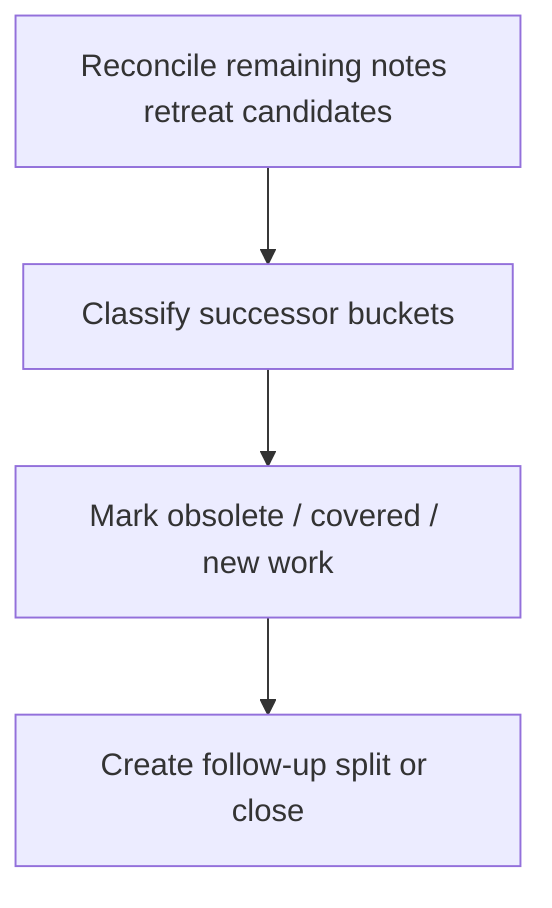

# WORK-DATA-009: Classify remaining UC-002 notes retreat debt

- **id**: WORK-DATA-009
- **status**: not_started
- **date**: 2026-06-01
- **source_requirement**: REQ-DATA-002
- **impact_refs**:
  - REQ-DATA-002
  - INV-DATA-002
  - TASK-DATA-003-04
  - TASK-DATA-005-01
  - TASK-DATA-005-02
- **tasks**:

## Goal

Classify the remaining UC-002 notes retreat debt into smaller successor buckets after the helper/model render, signature policy, tagged union, DAG TypeRef hint, MCP identity, and UC-002 duplicate task QID follow-ups have been separated.

This work item is cleanup planning, not direct cleanup implementation.

## Boundary

### Included

- Review remaining UC-002 notes retreat candidates that were not handled by M15, WORK-DATA-002, WORK-DATA-003, or WORK-DATA-004.
- Classify remaining debt into implementable successor buckets.
- Separate enum-like leftovers, numeric/default behavior, selector matrices, recursive / union cases, request-side / generic containers, MCP identity-related notes, and human explanation / view-renderer notes.
- Decide which items are obsolete, already covered by successor work, or require new requirements / work items.

### Excluded

- Direct UC-002 YAML migration.
- Fixture / golden regeneration.
- ADR-073 tagged union implementation.
- ADR-074 DAG TypeRef hint implementation.
- ADR-078 / ADR-079 / ADR-080 MCP identity implementation.
- UC-002 duplicate task QID / unresolved flow task fix.
- Reopening M15, WORK-DATA-001, WORK-DATA-002, WORK-DATA-003, or WORK-DATA-004.

## Impact Scope

| layer | current state | handling in this work item |
|---|---|---|
| source requirement | REQ-DATA-002 captured | Owns broad helper/model follow-up umbrella, but not all cleanup implementation |
| investigation | INV-DATA-002 concluded | Use as broad note-retreat inventory source |
| classification | TASK-DATA-003-04 done | Use candidate split without reopening WORK-DATA-003 |
| successor planning | TASK-DATA-005-02 done | Use ownership classification as input |

## Task Flow

No task artifacts are created at initial capture time.

Expected later split:

## Completion Condition

This work item can be marked `done` when remaining UC-002 notes retreat debt is classified into concrete successor actions or explicit no-action / obsolete outcomes without performing direct cleanup implementation.
