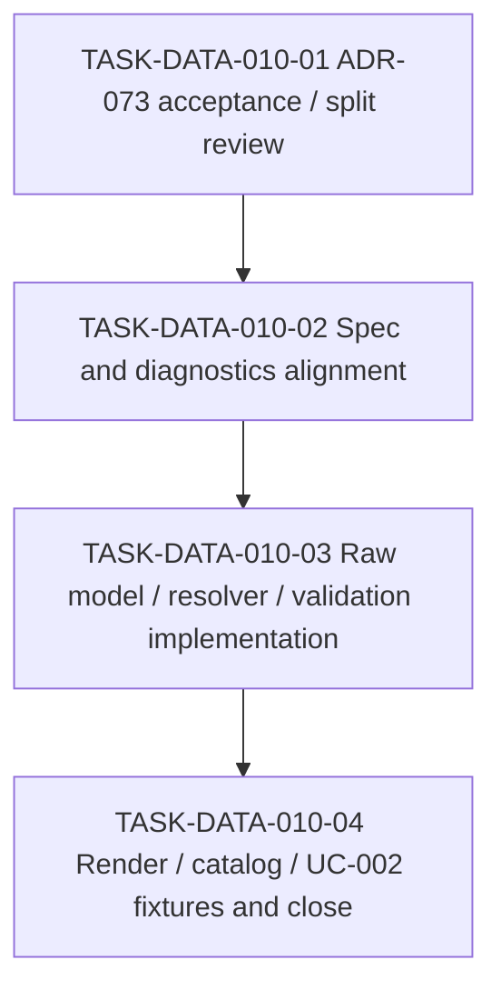

# WORK-DATA-010: Implement tagged union and discriminator payload support

- **id**: WORK-DATA-010
- **status**: done
- **date**: 2026-06-01
- **source_requirement**: REQ-DATA-004
- **impact_refs**:
  - REQ-DATA-004
  - ADR-073
  - INV-DATA-002
  - TASK-DATA-003-04
  - TASK-DATA-005-02
- **tasks**:
  - TASK-DATA-010-01
  - TASK-DATA-010-02
  - TASK-DATA-010-03
  - TASK-DATA-010-04

## Goal

Implement tagged union and discriminator payload support as a dedicated DATA expressiveness successor instead of mixing it into helper model render or broad UC-002 cleanup work.

## Boundary

### Included

- Review ADR-073 and decide whether it can be accepted as-is, revised, or split before implementation.
- Define the tagged union model shape and discriminator payload validation boundary.
- Update relevant specs for model representation, TypeRef usage, validation diagnostics, and render behavior.
- Implement parser / resolver / validation support needed for the accepted minimum.
- Add render / catalog support and fixtures / golden evidence for representative UC-002 tagged-union candidates in TASK-DATA-010-04.

### Excluded

- ADR-074 DAG asset TypeRef hint.
- ADR-078 / ADR-079 / ADR-080 MCP semantic identity / state machine identity.
- UC-002 duplicate task QID / unresolved flow task issue.
- Full remaining UC-002 notes retreat cleanup.
- Reopening M15, WORK-DATA-001, WORK-DATA-002, WORK-DATA-003, or WORK-DATA-004.

## Impact Scope

| layer | current state | handling in this work item |
|---|---|---|
| source requirement | REQ-DATA-004 captured | Owns tagged union successor work |
| decision | ADR-073 accepted | Implement against the accepted tagged union contract; TASK-DATA-010-02 completed spec / diagnostics alignment |
| investigation | INV-DATA-002 concluded | Use tagged-union candidate inventory as evidence |
| UC-002 classification | TASK-DATA-003-04 done | Use tagged-union candidates without reopening WORK-DATA-003 |
| implementation | TASK-DATA-010-03 done | Continue with render / catalog / UC-002 fixture and close work in TASK-DATA-010-04 |

## Task Flow

Initial decision / spec task artifacts:

- TASK-DATA-010-01
- TASK-DATA-010-02

Completed review / alignment:

- TASK-DATA-010-01
- TASK-DATA-010-02

Implementation task artifacts:

- TASK-DATA-010-03

Render / fixture / close task artifacts:

- TASK-DATA-010-04

Final task flow:

## Completion Condition

This work item can be marked `done` when tagged union support is accepted, specified, implemented, rendered/cataloged as needed, fixture/golden-covered, verified, and closed without pulling in DAG TypeRef hint, MCP identity, UC-002 duplicate task QID repair, or broad notes retreat cleanup.

## Close Evidence

Closed by TASK-DATA-010-04 on 2026-06-03.

- ADR-073 accepted (TASK-DATA-010-01)
- Spec and diagnostics alignment done (TASK-DATA-010-02)
- Raw YAML / semantic model / resolver / validation implemented with tests (TASK-DATA-010-03)
- Model-file renderer: tagged_union support added to `writeKindSection` and `compactShape`
- DAG private models renderer: tagged_union support added to `privateModelShape`
- model-file spec (`docs/spec/views/model-file.md`): tagged union section added, execution boundary updated
- UC-002 migration: `analyze_impact_change` created as `kind: tagged_union` with 4 variants (rename/remove/change_type/add); change_contract and change_transition_target deferred
- `analyze_impact_request.change` migrated from `any` to `analyze_impact_change`
- `analyze_impact_response.change` migrated from `any` to `analyze_impact_change`
- Golden render regenerated: `model-analyze_impact_change.md` (new), `model-analyze_impact_request.md` (updated), `model-analyze_impact_response.md` (updated)
- `TestRenderTaggedUnionModelGolden` added to `internal/render/model/renderer_test.go`
- `go test -count=1 ./...` PASS
- `go run ./cmd/brewprint validate --yaml-root docs/uc/002-brewprint-self-hosting/yaml` PASS (0 errors, 0 warnings)
- Excluded scope (DAG TypeRef hint, MCP identity, duplicate task QID repair, broad notes retreat cleanup) not touched
