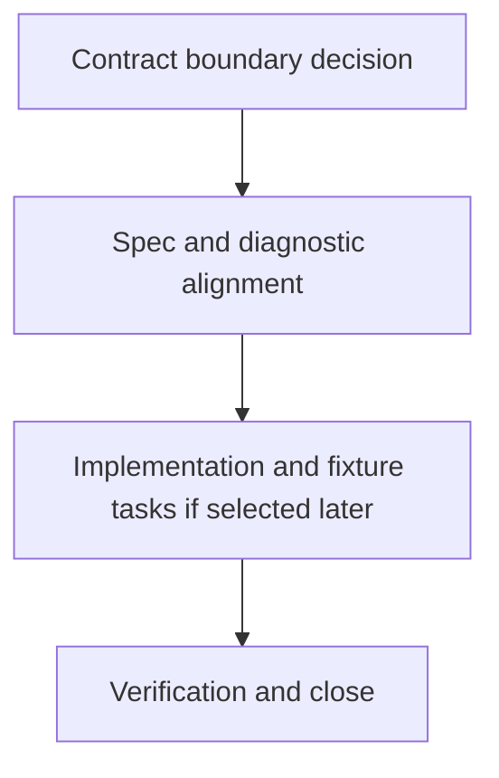

# WORK-DATA-014: Define selector support matrix and object-dependent vocabulary

- **id**: WORK-DATA-014
- **status**: decision_pending
- **date**: 2026-06-01
- **source_requirement**: REQ-DATA-007
- **impact_refs**:
  - REQ-DATA-007
  - REQ-DATA-002
  - INV-DATA-002
  - WORK-DATA-009
  - TASK-DATA-009-03
  - TASK-DATA-009-04
- **tasks**:

## Goal

Define the follow-up path for selector support matrices and object-dependent vocabulary captured by `REQ-DATA-007`.

This work item owns the `selector matrix / support matrix` bucket: N-020, N-031, N-037, N-040, and N-042.

## Boundary

### Included

- Decide the contract boundary for selector support matrices and object-dependent kind vocabulary.
- Identify required spec, diagnostic, YAML, and fixture follow-up before any implementation work begins.
- Split later task artifacts only when this work item is selected for execution.

### Excluded

- Direct UC-002 YAML migration in this capture.
- Fixture / golden regeneration in this capture.
- Parser, renderer, validator, MCP, or other implementation changes in this capture.
- Tagged union / discriminator payload support.
- DAG asset TypeRef hint support.
- MCP identity / semantic reference support.
- Request-side generic container cleanup, enum/literal cleanup, numeric/default behavior, recursive structure, or untagged-union successor scope.
- Reopening M15, WORK-DATA-001, WORK-DATA-002, WORK-DATA-003, WORK-DATA-004, WORK-DATA-005, WORK-DATA-006, WORK-DATA-007, WORK-DATA-008, WORK-DATA-009, or WORK-DATA-010.

## Impact Scope

| layer | current state | handling in this work item |
|---|---|---|
| source requirement | REQ-DATA-007 captured | Owns selector support matrix and object-dependent vocabulary |
| source planning | WORK-DATA-009 done | Consume the selected successor bucket only |
| candidate bucket | selector matrix / support matrix | Own the bucket as a future contract decision track |

## Task Flow

No task artifacts are created at initial capture time.

Expected later split:

## Completion Condition

This work item can be marked `done` when selector support matrix and object-dependent vocabulary constraints are accepted, specified, implemented and verified if selected, or explicitly closed as no-action without mixing in unrelated DATA or MCP identity work.
