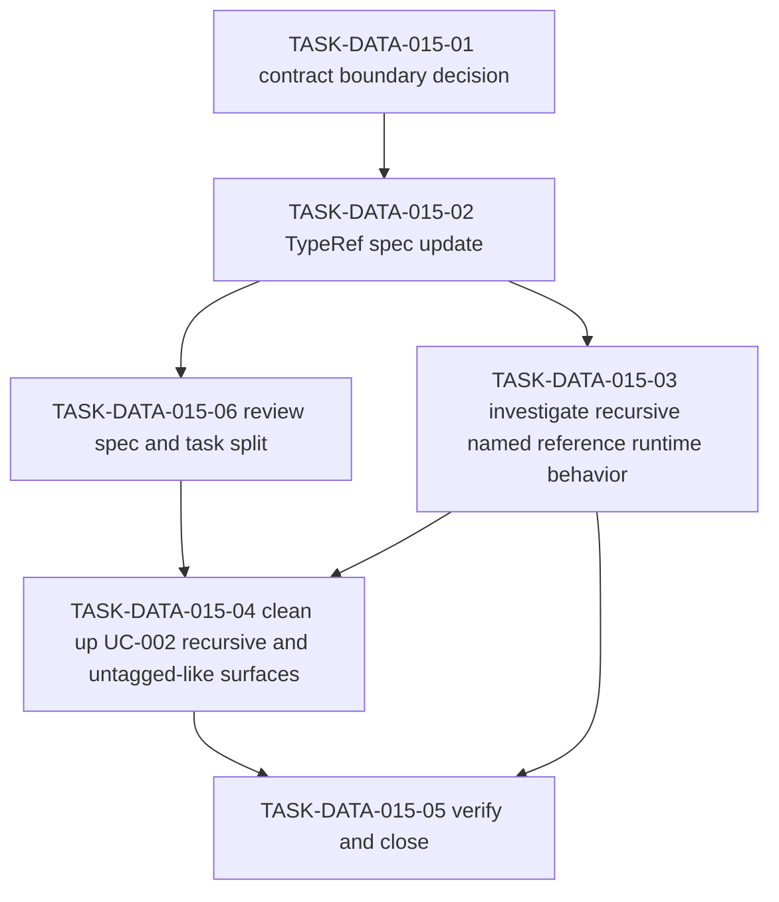

# WORK-DATA-015: Define recursive and untagged-union representation

- **id**: WORK-DATA-015
- **status**: done
- **date**: 2026-06-01
- **source_requirement**: REQ-DATA-008
- **impact_refs**:
  - REQ-DATA-008
  - REQ-DATA-002
  - INV-DATA-002
  - WORK-DATA-009
  - TASK-DATA-009-03
  - TASK-DATA-009-04
- **tasks**:
  - TASK-DATA-015-01
  - TASK-DATA-015-02
  - TASK-DATA-015-03
  - TASK-DATA-015-04
  - TASK-DATA-015-05
  - TASK-DATA-015-06

## Goal

Define the follow-up path for recursive structures and untagged unions captured by `REQ-DATA-008`.

This work item owns the `recursive / union structure` bucket: N-009 and N-044.

## Boundary

### Included

- Decide whether brewprint data models should represent recursive references and untagged union shapes.
- Decide whether this remains separate from ADR-073 or requires an explicit future ADR-073 successor / broadening decision.
- Identify required spec, diagnostic, YAML, render, and fixture follow-up before any implementation work begins.
- Split later task artifacts only when this work item is selected for execution.

### Excluded

- Direct UC-002 YAML migration in this capture.
- Fixture / golden regeneration in this capture.
- Parser, renderer, validator, MCP, or other implementation changes in this capture.
- Tagged union / discriminator payload support as already captured by `REQ-DATA-004` / `WORK-DATA-010`.
- DAG asset TypeRef hint support.
- MCP identity / semantic reference support.
- Request-side generic container cleanup, enum/literal cleanup, numeric/default behavior, or selector support matrix successor scope.
- Reopening M15, WORK-DATA-001, WORK-DATA-002, WORK-DATA-003, WORK-DATA-004, WORK-DATA-005, WORK-DATA-006, WORK-DATA-007, WORK-DATA-008, WORK-DATA-009, or WORK-DATA-010.

## Impact Scope

| layer | current state | handling in this work item |
|---|---|---|
| source requirement | REQ-DATA-008 captured | Owns recursive and untagged-union representation |
| related tagged-union successor | REQ-DATA-004 / WORK-DATA-010 not_started | Preserve as tagged / discriminated union only unless a later decision broadens it |
| source planning | WORK-DATA-009 done | Consume the selected successor bucket only |
| candidate bucket | recursive / union structure | Own the bucket as a future contract decision track |

## Task Flow

Current task split:

`TASK-DATA-015-01` through `TASK-DATA-015-06` are complete.

## Completion Condition

This work item is done.

Completion evidence:

- Recursive named model reference support was accepted in `TASK-DATA-015-01`.
- `docs/spec/type-ref.md` was updated in `TASK-DATA-015-02`.
- Runtime behavior was investigated in `TASK-DATA-015-03` and classified as already-supported.
- UC-002 N-044 was migrated from `any` to recursive named model reference `object_ref` in `TASK-DATA-015-04`.
- UC-002 N-009 was migrated from `any` to `list<diagnostic_related>` using a tagged union envelope in `TASK-DATA-015-04`.
- `TASK-DATA-015-06` reviewed the spec and task split after cleanup.
- `TASK-DATA-015-05` verified the completed work and recommended closing this work item.

Boundary preserved:

- No untagged union / general `oneOf` / `anyOf` / scalar union support was introduced.
- ADR-073 remains limited to tagged / discriminated union support.
- No M15 or completed DATA work item was reopened.

Verification recorded in task evidence:

- UC-002 YAML validation passed with `error_count: 0` and `warning_count: 0`.
- UC-002 render passed and rendered 47 files.
- `go test ./internal/resolve ./internal/render/model ./cmd/brewprint` passed.
- MCP `validate_records` passed for the affected task / work item records.

## Evidence

Completed on 2026-06-08.

`WORK-DATA-015` closes `REQ-DATA-008` by accepting recursive named model references and rejecting general untagged union support.

Selected outcomes:

- Recursive structures are represented through named model TypeRef references only.
- Inline recursive shapes are not introduced.
- Untagged union / general `oneOf` / `anyOf` / scalar union support is not introduced.
- Untagged-like machine-readable surfaces use tagged union envelope models.
- Intentionally opaque surfaces may remain `any + note` / prose where schema is not required.

Implemented UC-002 cleanup:

- `object_ref.parent` now uses `type: object_ref`.
- `diagnostic.related` now uses `type: list<diagnostic_related>`.
- `diagnostic_related` is a tagged union envelope with `kind` discriminator and `source_location` / `object_ref` variants.

Close verification:

- All tasks `TASK-DATA-015-01` through `TASK-DATA-015-06` are done.
- `TASK-DATA-015-05` records the final verification summary.
- `REQ-DATA-008` can be updated from `captured` to `accepted`.
